# RepoQL Indexing Process

> **Note:** The former `RepositoryIndexer` host has been superseded by the `RepoqlHost` + `IndexingCoordinator` + `IndexingEngine` stack. References to `RepositoryIndexer` in this document describe the overall pipeline now implemented by those components.

## Overview

The RepoQL indexing process transforms files from a repository into a queryable graph database. This document provides an in-depth explanation of how the indexing pipeline works, its stages, components, and optimization strategies.

## Architecture

The indexing system is orchestrated by **RepositoryIndexer** (`src/RepoQL.Core/RepositoryIndexer.cs:23`), which manages a multi-stage concurrent pipeline.

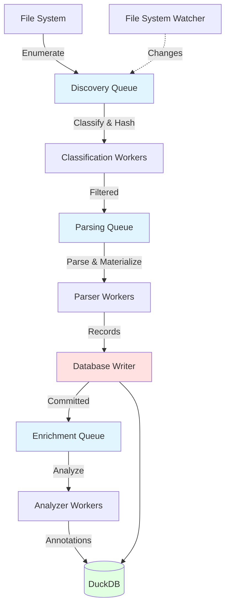
```mermaid
graph TB
    FS[File System] -->|Enumerate| Discovery[Discovery Queue]
    Discovery -->|Classify & Hash| Classification[Classification Workers]
    Classification -->|Filtered| Parsing[Parsing Queue]
    Parsing -->|Parse & Materialize| Parser[Parser Workers]
    Parser -->|Records| Writer[Database Writer]
    Writer -->|Committed| Enrich[Enrichment Queue]
    Enrich -->|Analyze| Analyzer[Analyzer Workers]
    Analyzer -->|Annotations| DB[(DuckDB)]
    Writer --> DB

    FSW[File System Watcher] -.->|Changes| Discovery

    style Discovery fill:#e1f5ff
    style Parsing fill:#e1f5ff
    style Enrich fill:#e1f5ff
    style Writer fill:#ffe1e1
    style DB fill:#e1ffe1
```

## Pipeline Stages

The indexing pipeline consists of four main stages that operate concurrently:

### Stage 1: Discovery/Classification

- **Queue**: `_classificationQueue` with deduplication
- **Concurrency**: Up to 16 workers (2× CPU cores)
- **Capacity**: 20,000 items
- **Purpose**: Discover files, hash content, classify media type, check for changes

**Key Operations**:
1. Enumerate files from file system
2. Filter using `IUriFilter`
3. Hash file content (xxHash64)
4. Classify using `IFileClassifier`
5. Check if digest differs from database
6. Enqueue changed files to parsing

### Stage 2: Parsing

- **Queue**: `_parsingQueue` with deduplication
- **Concurrency**: Up to 8 workers (1× CPU cores)
- **Capacity**: 20,000 items
- **Purpose**: Load documents and materialize into graph structures

**Key Operations**:
1. Resolve format descriptor from `FormatRegistry`
2. Load document using `IFormatLoader`
3. Materialize into `Records` (artifacts, nodes, spans, edges)
4. Enqueue to database writer

### Stage 3: Database Writer

- **Implementation**: `SingleThreadedDatabaseWriter`
- **Concurrency**: 1 worker (single-threaded by design)
- **Capacity**: 1,000 operations
- **Purpose**: Serialize all database writes to avoid concurrency conflicts

**Key Operations**:
1. Upsert artifacts (content blobs)
2. Upsert document node by URI
3. Replace document content (child nodes, spans, edges)
4. Fire `OnCommitted` callback
5. Trigger enrichment

### Stage 4: Analysis/Enrichment

- **Queue**: `_enrichmentQueue`
- **Concurrency**: CPU/2 workers (minimum 1)
- **Capacity**: 4,000 items
- **Purpose**: Post-processing analysis and annotation generation

**Key Operations**:
1. Load document from database or cache
2. Resolve format descriptor
3. Run `IAnalyzer` implementations
4. Write analysis results (annotations, lint, metrics)

## Indexing Modes

### Cold Start (Initial Indexing)

When RepoQL starts without persisted data:

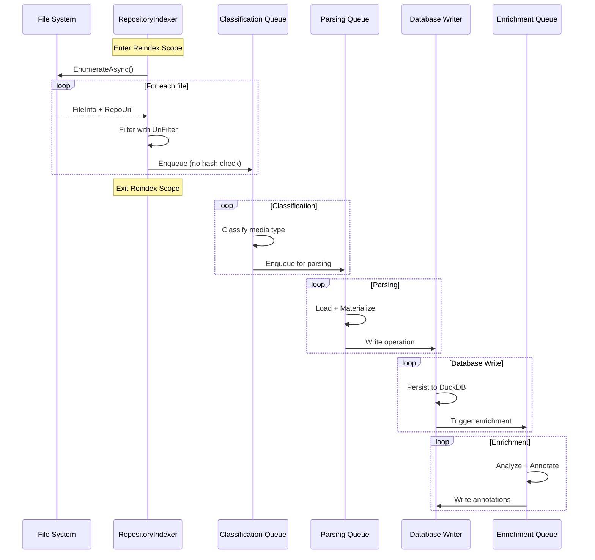
```mermaid
sequenceDiagram
    participant FS as File System
    participant IDX as RepositoryIndexer
    participant CQ as Classification Queue
    participant PQ as Parsing Queue
    participant DBW as Database Writer
    participant EQ as Enrichment Queue

    Note over IDX: Enter Reindex Scope
    IDX->>FS: EnumerateAsync()
    loop For each file
        FS-->>IDX: FileInfo + RepoUri
        IDX->>IDX: Filter with UriFilter
        IDX->>CQ: Enqueue (no hash check)
    end
    Note over IDX: Exit Reindex Scope

    loop Classification
        CQ->>CQ: Classify media type
        CQ->>PQ: Enqueue for parsing
    end

    loop Parsing
        PQ->>PQ: Load + Materialize
        PQ->>DBW: Write operation
    end

    loop Database Write
        DBW->>DBW: Persist to DuckDB
        DBW->>EQ: Trigger enrichment
    end

    loop Enrichment
        EQ->>EQ: Analyze + Annotate
        EQ->>DBW: Write annotations
    end
```

**Characteristics**:
- Skips hash checks (fast path)
- Skips database digest comparisons
- Processes all files
- Flag: `IsReindexing == true`

### Warm Start (Incremental Indexing)

When RepoQL starts with existing database:

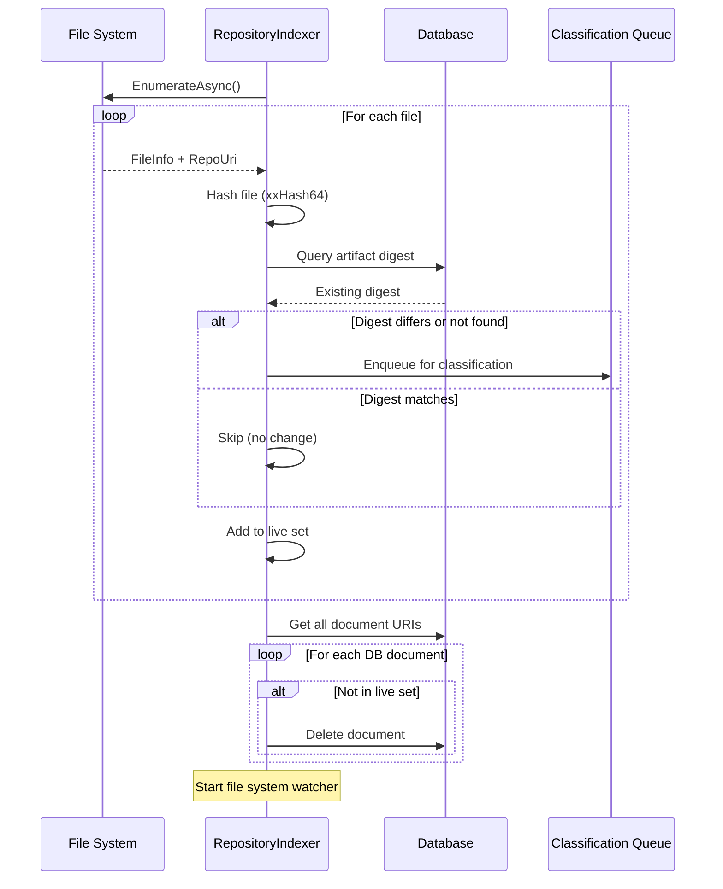
```mermaid
sequenceDiagram
    participant FS as File System
    participant IDX as RepositoryIndexer
    participant DB as Database
    participant CQ as Classification Queue

    IDX->>FS: EnumerateAsync()
    loop For each file
        FS-->>IDX: FileInfo + RepoUri
        IDX->>IDX: Hash file (xxHash64)
        IDX->>DB: Query artifact digest
        DB-->>IDX: Existing digest

        alt Digest differs or not found
            IDX->>CQ: Enqueue for classification
        else Digest matches
            IDX->>IDX: Skip (no change)
        end

        IDX->>IDX: Add to live set
    end

    IDX->>DB: Get all document URIs
    loop For each DB document
        alt Not in live set
            IDX->>DB: Delete document
        end
    end

    Note over IDX: Start file system watcher
```

**Characteristics**:
- Hashes all files
- Compares digests with database
- Skips unchanged files
- Prunes deleted files
- Enables file system watching

### File System Watching

After initial indexing, the system watches for changes:

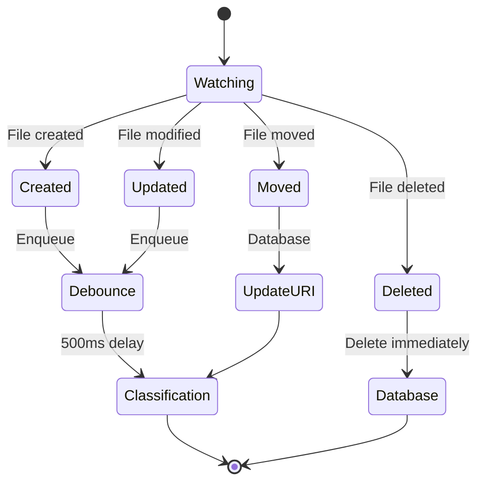
```mermaid
stateDiagram-v2
    [*] --> Watching

    Watching --> Created: File created
    Watching --> Updated: File modified
    Watching --> Deleted: File deleted
    Watching --> Moved: File moved

    Created --> Debounce: Enqueue
    Updated --> Debounce: Enqueue
    Moved --> UpdateURI: Database

    Debounce --> Classification: 500ms delay
    UpdateURI --> Classification

    Deleted --> Database: Delete immediately

    Classification --> [*]
    Database --> [*]
```

**Debouncing**: File changes are debounced with a 500ms window to prevent excessive reindexing during rapid changes.

## Core Components

### WorkQueue

A bounded, deduplicated work queue (`src/RepoQL.Core/WorkQueue.cs:12`):

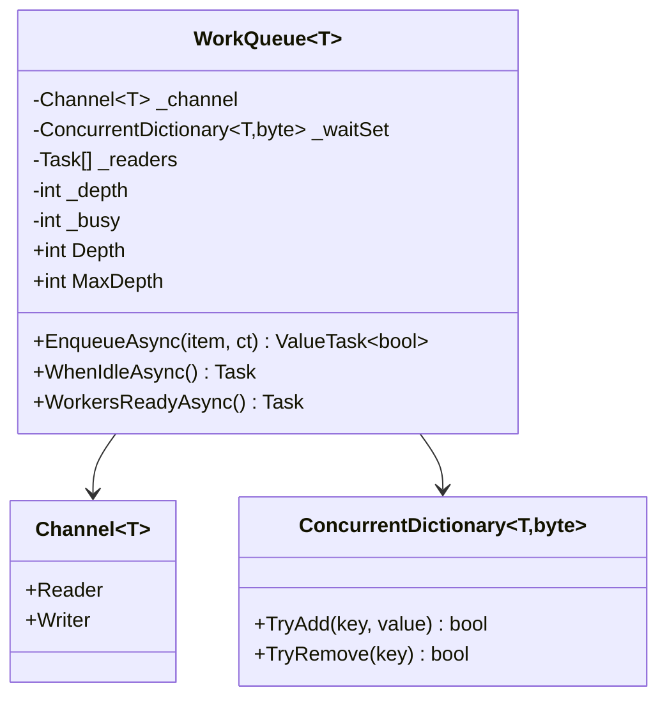
```mermaid
classDiagram
    class WorkQueue~T~ {
        -Channel~T~ _channel
        -ConcurrentDictionary~T,byte~ _waitSet
        -Task[] _readers
        -int _depth
        -int _busy
        +int Depth
        +int MaxDepth
        +EnqueueAsync(item, ct) ValueTask~bool~
        +WhenIdleAsync() Task
        +WorkersReadyAsync() Task
    }

    class Channel~T~ {
        +Reader
        +Writer
    }

    class ConcurrentDictionary~T,byte~ {
        +TryAdd(key, value) bool
        +TryRemove(key) bool
    }

    WorkQueue~T~ --> Channel~T~
    WorkQueue~T~ --> ConcurrentDictionary~T,byte~
```

**Features**:
- Prevents duplicate enqueues using `_waitSet`
- Bounded capacity with backpressure
- Multiple concurrent readers
- Tracks queue depth and busy workers
- Provides idle detection

### Format System

Each file format is handled by three components:

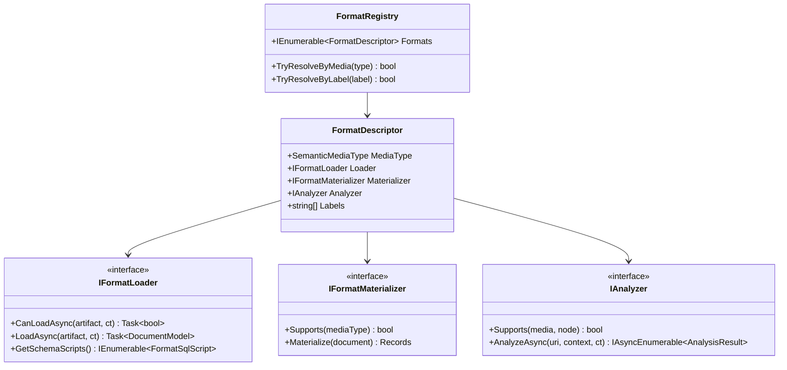
```mermaid
classDiagram
    class IFormatLoader {
        <<interface>>
        +CanLoadAsync(artifact, ct) Task~bool~
        +LoadAsync(artifact, ct) Task~DocumentModel~
        +GetSchemaScripts() IEnumerable~FormatSqlScript~
    }

    class IFormatMaterializer {
        <<interface>>
        +Supports(mediaType) bool
        +Materialize(document) Records
    }

    class IAnalyzer {
        <<interface>>
        +Supports(media, node) bool
        +AnalyzeAsync(uri, context, ct) IAsyncEnumerable~AnalysisResult~
    }

    class FormatDescriptor {
        +SemanticMediaType MediaType
        +IFormatLoader Loader
        +IFormatMaterializer Materializer
        +IAnalyzer Analyzer
        +string[] Labels
    }

    class FormatRegistry {
        +IEnumerable~FormatDescriptor~ Formats
        +TryResolveByMedia(type) bool
        +TryResolveByLabel(label) bool
    }

    FormatDescriptor --> IFormatLoader
    FormatDescriptor --> IFormatMaterializer
    FormatDescriptor --> IAnalyzer
    FormatRegistry --> FormatDescriptor
```

**Component Responsibilities**:

1. **IFormatLoader** (`src/RepoQL.Contracts/IFormatLoader.cs:5`)
   - Determines if this loader can handle a file
   - Reads file and produces `DocumentModel` (in-memory representation)
   - Provides SQL schema scripts for format-specific views

2. **IFormatMaterializer** (`src/RepoQL.Contracts/IFormatMaterializer.cs:5`)
   - Converts `DocumentModel` to `Records` (graph structure)
   - Produces: Artifacts, Nodes, Spans, Edges
   - Defines the graph topology

3. **IAnalyzer** (`src/RepoQL.Core/Analysis/IAnalyzer.cs:11`)
   - Performs post-processing analysis
   - Emits annotations (lint errors, metrics, suggestions)
   - Operates on persisted graph data

### Records Structure

The `Records` object represents the graph structure:

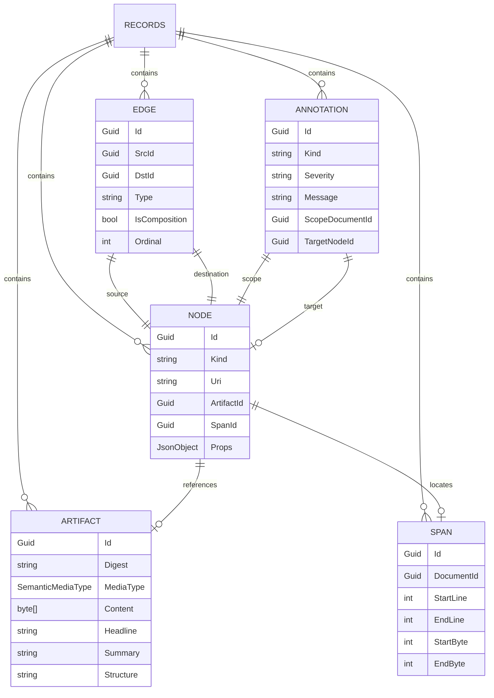
```mermaid
erDiagram
    RECORDS ||--o{ ARTIFACT : contains
    RECORDS ||--o{ NODE : contains
    RECORDS ||--o{ SPAN : contains
    RECORDS ||--o{ EDGE : contains
    RECORDS ||--o{ ANNOTATION : contains

    ARTIFACT {
        Guid Id
        string Digest
        SemanticMediaType MediaType
        byte[] Content
        string Headline
        string Summary
        string Structure
    }

    NODE {
        Guid Id
        string Kind
        string Uri
        Guid ArtifactId
        Guid SpanId
        JsonObject Props
    }

    SPAN {
        Guid Id
        Guid DocumentId
        int StartLine
        int EndLine
        int StartByte
        int EndByte
    }

    EDGE {
        Guid Id
        Guid SrcId
        Guid DstId
        string Type
        bool IsComposition
        int Ordinal
    }

    ANNOTATION {
        Guid Id
        string Kind
        string Severity
        string Message
        Guid ScopeDocumentId
        Guid TargetNodeId
    }

    NODE ||--o| ARTIFACT : references
    NODE ||--o| SPAN : locates
    EDGE ||--|| NODE : source
    EDGE ||--|| NODE : destination
    ANNOTATION ||--|| NODE : scope
    ANNOTATION ||--o| NODE : target
```

## Detailed Flow Example: Markdown File

Let's trace how a markdown file (`docs/Schema.md`) flows through the system:

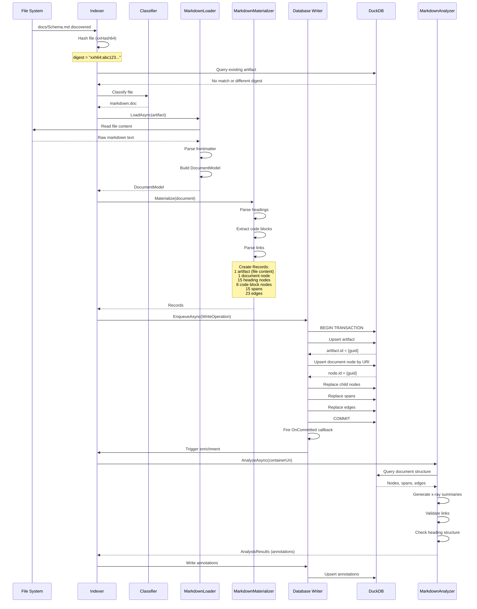
```mermaid
sequenceDiagram
    participant FS as File System
    participant IDX as Indexer
    participant CLS as Classifier
    participant LDR as MarkdownLoader
    participant MAT as MarkdownMaterializer
    participant DBW as Database Writer
    participant DB as DuckDB
    participant ANA as MarkdownAnalyzer

    FS->>IDX: docs/Schema.md discovered
    IDX->>IDX: Hash file (xxHash64)
    Note over IDX: digest = "xxh64:abc123..."

    IDX->>DB: Query existing artifact
    DB-->>IDX: No match or different digest

    IDX->>CLS: Classify file
    CLS-->>IDX: markdown.doc

    IDX->>LDR: LoadAsync(artifact)
    LDR->>FS: Read file content
    FS-->>LDR: Raw markdown text
    LDR->>LDR: Parse frontmatter
    LDR->>LDR: Build DocumentModel
    LDR-->>IDX: DocumentModel

    IDX->>MAT: Materialize(document)
    MAT->>MAT: Parse headings
    MAT->>MAT: Extract code blocks
    MAT->>MAT: Parse links

    Note over MAT: Create Records:<br/>1 artifact (file content)<br/>1 document node<br/>15 heading nodes<br/>8 code block nodes<br/>15 spans<br/>23 edges

    MAT-->>IDX: Records

    IDX->>DBW: EnqueueAsync(WriteOperation)

    DBW->>DB: BEGIN TRANSACTION
    DBW->>DB: Upsert artifact
    DB-->>DBW: artifact.id = {guid}
    DBW->>DB: Upsert document node by URI
    DB-->>DBW: node.id = {guid}
    DBW->>DB: Replace child nodes
    DBW->>DB: Replace spans
    DBW->>DB: Replace edges
    DBW->>DB: COMMIT

    DBW->>DBW: Fire OnCommitted callback
    DBW->>IDX: Trigger enrichment

    IDX->>ANA: AnalyzeAsync(containerUri)
    ANA->>DB: Query document structure
    DB-->>ANA: Nodes, spans, edges
    ANA->>ANA: Generate x-ray summaries
    ANA->>ANA: Validate links
    ANA->>ANA: Check heading structure
    ANA-->>IDX: AnalysisResults (annotations)

    IDX->>DBW: Write annotations
    DBW->>DB: Upsert annotations
```

**Result in Database**:

1. **1 Artifact**:
   - ID: Generated GUID
   - Digest: `xxh64:abc123...`
   - MediaType: `text/markdown;kind=markdown.doc`
   - Headline: "RepoQL Schema — Schema.md | markdown.doc | 24KB | 630 lines"
   - Summary: Brief description of the document
   - Structure: Hierarchical outline of headings

2. **23 Nodes**:
   - 1 document node (kind=`document`, has URI)
   - 15 heading nodes (kind=`md_heading`)
   - 7 code block nodes (kind=`md_code_block`)

3. **23 Spans**:
   - Precise line/byte locations for each node

4. **30 Edges**:
   - 22 composition edges (document → children)
   - 8 reference edges (links to other documents)

5. **N Annotations** (from analysis):
   - Lint warnings
   - Broken links
   - Outline metadata

## Concurrency & Deduplication

### Deduplication Strategy

The system uses multiple layers of deduplication to prevent redundant work:

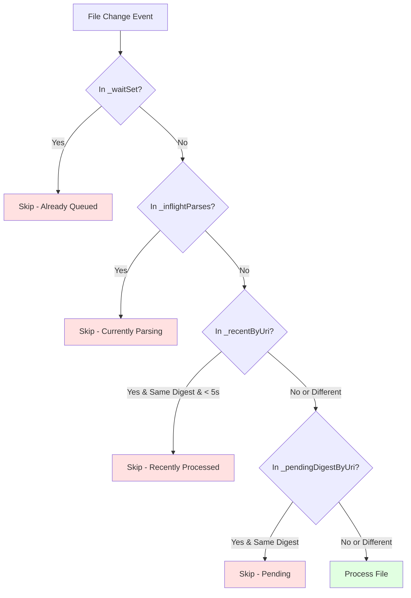
```mermaid
graph TD
    A[File Change Event] --> B{In _waitSet?}
    B -->|Yes| C[Skip - Already Queued]
    B -->|No| D{In _inflightParses?}
    D -->|Yes| E[Skip - Currently Parsing]
    D -->|No| F{In _recentByUri?}
    F -->|Yes & Same Digest & < 5s| G[Skip - Recently Processed]
    F -->|No or Different| H{In _pendingDigestByUri?}
    H -->|Yes & Same Digest| I[Skip - Pending]
    H -->|No or Different| J[Process File]

    style C fill:#ffe1e1
    style E fill:#ffe1e1
    style G fill:#ffe1e1
    style I fill:#ffe1e1
    style J fill:#e1ffe1
```

**Deduplication Layers**:

1. **`_waitSet`** (in WorkQueue): Prevents enqueueing if already in queue
2. **`_inflightParses`**: Prevents concurrent parsing of the same file
3. **`_recentByUri`**: 5-second cache of recently completed files
4. **`_pendingDigestByUri`**: Tracks digests of files currently in pipeline
5. **WorkQueue equality comparer**: URI-based deduplication

### Concurrency Model

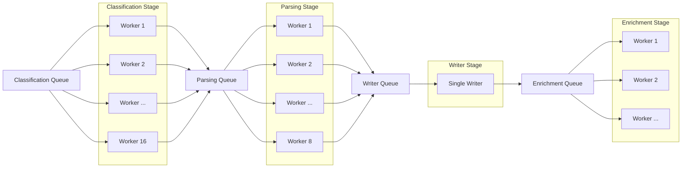
```mermaid
graph LR
    subgraph "Classification Stage"
        C1[Worker 1]
        C2[Worker 2]
        C3[Worker ...]
        CN[Worker 16]
    end

    subgraph "Parsing Stage"
        P1[Worker 1]
        P2[Worker 2]
        P3[Worker ...]
        PN[Worker 8]
    end

    subgraph "Writer Stage"
        W[Single Writer]
    end

    subgraph "Enrichment Stage"
        E1[Worker 1]
        E2[Worker 2]
        E3[Worker ...]
    end

    CQ[Classification Queue] --> C1 & C2 & C3 & CN
    C1 & C2 & C3 & CN --> PQ[Parsing Queue]
    PQ --> P1 & P2 & P3 & PN
    P1 & P2 & P3 & PN --> WQ[Writer Queue]
    WQ --> W
    W --> EQ[Enrichment Queue]
    EQ --> E1 & E2 & E3
```

**Worker Allocation** (`src/RepoQL.Core/RepositoryIndexer.cs:395`):
- **Classification**: `min(CPU * 2, 16)` workers (I/O bound)
- **Parsing**: `min(CPU, 8)` workers (CPU bound)
- **Writer**: `1` worker (serialization required)
- **Enrichment**: `max(CPU / 2, 1)` workers (deferred)

### Backpressure Management

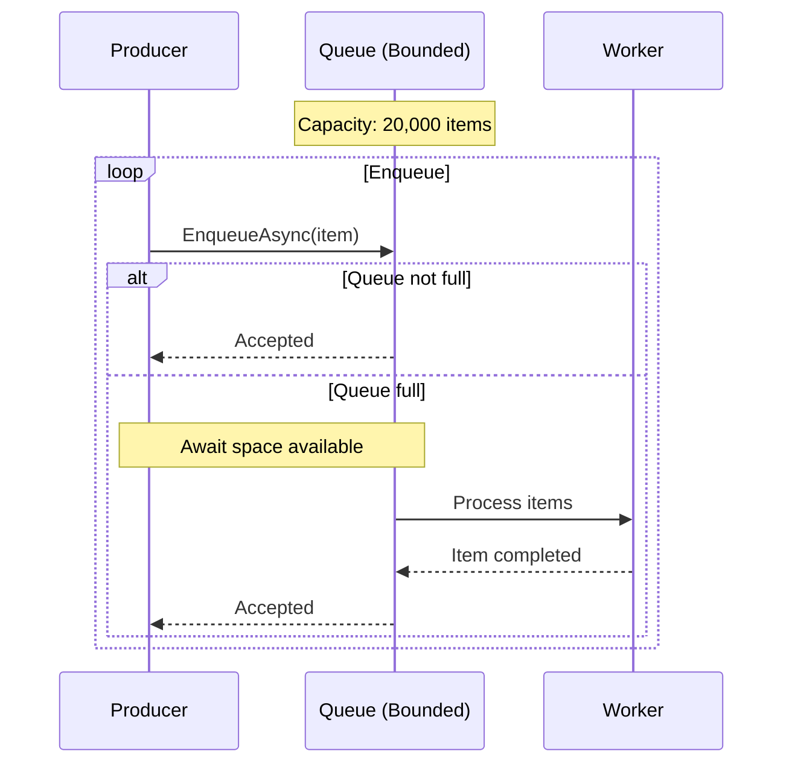
```mermaid
sequenceDiagram
    participant P as Producer
    participant Q as Queue (Bounded)
    participant W as Worker

    Note over Q: Capacity: 20,000 items

    loop Enqueue
        P->>Q: EnqueueAsync(item)
        alt Queue not full
            Q-->>P: Accepted
        else Queue full
            Note over P,Q: Await space available
            Q->>W: Process items
            W-->>Q: Item completed
            Q-->>P: Accepted
        end
    end
```

All queues use `BoundedChannelFullMode.Wait`, which causes producers to wait when the queue is full, creating natural backpressure.

## Change Detection

### Hash-Based Change Detection

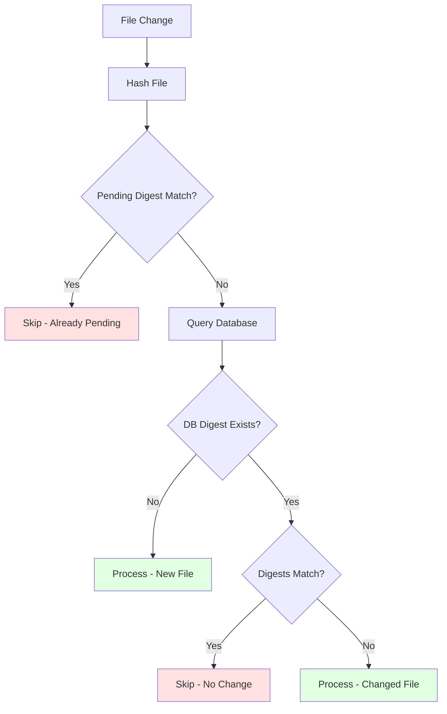
```mermaid
graph TD
    A[File Change] --> B[Hash File]
    B --> C{Pending Digest Match?}
    C -->|Yes| D[Skip - Already Pending]
    C -->|No| E[Query Database]
    E --> F{DB Digest Exists?}
    F -->|No| G[Process - New File]
    F -->|Yes| H{Digests Match?}
    H -->|Yes| I[Skip - No Change]
    H -->|No| J[Process - Changed File]

    style D fill:#ffe1e1
    style I fill:#ffe1e1
    style G fill:#e1ffe1
    style J fill:#e1ffe1
```

**Hash Algorithm**: xxHash64
- Fast non-cryptographic hash
- Produces 8-byte digest
- Formatted as: `xxh64:0123456789abcdef`

**Comparison Points**:
1. `_pendingDigestByUri`: In-flight files
2. `_recentByUri`: Recently completed (5s window)
3. Database artifact digest: Persisted state

## Observability

### Distributed Tracing

Each file creates a trace chain linking all pipeline stages:

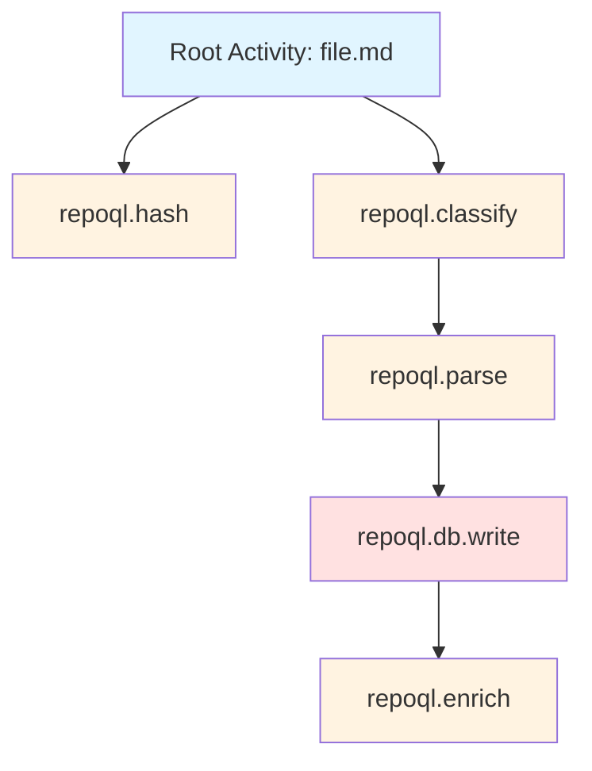
```mermaid
graph TD
    Root[Root Activity: file.md] --> Hash[repoql.hash]
    Root --> Classify[repoql.classify]
    Classify --> Parse[repoql.parse]
    Parse --> Write[repoql.db.write]
    Write --> Enrich[repoql.enrich]

    style Root fill:#e1f5ff
    style Hash fill:#fff3e1
    style Classify fill:#fff3e1
    style Parse fill:#fff3e1
    style Write fill:#ffe1e1
    style Enrich fill:#fff3e1
```

**Trace Tags**:
- `url.full`: Full RepoUri
- `repoql.uri`: Container URI
- `file.name`: File name
- `file.extension`: File extension
- `file.size`: File size in bytes
- `file.hash`: Content digest
- `content.type`: Semantic media type
- `repoql.nodes.count`: Nodes extracted
- `db.system`: "duckdb"
- `db.operation`: Operation type

**Activity Linking**: Activities are linked using `ActivityContext` stored in `_traceChains` dictionary, allowing distributed tracing across async boundaries.

### Metrics

OpenTelemetry metrics exposed:

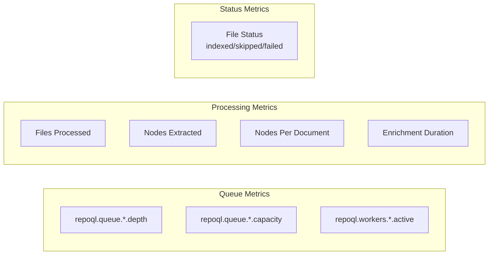
```mermaid
graph LR
    subgraph "Queue Metrics"
        QD[repoql.queue.*.depth]
        QC[repoql.queue.*.capacity]
        WA[repoql.workers.*.active]
    end

    subgraph "Processing Metrics"
        FP[Files Processed]
        NE[Nodes Extracted]
        NPD[Nodes Per Document]
        ED[Enrichment Duration]
    end

    subgraph "Status Metrics"
        FS[File Status<br/>indexed/skipped/failed]
    end
```

### Pipeline Status

The `GetPipelineSnapshot()` method returns real-time pipeline state:

```typescript
interface PipelineSnapshot {
  capturedAt: DateTimeOffset
  discovery: {
    stage: "Discovery"
    depth: number           // Current backlog
    maxDepth: number        // Capacity
    scheduled: number       // Total scheduled
    completed: number       // Total completed
  }
  parsing: { /* same */ }
  analysis: { /* same */ }
  writer: { /* same */ }
  isReindexing: boolean
}
```

**Readiness Calculation**:
- Stage is "ready" when `depth == 0` (no backlog)
- System is "ready" when all stages are ready AND writer is flushed

## Database Schema

The graph is persisted in DuckDB with these core tables:

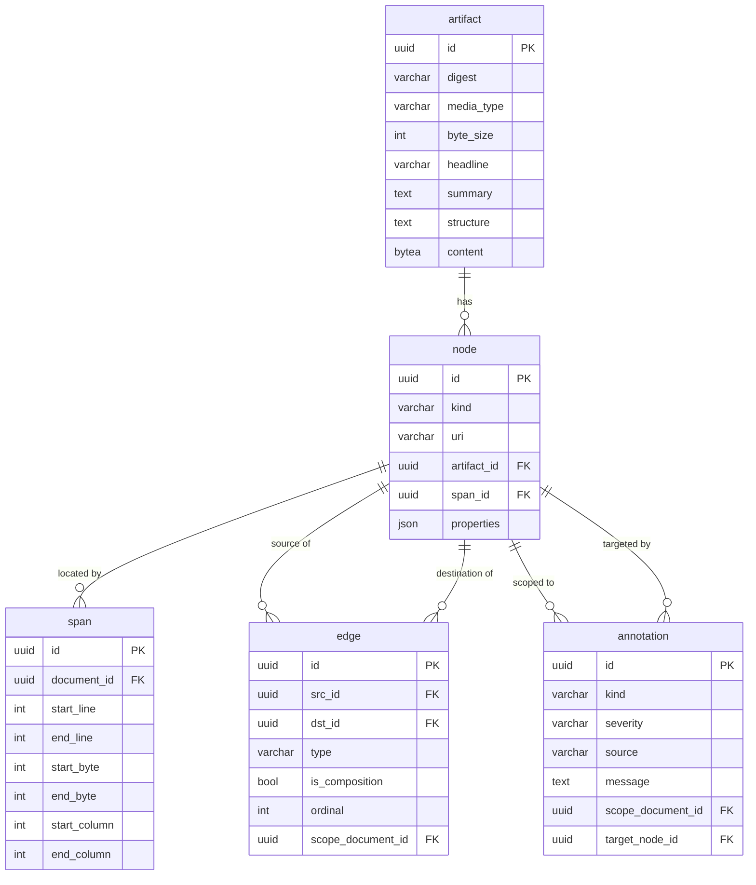
```mermaid
erDiagram
    artifact ||--o{ node : "has"
    node ||--o{ span : "located by"
    node ||--o{ edge : "source of"
    node ||--o{ edge : "destination of"
    node ||--o{ annotation : "scoped to"
    node ||--o{ annotation : "targeted by"

    artifact {
        uuid id PK
        varchar digest
        varchar media_type
        int byte_size
        varchar headline
        text summary
        text structure
        bytea content
    }

    node {
        uuid id PK
        varchar kind
        varchar uri
        uuid artifact_id FK
        uuid span_id FK
        json properties
    }

    span {
        uuid id PK
        uuid document_id FK
        int start_line
        int end_line
        int start_byte
        int end_byte
        int start_column
        int end_column
    }

    edge {
        uuid id PK
        uuid src_id FK
        uuid dst_id FK
        varchar type
        bool is_composition
        int ordinal
        uuid scope_document_id FK
    }

    annotation {
        uuid id PK
        varchar kind
        varchar severity
        varchar source
        text message
        uuid scope_document_id FK
        uuid target_node_id FK
    }
```

**Key Constraints**:
- Only document nodes have `uri` populated
- Child nodes are located via `span_id`
- Composition edges form a tree (document → children)
- Reference edges form a graph (cross-document links)
- Annotations always have a scope document

## Error Handling

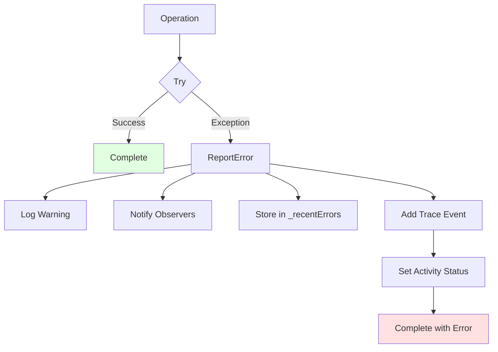
```mermaid
graph TD
    A[Operation] --> B{Try}
    B -->|Success| C[Complete]
    B -->|Exception| D[ReportError]
    D --> E[Log Warning]
    D --> F[Notify Observers]
    D --> G[Store in _recentErrors]
    D --> H[Add Trace Event]
    H --> I[Set Activity Status]
    I --> J[Complete with Error]

    style C fill:#e1ffe1
    style J fill:#ffe1e1
```

**Error Handling Strategy**:
1. Exceptions are caught at stage boundaries
2. Logged with `ILogger`
3. Notified to observers via `IObserver<IndexerEvent>.OnError()`
4. Stored in `_recentErrors` ring buffer (capacity: 64)
5. Added to distributed trace as exception event
6. Stage completion counter still incremented
7. Pipeline continues processing other files

**No Fatal Errors**: Individual file failures do not stop the pipeline.

## Configuration & Tuning

### Queue Capacities

| Stage | Capacity | Reasoning |
|-------|----------|-----------|
| Classification | 20,000 | Large buffer for initial enumeration |
| Parsing | 20,000 | Match classification capacity |
| Writer | 1,000 | Smaller to apply backpressure |
| Enrichment | 4,000 | Deferred, lower priority |

### Worker Counts

| Stage | Formula | Example (8 cores) |
|-------|---------|-------------------|
| Classification | `min(CPU × 2, 16)` | 16 workers |
| Parsing | `min(CPU, 8)` | 8 workers |
| Writer | `1` | 1 worker |
| Enrichment | `max(CPU / 2, 1)` | 4 workers |

### Debounce & Cache Windows

| Setting | Value | Purpose |
|---------|-------|---------|
| File watcher debounce | 500ms | Prevent rapid re-indexing |
| Recent URI cache | 5 seconds | Short-term deduplication |

## Performance Characteristics

### Throughput

Typical throughput on modern hardware (8-core CPU, SSD):
- **Cold indexing**: 500-2,000 files/second (depends on file size and format)
- **Warm startup**: 5,000-20,000 files/second (hash-only, most skipped)
- **File changes**: Sub-second latency from change to queryable

### Bottlenecks

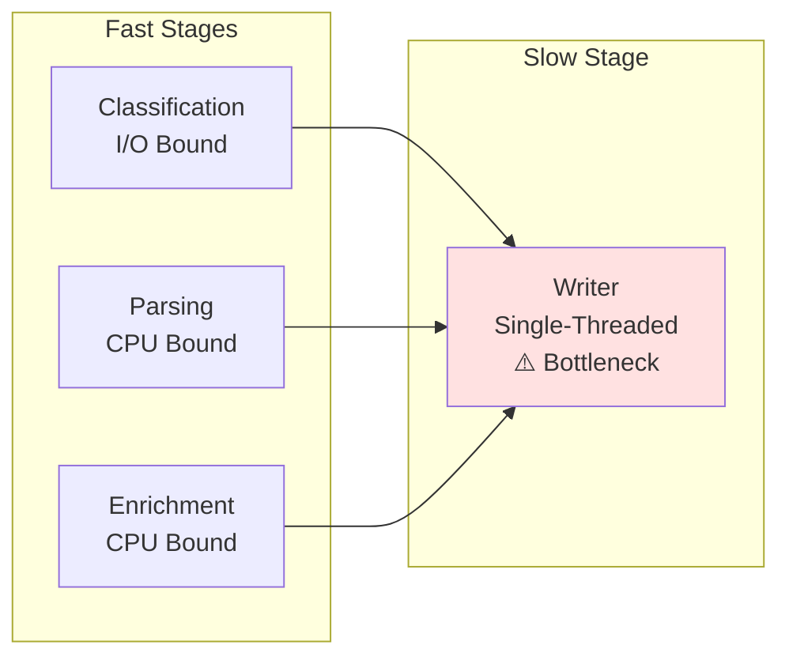
```mermaid
graph LR
    subgraph "Fast Stages"
        C[Classification<br/>I/O Bound]
        P[Parsing<br/>CPU Bound]
        E[Enrichment<br/>CPU Bound]
    end

    subgraph "Slow Stage"
        W[Writer<br/>Single-Threaded<br/>⚠️ Bottleneck]
    end

    C --> W
    P --> W
    E --> W

    style W fill:#ffe1e1
```

**Primary Bottleneck**: Single-threaded database writer
- **Reason**: DuckDB connections are not thread-safe
- **Mitigation**: Bounded queue creates backpressure, preventing memory exhaustion
- **Future**: Could potentially batch multiple operations per transaction

## Key Source Files

| Component | Path |
|-----------|------|
| Main orchestrator | `src/RepoQL.Core/RepositoryIndexer.cs:23` |
| Work queue | `src/RepoQL.Core/WorkQueue.cs:12` |
| Database writer | `src/RepoQL.Data.DuckDB/SingleThreadedDatabaseWriter.cs:15` |
| Format registry | `src/RepoQL.Core/FormatRegistry.cs:6` |
| Format loader interface | `src/RepoQL.Contracts/IFormatLoader.cs:5` |
| Format materializer interface | `src/RepoQL.Contracts/IFormatMaterializer.cs:5` |
| Analyzer interface | `src/RepoQL.Core/Analysis/IAnalyzer.cs:11` |
| Pipeline design proposal | `docs/proposals/implemented/indexer-pipeline-stages.md` |

## Summary

The RepoQL indexing process is a highly concurrent, multi-stage pipeline that:

1. **Discovers** files and classifies their types
2. **Parses** files into structured documents
3. **Materializes** documents into graph structures
4. **Persists** graphs to DuckDB (single-threaded)
5. **Enriches** graphs with analysis and annotations

Key design principles:
- **Concurrent processing** where possible
- **Deduplication** at multiple levels
- **Backpressure** through bounded queues
- **Change detection** via content hashing
- **Single-threaded writes** for correctness
- **Observable** through distributed tracing and metrics
- **Resilient** with per-file error isolation

This architecture achieves high throughput while maintaining correctness and enabling real-time incremental updates.
