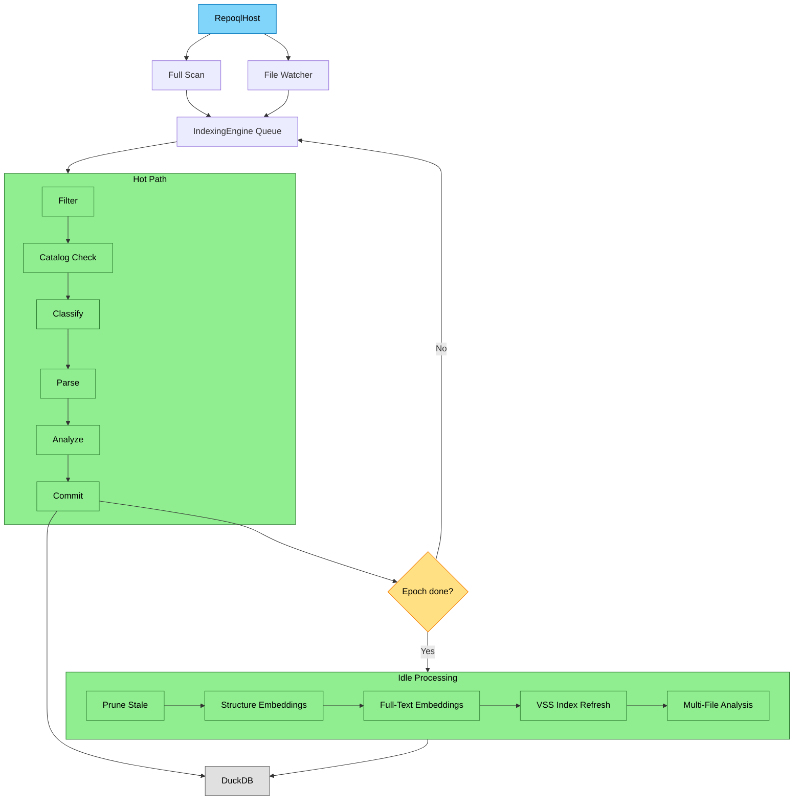
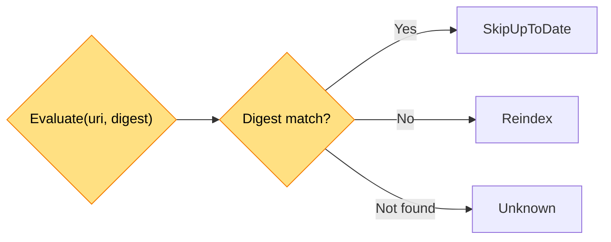

# Indexing System

> **Scope**: How RepoQL transforms repository files into a queryable graph database.

---

## Capsule: IndexingCore

**Invariant**
Files flow through staged pipelines: Discover → Classify → Parse → Analyze → Commit. Incremental via digest-based change detection. Epoch batching coordinates idle processing.

**Example**
```
File changed → Enqueue
  → Catalog check (digest match? skip)
  → Classify (determine media type)
  → Parse (materialize graph)
  → Analyze (lint/validate)
  → Commit (persist to DuckDB)
  → Epoch complete? → Idle processing (prune, embed, rebuild)
```

**Depth**
- Hot path: N workers process files concurrently through stages
- Idle path: Runs when epoch drains (pruning, embeddings, analysis)
- Single-writer: All DuckDB writes via `DuckDbDataStore` (thread-safe)
- Catalog: In-memory digest cache prevents redundant work

---

## Architecture



---

## Critical Constraints

### Capsule: IndexingConstraints

**Invariant**
Single-writer for DuckDB. Catalog updates only via OnCommitted. Epochs never reused. Pruner runs before embeddings.

**Example**
```csharp
// WRONG: Parallel writes corrupt database
Parallel.ForEach(items, item => db.Write(item));

// RIGHT: All writes through single-writer
await _committer.CommitAsync(batch, cancellationToken);
```

**Depth**
- Single-writer: `DuckDbDataStore` enforces via `ReaderWriterLockSlim`
- Catalog timing: Update only after DB commit succeeds (consistency)
- Epoch monotonic: Reuse would break idle coordination
- Prune-first: Embedding stale documents wastes compute

---

## Key Components

### RepoqlHost

**Location**: `src/Indexing/RepoQL.Indexing/Hosting/RepoqlHost.cs`

BackgroundService that discovers and watches files.

**Responsibilities**:
1. Full scan on startup (`EnqueueFullScanAsync`)
2. File system watching (`StartWatcherAsync`)
3. Dirty scan on watcher overflow
4. Enqueue artifacts to `IndexingEngine`

**Configuration**:
| Option | Default | Description |
|--------|---------|-------------|
| `RunFullScanOnStartup` | `true` | Enumerate all files at start |
| `EnableWatching` | `true` | Watch for changes |
| `WatcherQueueCapacity` | 10,000 | Buffer overflow triggers dirty scan |

### IndexingEngine

**Location**: `src/Indexing/RepoQL.Indexing/Indexing/IndexingEngine.cs`

Core pipeline orchestrator using flow object pattern.

**Threading**:
| Path | Workers | Purpose |
|------|---------|---------|
| Hot path | `ProcessorCount × 2` | Classification → Parsing → Analysis → Commit |
| Idle processing | 1 | Pruning, embeddings |
| Analysis queue | `ProcessorCount` | Multi-file analysis, index rebuild |

### IndexItem (Flow Object)

**Location**: `src/Indexing/RepoQL.Indexing/Indexing/Pipelines/IndexItem.cs`

Mutable object carrying state through pipeline stages.

```csharp
public sealed class IndexItem
{
    public RawArtifact RawArtifact { get; }      // Raw file info
    public RepoUri Uri { get; }                  // Unique identifier
    public SemanticMediaType? MediaType { get; set; }  // Set by classifier
    public string? DigestHex { get; set; }       // xxHash64 for change detection
    public Records? Records { get; set; }        // Graph structure from parser
    internal long Epoch { get; }                 // Batch coordination
}
```

### DocumentCatalog

**Location**: `src/Indexing/RepoQL.Indexing/Indexing/State/DocumentCatalog.cs`

In-memory digest cache for incremental indexing.



---

## Pipeline Stages

### Hot Path

Each item flows sequentially through stages on one worker.

1. **Filter**: Check `.gitignore` patterns, skip excluded files
2. **Catalog Check**: Compute digest, query catalog, skip if unchanged
3. **Classification**: Determine semantic media type via format classifiers
4. **Parsing**: Materialize graph structure (Artifacts, Nodes, Spans, Edges)
5. **Single-File Analysis**: Validate/lint, add annotations
6. **Commit**: Batch items (64 items or 100ms), persist to DuckDB

### Idle Processing

Triggered when epoch's pending count reaches zero.

1. **Prune**: Delete stale documents (no longer in file system)
2. **Structure Embeddings**: Generate embeddings for `headline + structure`
3. **Full-Text Embeddings**: Refresh embeddings for changed documents
4. **VSS Index Refresh**: Rebuild in-memory HNSW indexes
5. **Multi-File Analysis**: Cross-file validation (enqueued to analysis queue)

---

## Epoch System

### Capsule: EpochBatching

**Invariant**
Items enqueued together share an epoch. When epoch's pending count reaches zero and all stages idle, idle processing triggers.

**Example**
```csharp
var epoch = epochTracker.BeginNewEpoch();  // Increment counter
EnqueueItem(item);                          // Stamps epoch, increments pending
// ... item completes hot path ...
epochTracker.Decrement(epoch);              // If pending==0 && AllIdle → trigger idle
```

**Depth**
- Epochs monotonically increasing (never reused)
- `EpochTracker.Decrement()` returns true when epoch fully drained
- Late arrivals after epoch release trigger re-enqueue via `EnqueueIdleEpoch()`
- Idle processing runs sequentially per epoch

---

## Embedding Generation

### Capsule: EmbeddingModes

**Invariant**
Three modes: Disabled (none), StructureOnly (headline + structure), Full (structure + content chunks).

**Example**
```csharp
// Structure embedding payload
var payload = $"{relativePath}\n\n{headline}\n\n{structure}";
// → "src/Auth.cs\n\nAuthService.cs | class\n\nnamespace RepoQL.Auth..."

// Written to document_embedding table with type='structure'
```

**Depth**
- Structure embeddings: Fast path for immediate search
- Full-text embeddings: Chunked content for deeper semantic search
- VSS refresh: Rebuild HNSW indexes after embedding changes
- Batch size: 100 items per embedding batch

**Location**: `src/Indexing/RepoQL.Indexing/Indexing/PostProcessing/VectorIndexCoordinator.cs`

---

## Format Processors

### Capsule: ProcessorPipeline

**Invariant**
Classifiers determine media type, parsers materialize graph structure, analyzers add annotations. Each calls `next()` for unhandled files.

**Example**
```csharp
// Classifier
if (provisionalType?.Type != "application/yaml")
    return await next(item);  // Not my type, delegate
return (SemanticMediaType.Parse("application/yaml;kind=yaml.doc"), PipelineResult.Success);

// Parser
if (!ShouldHandle(item.MediaType))
    return await next(item);
var records = Parse(item);
return (records, PipelineResult.Success);
```

**Depth**
- Provisional media type computed from file extension
- Classifiers refine by adding `kind` parameter
- Parsers create: Artifacts (file-level), Nodes (symbols), Spans (positions), Edges (relationships)
- Analyzers emit Annotations (lint warnings, errors)

### Supported Formats

| Format | Project |
|--------|---------|
| Markdown | `RepoQL.Formats.Markdown` |
| C# | `RepoQL.Formats.CSharp` |
| TypeScript | `RepoQL.Formats.TypeScript` |
| GraphQL | `RepoQL.Formats.GraphQL` |
| Mermaid | `RepoQL.Formats.Mermaid` |
| Terraform | `RepoQL.Formats.Terraform` |
| PHP | `RepoQL.Formats.PHP` |
| CSS/SCSS | `RepoQL.Formats.CSS` |
| Excel | `RepoQL.Formats.Xlsx` |
| .csproj/.sln | `RepoQL.Formats.DotNet` |

See `src/Indexing/RepoQL.Indexing/PROCESSOR_GUIDE.md` for adding new formats.

---

## State Tracking

### Capsule: IndexingState

**Invariant**
Fine-grained flags track busy/idle per stage. State counters track concurrent workers, not individual items.

**Example**
```csharp
[Flags]
public enum IndexingState
{
    AllIdle = 0,
    ClassificationBusy = 1,
    ParsingBusy = 4,
    SingleFileAnalysisBusy = 16,
    MultiFileAnalysisBusy = 64,
    IndexRebuildBusy = 256,
    Started = 1024
}

// Wait for specific state
await engine.WaitForAsync(IndexingState.AllIdle, cancellationToken);
```

**Depth**
- Each stage has Busy/Idle flag pair
- StateChanged event fires on every transition
- `WaitForIdleAsync()` waits for full quiescence
- Counters track how many workers in each stage (not which items)

---

## Configuration

| Component | Option | Default |
|-----------|--------|---------|
| RepoqlHost | `RunFullScanOnStartup` | `true` |
| RepoqlHost | `EnableWatching` | `true` |
| RepoqlHost | `WatcherQueueCapacity` | 10,000 |
| IndexingEngine | `IndexingWorkers` | `ProcessorCount × 2` |
| IndexingEngine | `AnalysisWorkers` | `ProcessorCount` |
| IndexingEngine | `IndexingQueueSize` | 10,000 |
| VectorCoordinator | `REPOQL_EMBED_CONCURRENCY` | 2 |

---

## Key Locations

| Component | File |
|-----------|------|
| Host | `src/Indexing/RepoQL.Indexing/Hosting/RepoqlHost.cs` |
| Engine | `src/Indexing/RepoQL.Indexing/Indexing/IndexingEngine.cs` |
| IndexItem | `src/Indexing/RepoQL.Indexing/Indexing/Pipelines/IndexItem.cs` |
| Catalog | `src/Indexing/RepoQL.Indexing/Indexing/State/DocumentCatalog.cs` |
| VectorCoordinator | `src/Indexing/RepoQL.Indexing/Indexing/PostProcessing/VectorIndexCoordinator.cs` |
| Committer | `src/Indexing/RepoQL.Indexing/Indexing/Commit/IndexingCommitter.cs` |

---

## See Also

- `docs/flows/indexing.md` — Flow diagram and constraints
- `src/Indexing/RepoQL.Indexing/PROCESSOR_GUIDE.md` — Adding new formats
- `docs/XRay.md` — Producing x-ray content (headline/summary/structure)
- `docs/current-state/search.md` — How search uses the indexed data
