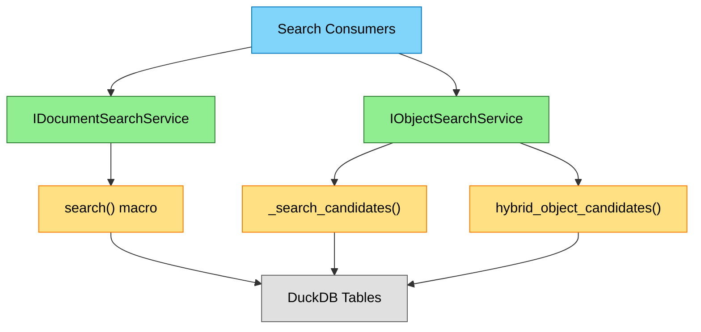
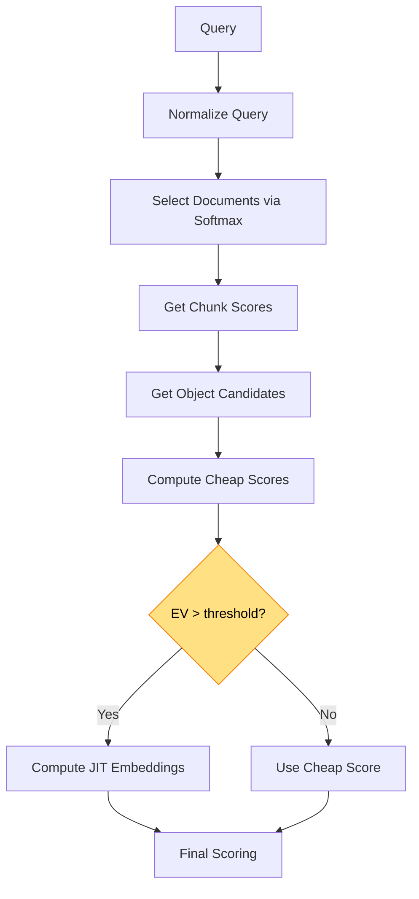

# Search Infrastructure

> **Scope**: How RepoQL finds documents and objects. Used by explore, read, and SQL queries.

---

## Capsule: SearchLayers

**Invariant**
Two granularities: DocumentSearch finds files, ObjectSearch finds symbols within files. Both use hybrid semantic+lexical retrieval.

**Example**
```sql
-- Document level
SELECT * FROM search('authentication', k := 10);

-- Object level (symbols within documents)
SELECT * FROM _search_candidates('ValidateToken', k := 50) WHERE scope = 'object';
```

**Depth**
- DocumentSearch: Returns files with headlines, structures, scores
- ObjectSearch: Returns symbols with line positions, snippets
- JitObjectSearch: Computes embeddings at query time for higher accuracy
- All three compose: explore uses Document → Object → JIT pipeline

---

## Architecture



---

## Document Search

### Capsule: DocumentSearchModes

**Invariant**
Three modes: semantic search (question provided), scope-only (glob filter), or default (docs first, then by mtime).

**Example**
```sql
-- Mode 1: Semantic (question provided)
SELECT * FROM search('authentication flow', k := 20);

-- Mode 2: Scope-only (no question)
SELECT * FROM Files WHERE matches_glob(uri, 'file:///src/**/*.cs', TRUE, 'file:///');

-- Mode 3: Default (no question, no scope)
SELECT * FROM Files ORDER BY CASE WHEN uri LIKE 'help://%' THEN 0 ELSE 1 END, mtime DESC;
```

**Depth**
- Semantic mode uses `search()` macro (hybrid semantic + BM25)
- Scope-only returns files matching glob, ordered by modification time
- Default prioritizes: embedded docs → READMEs → doc folders → rest by mtime

### Interface

**Location**: `src/RepoQL.Xray/Search/IDocumentSearchService.cs`

```csharp
public interface IDocumentSearchService
{
    Task<DocumentSearchResult> SearchAsync(
        string? scope,      // Glob pattern
        string? question,   // Search query
        int limit,          // Max results
        CancellationToken cancellationToken);
}

public record DocumentMatch(
    string Uri, string? Headline, string? Structure,
    string? Snippet, string? Lang, string? SemanticType, double Score);
```

---

## Object Search

### Capsule: ObjectSearchStrategy

**Invariant**
Two-phase: embedding search first, position fallback for gaps. Groups results by parent document.

**Example**
```csharp
// Phase 1: Embedding search
var embedded = await _search_candidates(question, k := limit);

// Phase 2: Fill gaps with position-based selection
var remaining = documentsNeedingMore.SelectMany(d =>
    GetObjectsByPosition(d.Uri, needed: objectsPerDocument - d.Count));
```

**Depth**
- Phase 1 uses `_search_candidates()` for semantic matching
- Phase 2 fills documents where embedding search returned fewer than requested
- Position fallback orders by line number (top-of-file bias)
- Results partitioned by `ROW_NUMBER() OVER (PARTITION BY document_uri)`

### Interface

**Location**: `src/RepoQL.Xray/Search/IObjectSearchService.cs`

```csharp
public interface IObjectSearchService
{
    Task<IReadOnlyList<ObjectMatch>> SearchInDocumentsAsync(
        IReadOnlyList<string> documentUris,
        string? question,
        int objectsPerDocument,
        CancellationToken cancellationToken);
}
```

---

## JIT Object Search

### Capsule: JitEmbeddingStrategy

**Invariant**
Compute embeddings at query time only for candidates where expected value exceeds threshold. Three-tier cache: persistent → session → fresh.

**Example**
```csharp
// Expected value determines which candidates get embeddings
var ev = uncertainty * impact * semanticBonus;
if (ev >= 0.15) computeEmbedding(candidate);

// Cache hierarchy
embedding = persistent[uri] ?? sessionCache[uri] ?? computeFresh(uri);
```

**Depth**
- Uncertainty: `1.0 - (cheapScore / maxCheapScore)` — unsure candidates benefit more
- Impact: `1.0 / sqrt(rank)` — top candidates matter more
- SemanticBonus: 1.5x for high chunk overlap + low name hit
- Threshold: 0.12-0.15 depending on intent
- Fresh embeddings persisted fire-and-forget for future searches

**Location**: `src/RepoQL.ConsoleApp/Search/JitObjectSearchService.cs`

### Algorithm



### Query Normalization

Detects intent from query structure:

| Signal | Intent | Temperature |
|--------|--------|-------------|
| PascalCase, dots, `::` | Symbol | 0.3 (focused) |
| Question words, multi-word | Semantic | 0.7 (broader) |
| Mixed | Hybrid | 0.5 |

### Document Selection

Uses softmax probability selection:

```csharp
var prob = Math.Exp((score - maxScore) / temperature) / sumExp;
```

Selects until:
- Cumulative probability ≥ `MinProbabilityMass` (0.75-0.90), OR
- `MaxDocumentsToExpand` reached (10-15)
- Always includes `MinDocumentsToExpand` (2-3)

### Cheap Aggregate Scoring

Combines signals without embeddings:

```csharp
cheapScore = weights.NameHit * nameHitScore
           + weights.ChunkOverlap * chunkOverlapScore
           + weights.RegexHit * Math.Min(1.0, regexHitScore)
           + weights.TypePrior * (typePriorScore - 1.0);
```

### JIT Embedding Planning

```csharp
// Only embed candidates where it might change ranking
candidate.Uncertainty = 1.0 - (cheapScore / maxCheapScore);
candidate.ExpectedImpact = 1.0 / Math.Sqrt(rank);
var bonus = (chunkOverlap > 0.5 && nameHit < 0.3) ? 1.5 : 1.0;
candidate.ExpectedValue = Uncertainty * Impact * bonus;

if (ExpectedValue >= threshold) scheduleForEmbedding(candidate);
```

### Three-Tier Cache

1. **Persistent**: `document_embedding` table (survives sessions)
2. **Session**: `JitEmbeddingCache` (dedupe within request)
3. **Fresh**: Local ONNX computation → persisted fire-and-forget

---

## SQL Macros

### Capsule: SearchMacros

**Invariant**
`search()` finds documents, `_search_candidates()` finds raw candidates, `hybrid_object_candidates()` adds name/regex scoring.

**Example**
```sql
-- Documents
SELECT uri, score FROM search('auth', k := 10);

-- Raw candidates (docs + objects)
SELECT uri, kind FROM _search_candidates('Token', k := 50) WHERE scope = 'object';

-- Objects with scoring
SELECT uri, name_hit_score FROM hybrid_object_candidates(
    ARRAY['file:///src/Auth.cs'], keywords := 'validate', max_per_doc := 20);
```

**Depth**
| Macro | Returns | Use When |
|-------|---------|----------|
| `search()` | Documents with scores | Finding relevant files |
| `_search_candidates()` | Raw candidates | Need both docs and objects |
| `hybrid_object_candidates()` | Objects with name/regex scores | Need scoring signals |
| `matches_glob()` | Boolean | Filtering by path pattern |

---

## Post-Processing

### ChunkProximityBooster

**Location**: `src/RepoQL.Xray/Search/ChunkProximityBooster.cs`

Boosts objects overlapping high-scoring document chunks:

```csharp
var overlap = CalculateOverlap(object.LineStart, object.LineEnd, chunk.StartLine, chunk.EndLine);
object.Score += overlap * chunk.Score * boostFactor;
```

### PatternBooster

**Location**: `src/RepoQL.Xray/Search/PatternBooster.cs`

Applies regex boost/penalize patterns:

```csharp
// Boost: multiply score for matches
if (boostPattern.IsMatch(result.Uri)) result.Score *= 1.5;

// Penalize: reduce score (doesn't exclude)
if (penalizePattern.IsMatch(result.Uri)) result.Score *= 0.5;
```

### ConfidenceNormalizer

**Location**: `src/RepoQL.Xray/Search/ConfidenceNormalizer.cs`

Scales raw scores to 1-100 confidence range for display.

### FileGrouper

**Location**: `src/RepoQL.Xray/Search/FileGrouper.cs`

Groups objects under parent documents. First 3 objects per file get snippets, rest get headlines only.

---

## Configuration

| Aspect | Setting | Default |
|--------|---------|---------|
| Document search limit | `k` parameter | 20 |
| Objects per document | `objectsPerDocument` | 5-8 |
| JIT embedding threshold | `JitEmbeddingThreshold` | 0.12-0.15 |
| Max JIT embeddings | `MaxJitEmbeddings` | 30-40 |
| Softmax temperature | Intent-dependent | 0.3-0.7 |

---

## See Also

- `docs/current-state/xray.md` — Explore tool that uses this search infrastructure
- `docs/current-state/indexing.md` — How files become searchable
- `docs/XRay.md` — Producing x-ray content (headline/summary/structure)
