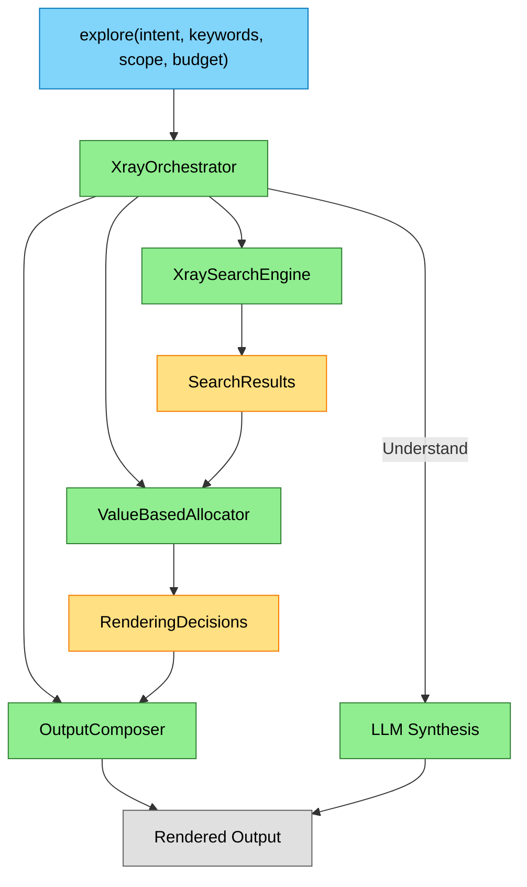

# Explore Tool

> **Scope**: Token-budgeted codebase exploration. Orchestrates search and renders results within a token budget.

---

## Capsule: ExploreCore

**Invariant**
Given query + budget, explore searches → allocates tokens across results → renders at appropriate detail levels. Intent determines behavior.

**Example**
```sql
-- Explore: inventory what exists
SELECT * FROM explore('file:///src/**', 'Explore', 1500);

-- Find: locate specific code
SELECT * FROM explore('authentication', 'Find', 2000);

-- Examine: deep structure
SELECT * FROM explore('file:///src/Auth.cs', 'Examine', 3000, keywords := 'validate');

-- Understand: LLM synthesis
SELECT * FROM explore('How does JWT validation work?', 'Understand', 2500);
```

**Depth**
- Explore: Breadth-first inventory, no keywords required
- Find: Ranked results with snippets, keywords required
- Examine: Deep structure with line numbers, scope recommended
- Understand: LLM-synthesized answer with citations, requires LLM provider

---

## Architecture



---

## Intents

### Capsule: IntentBehavior

**Invariant**
Intent determines: keywords requirement, max children per file, allocation modifier, and whether LLM synthesis runs.

**Example**
| Intent | Keywords | MaxChildren | Modifier | LLM |
|--------|----------|-------------|----------|-----|
| Explore | Optional | 3 | 0.8 | No |
| Find | Required | 5 | 1.0 | No |
| Examine | Optional | 8 | 1.2 | No |
| Understand | Required | 6 | 1.1 | Yes |

**Depth**
- Explore flattens distribution (modifier 0.8) for breadth
- Examine concentrates on top results (modifier 1.2) for depth
- Find/Understand balance breadth and depth
- Minimal representation only allowed for Explore

---

## Token Allocation

### Capsule: TwoLevelAllocation

**Invariant**
Level 1: Files compete for budget based on expected value. Level 2: Items within each file compete for representation level.

**Example**
```
Budget: 2000 tokens
├─ File A (EV=0.9): 900 tokens
│   ├─ Document: Standard (150 tok)
│   ├─ Method1: Rich (300 tok)
│   └─ Method2: Compact (50 tok)
├─ File B (EV=0.6): 600 tokens
│   ├─ Document: Standard (150 tok)
│   └─ Class1: Standard (100 tok)
└─ File C (EV=0.3): 500 tokens
    └─ Document: Compact (50 tok)
```

**Depth**
- File EV = max(fileConfidence, bestChildConfidence) × intentModifier
- Proportional allocation: `fileBudget = totalBudget × (fileEV / sumEV)`
- Drop lowest-EV files if minimum costs exceed budget
- Upgrade pass uses remaining budget to improve representations

**Location**: `src/RepoQL.Xray/ValueBasedAllocator.cs`

### Allocation Flow

1. Calculate file-level expected values
2. Allocate budget proportionally to files
3. Drop lowest-EV files if over budget
4. For each file: allocate among file + children
5. Pick representation level that fits allocation
6. Upgrade pass: improve stragglers with remaining budget

---

## Representation Levels

### Capsule: RepresentationLevels

**Invariant**
Four levels with increasing token cost: Minimal (headline) → Compact (+URI) → Standard (+structure) → Rich (+snippet).

**Example**
```
Minimal (~10 tok):
  AuthService.cs | class | 450 LOC

Compact (~40 tok):
  93% file:///src/Auth/AuthService.cs
    AuthService.cs | class | 450 LOC

Standard (~150 tok):
  93% file:///src/Auth/AuthService.cs
    AuthService.cs | class | 450 LOC
    namespace RepoQL.Auth
      public class AuthService : IAuthService
        +ValidateCredentials(string, string) → Task<AuthResult>

Rich (~300 tok):
  93% [csharp.method] file:///src/Auth.cs#line=42,60&symbol=ValidateCredentials
  ```csharp
  public async Task<AuthResult> ValidateCredentials(string user, string pass)
  {
      // implementation
  }
  ```
```

**Depth**
- Token estimates via `XrayTokenEstimator` (heuristic, not actual tokenization)
- Rich requires snippet content; falls back to Standard if missing
- Minimal only allowed for Explore intent (URI is high-value for other intents)

**Location**: `src/RepoQL.Xray/RepresentationFormatter.cs`

---

## Output Composition

### Capsule: OutputComposition

**Invariant**
Render decisions with proper spacing, add truncation summary for omitted items, append status footer.

**Example**
```
 95% file:///src/Auth/AuthService.cs
  AuthService.cs | class AuthService | 1250 tokens
   78% [csharp.method] file:///src/Auth/AuthService.cs#line=42,80
    ValidateCredentials(string, string) → Task<AuthResult>

 82% file:///src/Auth/TokenService.cs
  TokenService.cs | class TokenService | 890 tokens

[More: 5 docs, 12 symbols (8x csharp.method, 4x csharp.class)]

[1.8k tok | 1.1s | index: ready | semantic: ready]
```

**Depth**
- Blank lines between multi-line items for readability
- Truncation summary groups omitted items by kind
- Status footer shows tokens used, latency, index status
- Indentation reflects parent-child hierarchy

**Location**: `src/RepoQL.Xray/OutputComposer.cs`

---

## Understand Intent

### Capsule: UnderstandFlow

**Invariant**
Extract keywords → search → expand to 50k tokens → LLM synthesizes answer with citations.

**Example**
```markdown
## Understanding: How does authentication work?

The authentication system uses JWT tokens:

1. User submits credentials to `/api/auth/login`
   (file:///src/Auth/AuthController.cs#line=42,60)

2. `AuthService.ValidateCredentials()` checks the user store
   (file:///src/Auth/AuthService.cs#line=85,120)

3. On success, `TokenService.GenerateToken()` creates a JWT
   (file:///src/Auth/TokenService.cs#line=30,55)

[2.1k tok | 1.2s | index: ready | semantic: ready]
```

**Depth**
- Requires LLM provider (OPENROUTER_API_KEY)
- Minimum budget auto-scaled to 3000 tokens
- Keywords extracted via LLM before search
- Citations as `file:///path#line=N,M` for verification
- Falls back to Examine if LLM unavailable

---

## Data Types

### XrayQuery

```csharp
public record XrayQuery(
    int TokenBudget,
    Intent Intent,
    string? Scope,       // Glob pattern
    string? Keywords,    // Search query
    string? Boost,       // Regex patterns to boost
    string? Penalize,    // Regex patterns to penalize
    int? Limit);
```

### XrayResult

```csharp
public record XrayResult(
    string Uri,
    int Confidence,                              // 1-100
    string? Kind,                                // null for docs, "class"/"method" for objects
    string? Headline,
    string? Structure,
    string? Snippet,
    string? Lang,
    string? SemanticType,
    IReadOnlyList<XrayResult>? ChildObjects);
```

### RenderingDecision

```csharp
public record RenderingDecision(
    XrayResult Result,
    Representation Level,                        // Minimal/Compact/Standard/Rich
    int EstimatedTokens,
    IReadOnlyList<RenderingDecision>? ChildDecisions,
    int OmittedChildrenCount);
```

---

## Key Locations

| Component | File |
|-----------|------|
| Orchestrator | `src/RepoQL.Xray/XrayOrchestrator.cs` |
| Allocator | `src/RepoQL.Xray/ValueBasedAllocator.cs` |
| Composer | `src/RepoQL.Xray/OutputComposer.cs` |
| Formatter | `src/RepoQL.Xray/RepresentationFormatter.cs` |
| Estimator | `src/RepoQL.Xray/XrayTokenEstimator.cs` |
| UDF | `src/RepoQL.Data.DuckDB/UdfImplementations/XrayUdf.cs` |

---

## See Also

- `docs/current-state/search.md` — Search infrastructure used by explore
- `docs/current-state/indexing.md` — How files become searchable
- `src/RepoQL.Documentation/repoql/tools/explore/using-xray.md` — User-facing documentation
