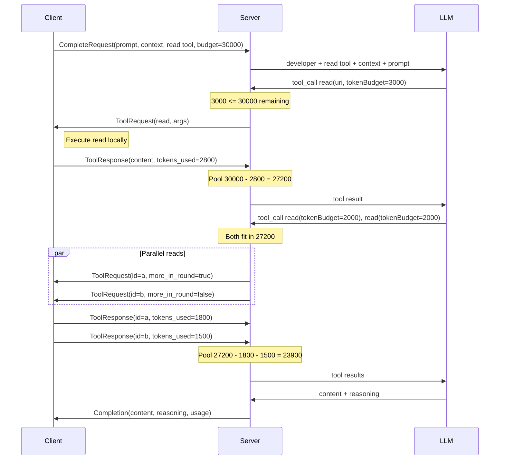

# Inference Service Design

> See [North Star](../../north-star/inference-service.md) for what great looks like.
> See [Flows](../../flows/future/inference-service/) for how the two RPCs work end-to-end.

## Context

RepoQL already has LLM-powered features (explain, query summarization) using OpenRouter. These run through the host's `ILlmProvider` — one HTTP call per LLM turn, tool results fed back in a loop. This works but ties LLM inference to the host process and a single provider.

A cloud inference service decouples LLM access from the host. The server handles the LLM API mechanics (auth, tool loop, model selection). The client sends a prompt with intent-level knobs, executes any tool calls the LLM makes, and receives one response. The client never picks a model — the server maps intent to implementation.

**Initial provider:** Grok 4.1 Fast (xAI) via the gRPC Chat API (`api.x.ai:443`). Generated C# client from published protos at [`xai-org/xai-proto`](https://github.com/xai-org/xai-proto). See [research/grok-4-1-fast.md](../research/grok-4-1-fast.md) for API details and pricing.

**Shares with embedding service:** Auth pattern (Bearer → SHA-256 hash), deploy workflow structure, WIF SA, infrastructure conventions.

## Constraints

- **Single turn** — one prompt, one response. No conversation history, no continuation. The server builds a fresh LLM context per request
- **Client conveys intent, not implementation** — the client says how hard to think, not which model. The server maps effort to model, temperature, and provider. Server-side evolution without client changes
- **Client-side tool execution** — the client has the data (RepoQL graph, indexed files). The server has the LLM. Tool calls cross the wire: server requests, client executes, client returns results
- **Read tool only** — the LLM gets `read` with the same description Claude sees. Not `explore` (client does that locally before calling), not `query` (too complex to learn on the fly), not `explain` (inference service replaces explain's LLM layer). Tool calls are for follow-up reads after the client provides broad context
- **tool_token_budget is a contract** — server-enforced cap on total tokens consumed by tool results. Pre-dispatch: the server rejects tool calls whose requested `tokenBudget` exceeds the remaining pool. The LLM never overspends
- **max_tokens is soft** — guidance to the LLM for response length, not a hard server-side cutoff
- **max_rounds is hard** — server-enforced safety limit on the tool loop. Prevents runaway tool chains
- **No data retention** — the server stores nothing. The gRPC Chat API is stateless by default (no `previous_response_id` continuation). Each stream is ephemeral

---

## The gRPC API

```protobuf
syntax = "proto3";

package repoql.inference.v1;

option csharp_namespace = "RepoQL.Inference";

// LLM inference with client-side tool execution.
//
// Two RPCs: Complete for simple prompt→response, CompleteWithTools
// for the bidirectional tool loop. Use Complete when you don't
// need tools — simpler failure modes, standard unary semantics.
service InferenceService {
  // Simple completion. No tools, no streaming.
  // Send a prompt, receive a response.
  rpc Complete(CompleteRequest) returns (Completion);

  // Completion with tool use. Bidirectional streaming.
  //
  // Stream state machine:
  //   Client sends: exactly one CompleteRequest
  //   Server sends: zero or more ToolRequests (possibly parallel within a round)
  //   Client sends: one ToolResponse per ToolRequest (matching call_id)
  //   ... (tool rounds repeat until LLM stops or limits hit)
  //   Server sends: exactly one Completion (terminal)
  //
  // On error: server closes stream with a gRPC status code.
  rpc CompleteWithTools(stream ClientMessage) returns (stream ServerMessage);
}

// ─── Client → Server ──────────────────────────────────────────────

message ClientMessage {
  oneof message {
    // First message on the stream. Exactly one required.
    CompleteRequest request = 1;

    // Tool execution result. Sent in response to a ToolRequest.
    ToolResponse tool_response = 2;
  }
}

message CompleteRequest {
  // The question or instruction.
  string prompt = 1;

  // Pre-gathered context (e.g., explore results). Placed between
  // system and prompt in the LLM context. Separating context from
  // prompt lets the server structure the LLM input cleanly and
  // maximizes prompt cache hits (system + tools stay stable).
  string context = 2;

  // System prompt. Placed first in the LLM context.
  string system = 3;

  // How hard to think. The server maps this to model selection,
  // temperature, and provider-specific settings. The client never
  // picks a model — intent in, implementation out.
  Effort effort = 4;

  // Guidance for response length. The LLM should aim for this
  // but the server will not truncate. 0 = no guidance.
  int32 max_tokens = 5;

  // Tools the LLM can call. Currently: read only.
  // Same name, same description that MCP/CLI consumers see.
  // Only used with CompleteWithTools.
  repeated ToolDefinition tools = 6;

  // Maximum tool rounds before the server forces a final response.
  // A round is one LLM turn that produces tool calls.
  // 0 = server default. Only used with CompleteWithTools.
  int32 max_rounds = 7;

  // Total token budget for tool results. The server enforces this
  // pre-dispatch: if a tool call's requested tokenBudget exceeds
  // the remaining pool, the call is rejected and the LLM is told
  // to answer with what it has. 0 = no tools (even if tools are
  // defined). Only used with CompleteWithTools.
  int32 tool_token_budget = 8;
}

// How hard to think. The server maps these to models and settings.
// This decouples the client from provider details — adding a new
// model or switching providers requires no client changes.
//
// Unknown values from newer clients fall back to EFFORT_UNSPECIFIED
// (proto3 default), which maps to EFFORT_BALANCED.
enum Effort {
  // Server default (currently maps to EFFORT_BALANCED).
  EFFORT_UNSPECIFIED = 0;

  // Fast, non-reasoning. Best for extraction, formatting,
  // deterministic tool paths. Low latency, low cost.
  EFFORT_LOW = 1;

  // Balanced. Good for most questions with tool use.
  // Non-reasoning model, moderate temperature.
  EFFORT_BALANCED = 2;

  // Deep reasoning. Thinking tokens, multi-step planning.
  // Best for ambiguous questions, complex analysis.
  EFFORT_HIGH = 3;
}

// ─── Tool Definitions ─────────────────────────────────────────────

// Client-provided tool definition. Passed through from the host's
// tool registry — same names, descriptions, and schemas that
// MCP/CLI consumers see.
message ToolDefinition {
  // Tool name. Must be unique within the request.
  string name = 1;

  // Human-readable description. Helps the LLM decide when to use it.
  string description = 2;

  // JSON Schema for the tool's parameters.
  string parameters_json = 3;
}

// Client's response to a ToolRequest.
message ToolResponse {
  // Must match the call_id from the ToolRequest.
  string call_id = 1;

  // Tool output. Fed back to the LLM as the tool result.
  string content = 2;

  // If true, the tool call failed. Content is the error message.
  // The LLM sees the error and can adjust its approach.
  bool is_error = 3;

  // Actual tokens in content, as counted by the client.
  // The server deducts this from the remaining tool_token_budget.
  // The client has a tokenizer (via the host) — accurate counts.
  int32 tokens_used = 4;
}

// ─── Server → Client ──────────────────────────────────────────────

message ServerMessage {
  oneof message {
    // The LLM wants to call a tool. The server is waiting
    // for a ToolResponse with the matching call_id.
    ToolRequest tool_request = 1;

    // Final event. Always last on the stream. Contains the
    // complete response, reasoning trace, and usage.
    Completion completion = 10;
  }
}

// Server requesting the client to execute a tool call.
message ToolRequest {
  // Unique identifier for this tool call. The client must
  // include this in the ToolResponse.
  string call_id = 1;

  // Which tool round (1-indexed).
  int32 round = 2;

  // Tool name (matches a ToolDefinition.name from the request).
  string tool = 3;

  // Tool arguments as JSON, as produced by the LLM.
  string arguments_json = 4;

  // True if more ToolRequests follow in this round. False (or
  // absent) means this is the last call in the round — the
  // server will wait for all ToolResponses before continuing.
  bool more_in_round = 5;
}

message Completion {
  // The LLM's response text.
  string content = 1;

  // Reasoning trace (thinking tokens). Not part of the answer —
  // included for explainability. Visible in host console when
  // running standalone, logged for post-hoc analysis. Not sent
  // to the consuming agent. May be empty (e.g., Effort.LOW).
  string reasoning = 2;

  StopReason stop_reason = 3;
  Usage usage = 4;

  // Model actually used (informational — the client didn't pick it).
  string model = 5;
}

enum StopReason {
  STOP_REASON_UNSPECIFIED = 0;
  // Natural end of generation.
  STOP_REASON_STOP = 1;
  // LLM stopped due to max_tokens.
  STOP_REASON_MAX_TOKENS = 2;
  // Hit max_rounds — server forced a final response without tools.
  STOP_REASON_TOOL_LIMIT = 3;
  // Tool token budget exhausted.
  STOP_REASON_TOOL_BUDGET = 4;
}

message Usage {
  int32 input_tokens = 1;
  int32 output_tokens = 2;
  // Tokens consumed by tool results injected into LLM context.
  int32 tool_tokens = 3;
  // Reasoning/thinking tokens.
  int32 thinking_tokens = 4;
}
```

---

## How It Works

### The Flow



The client sends one prompt. The server may loop through multiple tool rounds — each time the LLM requests tools, the server checks budgets, relays to the client, and feeds results back. When the LLM produces content without tool calls, that's the response. One question, some tool work, one answer.

### Budget Enforcement

The server enforces `tool_token_budget` at two points:

**Pre-dispatch** — when the LLM produces a tool call, the server extracts `tokenBudget` from `arguments_json`. If it exceeds the remaining pool, the server does not send the `ToolRequest` to the client. Instead, it tells the LLM the budget is exhausted and how much remains. The LLM must answer from what it has.

**Post-dispatch** — when the client returns a `ToolResponse`, the server deducts `tokens_used` from the remaining pool. The client provides accurate counts (the host has a tokenizer).

For parallel calls in one round: the server evaluates each call sequentially against the remaining pool. If the first call fits but the second doesn't, only the first is relayed. The rejected call is reported to the LLM as a budget error.

`tool_token_budget = 0` means no tools — even if `tools` is populated. To use tools, you must commit a budget.

### Typical Token Economics

A request like `explain` — "answer a question about this codebase with citations":

| Phase | Tokens | Who |
|-------|--------|-----|
| System prompt + tool definitions | ~5k | Client → Server (stable, cached by LLM provider) |
| Context (explore results) | ~30k | Client pre-gathers, sends in `context` field |
| Prompt (the question) | ~100 | Client |
| Tool results (follow-up reads) | ~30k | `tool_token_budget=30000` — LLM decides allocation |
| Response | ~2k | `max_tokens=2000` (soft) |

The `context` field is key. The client does an `explore` locally — broad search, 30k tokens of structure and summaries. The LLM sees the landscape, then uses tools to drill into specific files. Separating `context` from `prompt` also helps prompt caching: system + tool definitions are stable across requests, context varies per question.

### Authentication

Same pattern as the embedding service: Bearer token → SHA-256 hash comparison. The existing `ApiKeyAuthInterceptor` only handles `UnaryServerHandler`. The inference service must extend it to also handle `DuplexStreamingServerHandler` for `CompleteWithTools`. Both RPCs share the same auth logic — extract the token from the `Authorization` metadata, hash it, compare against stored hashes.

---

## Tools

The LLM gets `read` — same name, same core capability as the tool Claude sees via MCP, with one restriction: the `=> question:` modifier is stripped from the forwarded description. The client builds an inference-safe read definition from the host's tool registry.

**Why read only?**

- **`explore`** — the client does this locally before calling the service. The 30k tokens of context in the request *are* the explore results. The LLM doesn't need to search; it needs to drill into what the search already found.
- **`query`** — SQL over the graph is powerful but requires learning the schema, tables, macros, and query patterns. Too complex for a model to use effectively on the fly. If this changes, adding `query` is a client-side change (pass the definition) — no server work.
- **`explain`** — uses an LLM internally. The inference service *is* the explain replacement: the LLM reads via tools and synthesizes directly.

**Why no `=> question:` modifier?** It triggers a local LLM call within the host's read execution. During an inference service tool loop, that LLM call would be invisible to `tool_token_budget` and `Completion.usage` — breaking cost transparency. All other `read` modifiers (`tree`, `history`, `blame`, `lint`, content) are pure data transforms and are fine.

**The description is the tool.** The rich documentation embedded in `read`'s description teaches the LLM to use it effectively — URI addressing, fragment selectors, modifiers, token budgets. The inference-safe variant removes `=> question:` but keeps everything else.

---

## Effort → Model Mapping

The client sends intent; the server picks the implementation. Current mapping (Grok 4.1 Fast):

| Effort | Model | Reasoning | Differentiation |
|--------|-------|-----------|-----------------|
| `EFFORT_LOW` | `grok-4-1-fast-non-reasoning` | No | Lower temperature, tighter max_tokens defaults. For extraction and formatting. |
| `EFFORT_BALANCED` | `grok-4-1-fast-non-reasoning` | No | Moderate temperature. Default for most questions with tool use. |
| `EFFORT_HIGH` | `grok-4-1-fast-reasoning` | Yes (thinking tokens) | Multi-step planning. For ambiguous questions, complex analysis. |

This mapping is server-side configuration. Adding a new provider or swapping models requires no client changes — the `Effort` enum is the contract. `Completion.model` reports what was actually used (informational only).

Unknown `Effort` values from newer clients fall back to `EFFORT_UNSPECIFIED` (proto3 default) → `EFFORT_BALANCED`.

---

## Client Usage

### Simple completion (unary, no tools)

```python
response = client.Complete(CompleteRequest(
    prompt="Summarize this diff",
    context=diff_text,
    effort=EFFORT_LOW,
    max_tokens=500
))
print(response.content)
```

### Code question with tools (bidi)

```python
tools = [host.get_tool_definition("read")]  # read only
context = host.explore(keywords="token refresh", tokenBudget=30000)

stream = client.CompleteWithTools()
stream.send(CompleteRequest(
    prompt="How does token refresh work?",
    context=context,
    system="Answer questions about this codebase with citations.",
    effort=EFFORT_HIGH,
    tools=tools,
    max_rounds=5,
    tool_token_budget=30000
))
for event in stream:
    if event.tool_request:
        result = host.execute_tool(
            event.tool_request.tool,
            event.tool_request.arguments_json
        )
        stream.send(ToolResponse(
            call_id=event.tool_request.call_id,
            content=result,
            tokens_used=host.count_tokens(result)
        ))
    if event.completion:
        answer = event.completion.content
        log.info(event.completion.reasoning)  # visible in host console
        break
```

---

## Trade-offs

| Chose | Over | Because |
|-------|------|---------|
| Single turn (prompt, not conversation) | Multi-turn conversation history | Simpler contract. No state to manage. No data retention. Each request is self-contained. |
| Effort enum (intent) | Model string (implementation) | Client doesn't know or care about models. Server-side evolution without client changes. |
| Two RPCs (unary + bidi) | Single bidi for everything | Pure completion is common and trivial. Unary has simpler failure modes, standard auth interceptors, better load balancer compatibility. Bidi reserved for the complex case. |
| Pre-dispatch budget enforcement | Post-hoc accounting | The server rejects tool calls before they execute, not after. No overspend. Budget is a contract. |
| Client-reported `tokens_used` | Server-side token counting | The client (host) has a tokenizer. The server stays a relay — it doesn't need a tokenizer dependency. |
| `tool_token_budget = 0` means no tools | 0 means unlimited | Explicit opt-in. Using tools on a paid service requires committing a budget. |
| Read tool only | All host tools (explore, read, query) | `explore` is done locally before calling — the context field carries the results. `query` requires learning the schema per-request — too complex. `explain` is circular. Read is the follow-up tool: the LLM sees the landscape in context, drills into specific files. Adding tools later is a client-side change — pass the definition. |
| Soft max_tokens | Hard enforcement | The LLM should aim for the budget. Truncating mid-thought produces worse output than a slightly long response. |
| Hard max_rounds | Soft guidance | Unbounded tool loops are a real risk. Safety limit, not a quality knob. |
| No data retention (store: false) | Provider-side conversation state | Privacy. Simplicity. No stale state. |
| Complete response (no deltas) | Streaming content/thinking deltas | Client is a machine, not a UI. One `Completion` with content + reasoning is simpler than accumulating deltas. Streaming can be added later (backwards-compatible, field numbers 2-9 reserved in `ServerMessage`). |
| Reasoning in Completion | Omit or stream separately | Explainability. Visible in host console when running standalone, logged for post-hoc analysis. |
| OTel for correlation | Proto `request_id` field | gRPC propagates trace/span IDs through metadata. A proto field would duplicate what OTel already provides. |
| `more_in_round` flag | Implicit batch detection | Client knows whether to wait for more `ToolRequest` messages or start executing immediately. |

---

## Alternatives Considered

**REST Responses API instead of gRPC Chat API** — xAI's Responses API (`POST /v1/responses`) has more features: stateful continuation via `previous_response_id`, typed output items, `store: false`. But we're already a gRPC service, and the gRPC Chat API supports all we need (function calling, streaming, reasoning). gRPC-to-gRPC avoids HTTP client dependencies. The Responses API's stateful continuation conflicts with our no-retention design anyway.

**Grok Responses API with `previous_response_id` continuation** — stateful continuation simplifies multi-turn by letting xAI manage conversation state. But `previous_response_id` requires `store: true` (30-day default). We chose explicit conversation management with no data retention.

**Server-streaming + webhook for tool results** — the server streams content and tool requests; the client POSTs tool results to a callback URL. Eliminates bidi streaming complexity but introduces new problems: callback URL management, authentication on callbacks, lost results if the callback fails. Bidi streaming keeps everything in one connection.

**`google.protobuf.Struct` for tool arguments** — instead of `arguments_json` and `parameters_json` as strings. Provides proto-level structure but forces every consumer to use the Struct API, which is verbose in C# and most languages. JSON strings are the lingua franca of LLM tool calling — every provider produces and consumes them. The trade-off: late validation, but the server doesn't validate tool semantics anyway (it's a relay). `tokenBudget` is the one field the server inspects, and extracting one field from JSON is trivial.

**Capabilities bitfield instead of Effort enum** — more granular (e.g., `REASONING | LONG_CONTEXT | TOOL_USE`). But the server is the one that knows which capabilities map to which models. An enum keeps the client's decision simple ("how hard should you think?") and gives the server freedom to map that however it wants. Capabilities can be added later if three levels prove insufficient.

---

## Risks and Mitigations

| Risk | Impact | Mitigation |
|------|--------|------------|
| LLM produces malformed tool call JSON | Tool round stalls | Server parses `arguments_json`; on parse failure, return error to LLM as a tool result ("malformed arguments"), let it retry. Counts as a round. |
| Client disconnects mid-tool-loop | Server blocked waiting for `ToolResponse` | Deadline on `ToolResponse` wait (e.g., 60s). Stream context cancellation propagates. Server closes LLM connection and logs. |
| LLM enters degenerate loop (same tool call repeatedly) | Budget waste | `max_rounds` limits total rounds. Server can detect identical consecutive calls and force a final response. |
| LLM ignores `tokenBudget` parameter | Tool returns more than requested | Not the server's problem — `tokenBudget` is guidance to the RepoQL tool, which respects it. If the tool returns more, `tokens_used` reflects actuals and the pool deducts accordingly. |
| xAI API timeout or rate limiting | Request fails | Server returns gRPC `UNAVAILABLE` with retry-after hint. Caller (host) retries or degrades gracefully (LLM features unavailable). |
| xAI returns malformed response | Server can't parse LLM output | Server returns gRPC `INTERNAL` with details. Logged for investigation. |
| Large tool results accumulate in LLM context | Context window exceeded, high cost | `tool_token_budget` caps total tool tokens. The Grok research notes: "prompt_tokens accumulate across the internal loop... long tool loops + growing context dominate spend." Budget is the control. |
| Prompt injection via tool results | LLM behavior manipulation | Tool results are data in the LLM context, not system instructions. Risk is inherent to tool-using LLMs. Documented, not solvable at the proto level. |
| Auth interceptor doesn't cover bidi streaming | Unauthenticated access to `CompleteWithTools` | Extend `ApiKeyAuthInterceptor` to override `DuplexStreamingServerHandler`. Test both paths. |

---

## Extension Points

- **New providers** — add Anthropic, OpenAI, Gemini behind the same `Effort` mapping. Client unchanged.
- **New effort levels** — add `EFFORT_CRITICAL` for multi-provider consensus, or `EFFORT_DRAFT` for cheapest possible.
- **New tools** — tools added to the host automatically become available. No server changes needed.
- **Content streaming** — add `ContentDelta` to `ServerMessage` (field numbers 2-9 reserved). Backwards-compatible for clients that want to display incremental output.
- **Progress updates** — add a `ProgressUpdate` message to `ServerMessage` (round number, tool call status) to address the "what is it doing?" problem during long tool loops.
- **Structured output** — add `response_format` field for JSON schema constraints.

---

## Related

- [North Star: Inference Service](../../north-star/inference-service.md) — what great looks like
- [Flows: Inference Service](../../flows/future/inference-service/) — tool-use completion and simple completion
- [Plans: Inference Service](../../plans/future/inference-service/) — 01-foundation, 02-tool-loop (implementation scope), 03-host-integration (deferred)
- [Embedding Service Design](../current/cloud-embedding-cache.md) — sibling service, same infrastructure pattern
- [Operations Guide](../current/cloud-embedding-cache-ops.md) — auth, secrets, deploy patterns (reusable for inference)
- [OpenRouterLlmProvider](../../src/RepoQL.LLM.Client/OpenRouterLlmProvider.cs) — existing tool loop implementation (inference service replaces this entirely)
- [embedding.proto](../../src/RepoQL.Embedding.Proto/Protos/embedding.proto) — proto conventions
- [Grok 4.1 Fast Research](../research/grok-4-1-fast.md) — API details and pricing
