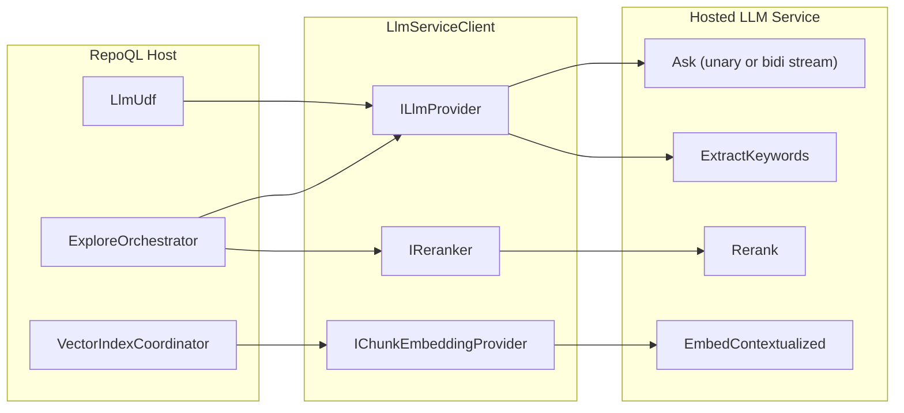
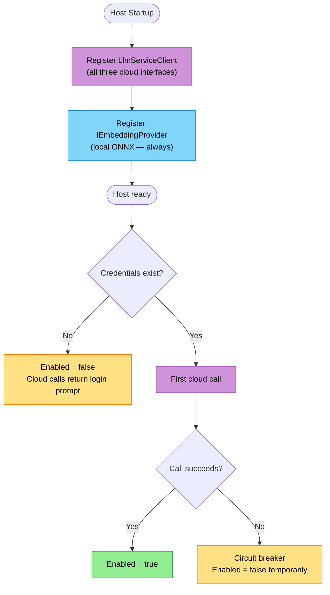

# LLM Service Integration Design

## North Star

Every cloud token returns more value than it costs. Local handles the volume; cloud handles the insight. The host connects to the hosted service and gets explain, reranking, and cloud embedding without any provider keys, model configuration, or infrastructure. When the service is unreachable, everything except those three features works exactly as it does today.

**Informed by:**
- [north-star/llm-service.md](../../north-star/llm-service.md) — what great looks like
- [flows/future/llm-service/](../../flows/future/llm-service/) — explain, reranking, batch-embedding, auth-and-billing, service-lifecycle, failure-modes

## Context

The RepoQL host has clean provider abstractions: `ILlmProvider` for synthesis and `IEmbeddingProvider` for vector generation. Both are registered at startup, toggled by the `OPENROUTER_API_KEY` environment variable. This works for a BYO-key model.

The hosted LLM service changes the model. The host no longer talks to providers directly. It talks to a gRPC service that owns the provider credentials, authenticates via GitHub identity, and enforces billing. Three new capabilities arrive: streaming synthesis (Grok), cross-encoder reranking (Voyage), and contextualized chunk embedding (Voyage). Two of these have no interface today.

This design bridges the gap: how the existing host abstractions evolve to consume the hosted service, how new abstractions are introduced, and how the host degrades gracefully when the service is unavailable.

## Constraints

| Constraint | Source | Impact |
|------------|--------|--------|
| Single writer to DuckDB | Hard constraint | Cloud embeddings stored through `DuckDbDataStore`, same as local |
| Schema frozen | Hard constraint | Cloud embeddings use existing `document_embedding` table with model tag |
| Transport parity | Hard constraint | Everything reachable via MCP must be reachable via CLI and gRPC |
| No BYO keys | North star | Host never holds provider credentials; service owns them |
| Local is foundation | North star | Service down = explain/rerank/cloud-embed unavailable, nothing else changes |
| Budget best-effort | North star | Tell LLM token count; don't truncate |
| `ILlmProvider` is optional | Code (ExploreOrchestrator) | Constructor takes `ILlmProvider?` — null means no LLM |
| `IEmbeddingProvider` is required | Code (VectorIndexCoordinator) | Constructor requires it — local ONNX is always present |
| Embedding spaces incompatible | North star | Local (384 dims) and cloud (1024 dims) never mix |

## Design

### Provider Interfaces

Three interfaces serve the hosted service. One exists and evolves; two are new.

```
ILlmProvider          (exists)  →  synthesis, keyword extraction
IReranker             (new)     →  cross-encoder reranking
IChunkEmbeddingProvider (new)   →  contextualized chunk embedding
```

`IEmbeddingProvider` is unchanged. It remains the local ONNX provider for file-level embedding. Cloud embedding is a different interface because it operates on grouped chunks, not individual texts, and produces vectors in a different space.

#### ILlmProvider — redesign

The interface collapses from four methods to two. `SummarizeAsync` and `ExtractAsync` were the same operation — ask the LLM a question given context — split by whether tools were available. `AskAsync` unifies them: pass tools or don't.

```csharp
public record ToolCall(string Name, string Arguments);
public record AskResult(string Content, string? Reasoning = null);

public interface ILlmProvider
{
    bool Enabled { get; }
    string Model { get; }

    Task<AskResult> AskAsync(
        string context,
        string question,
        int maxTokens = 500,
        bool includeReasoning = false,
        Func<ToolCall, Task<string>>? handleToolCall = null,
        CancellationToken ct = default);

    Task<string> ExtractKeywordsAsync(
        string question,
        CancellationToken ct = default);
}
```

Two methods. `AskAsync` returns `AskResult` — `Reasoning` is null unless requested. No tools, no reasoning = simplest call. Add either or both as needed.

**What changed:**

| Before | After | Why |
|--------|-------|-----|
| `SummarizeAsync(jsonData, intent, maxTokens, repoTree)` | `AskAsync(context, question, maxTokens)` | `repoTree` folds into context. |
| `SummarizeWithReasoningAsync(...)` | `AskAsync(..., includeReasoning: true)` | Flag, not a method. |
| `ExtractAsync(jsonData, intent, readUri)` | `AskAsync(..., handleToolCall: handler)` | Same method, with tools. |
| Four methods, two return types | Two methods, one return type | Three false splits collapsed. |

When `handleToolCall` is null, the service uses a unary `Ask` RPC. When provided, it uses bidirectional streaming (see [Function Calling](#function-calling-via-bidirectional-streaming)). The caller doesn't know or care which protocol is used.

| Call shape | Hosted service mapping |
|------------|----------------------|
| `AskAsync(context, question)` | Unary RPC; service streams from Grok internally, assembles result |
| `AskAsync(..., handleToolCall: handler)` | Bidirectional streaming; tool calls resolved locally |
| `AskAsync(..., includeReasoning: true)` | Same RPCs, reasoning trace included in response |
| `ExtractKeywordsAsync(question)` | `LlmService.ExtractKeywords` — unary RPC |

All use cases are unary — the host returns a complete result to the agent. The service streams from Grok internally (SSE), but the client assembles the result and returns it as a single response. No host-facing streaming RPC needed.

#### IReranker — new

```csharp
public readonly record struct RerankCandidate(string Id, string Text);
public readonly record struct RerankResult(string Id, float Score);

public interface IReranker
{
    bool Enabled { get; }
    Task<IReadOnlyList<RerankResult>> RerankAsync(
        string query,
        IReadOnlyList<RerankCandidate> candidates,
        int topK,
        CancellationToken ct = default);
}
```

`ExploreOrchestrator` takes an optional `IReranker?`. When present and enabled, it reranks after local retrieval when candidates exceed a threshold. When absent, local ranking is the final ranking.

`Id` is opaque to the reranker — the caller maps it back to results. `Text` is headline + structure, not full content (keeps within Voyage's per-pair token budget).

**Disabled implementation:** `DisabledReranker` — `Enabled = false`, `RerankAsync` returns empty list.

#### IChunkEmbeddingProvider — new

```csharp
public readonly record struct ChunkEmbeddingResult(int FileIndex, int ChunkIndex, float[]? Vector, string? Error = null);

public interface IChunkEmbeddingProvider
{
    bool Enabled { get; }
    string Model { get; }
    int Dimension { get; }

    /// <summary>
    /// Embed grouped chunks with cross-chunk context.
    /// Outer list = files. Inner list = ordered chunks per file
    /// (headline, structure, body chunks).
    /// </summary>
    Task<IReadOnlyList<ChunkEmbeddingResult>> EmbedContextualizedAsync(
        IReadOnlyList<IReadOnlyList<string>> groupedChunks,
        CancellationToken ct = default);

    /// <summary>
    /// Embed a query for searching the contextualized chunk space.
    /// </summary>
    Task<float[]?> EmbedQueryAsync(string query, CancellationToken ct = default);
}
```

`VectorIndexCoordinator` takes an optional `IChunkEmbeddingProvider?`. When present and enabled, idle processing generates cloud embeddings alongside (or instead of) local ones. The coordinator already knows how to write to `document_embedding` — it adds rows tagged with the cloud model.

`EmbedContextualizedAsync` takes the grouped structure (files x chunks) that Voyage's API requires. The client paginates large batches to stay within gRPC message limits (8 MB), making multiple `EmbedContextualized` calls and merging results. The service handles Voyage API batching internally. Both layers are transparent to the caller.

`EmbedQueryAsync` embeds a single query for searching the cloud space. Maps to a separate unary `EmbedQuery` RPC (Voyage uses `input_type: "query"` vs `"document"`).

**Disabled implementation:** `DisabledChunkEmbeddingProvider` — `Enabled = false`, returns empty list.

---

### Service Client

One client manages the gRPC channel to the hosted LLM service.

```
LlmServiceClient
├── Channel management (connect, reconnect, dispose)
├── Auth (token in call metadata)
├── Health (periodic check → capability flags)
│
├── implements ILlmProvider
├── implements IReranker
└── implements IChunkEmbeddingProvider
```

The client implements all three interfaces directly. Three separate classes would share the same channel, auth, and health state — splitting them adds indirection without separation of concern. The interfaces are the abstraction boundary; the client is a single implementation behind them.



#### Connection lifecycle

The client connects on first use, not at startup. If the service is unreachable, `Enabled` returns `false` on all interfaces and calls fail fast with actionable errors. Reconnection happens on next use after a backoff period.

The host does not block startup waiting for the service. Local features are available immediately. Cloud features become available when the client connects successfully.

#### Health via circuit breaker

No health endpoint, no polling, no persistent streams. The work calls are the health checks.

Each capability has an independent circuit breaker:

1. `Enabled` starts `true` (optimistic — assume it works until proven otherwise)
2. Call fails → mark that capability unhealthy, start backoff timer
3. During backoff → `Enabled` returns `false`, callers skip
4. Backoff expires → `Enabled` returns `true`, next real call is the probe
5. Call succeeds → healthy

Per-capability granularity: if synthesis fails but reranking works, only `ILlmProvider.Enabled` goes `false`. Backoff is exponential with a cap (e.g., 1s → 2s → 4s → ... → 60s max).

---

### Authentication

Every gRPC call carries a credential in call metadata:

```
authorization: Bearer <access-token>
```

**TLS required.** All gRPC connections to the service use TLS in production. Bearer tokens over plaintext is not acceptable.

Two credential types, resolved in priority order:

| Type | Source | Lifetime | Use case |
|------|--------|----------|----------|
| API key | `REPOQL_API_KEY` env var | Long-lived, manually revocable | CI/CD, automation, non-interactive |
| Refresh token | `~/.repoql/credentials` | Access token: short-lived (~1h). Refresh token: long-lived, auto-renewed | Interactive developer use |

#### API keys

Issued by the service operator as a convenience — not self-service. Useful for early access, CI pipelines, or environments where browser-based OAuth isn't practical. The key is sent directly as the bearer token — no refresh cycle. Revocation propagates within the server's cache TTL (up to 5 minutes).

#### Refresh tokens

Interactive login flow:

1. First cloud call with no credentials → client returns `"Run ::login to enable cloud features"`
2. `::login` (via agent) or `repoql login` (via CLI) opens the browser → OAuth (GitHub, Google, or Apple) → service issues access token + refresh token
3. Tokens stored in `~/.repoql/credentials` (file permissions restricted to owner)
4. Subsequent calls attach the access token
5. On 401 → client uses refresh token to get a new access token, retries once
6. Refresh token expired or revoked → client clears credentials, returns login prompt

The client handles refresh transparently. Callers see `Enabled = true` when valid credentials exist and `Enabled = false` when they don't. No caller ever touches tokens directly.

#### No credentials

When neither API key nor refresh token is available, `Enabled` returns `false` on all cloud interfaces. Error messages are actionable:

- No credentials at all: `"Run ::login to enable cloud features"`
- Expired/revoked: `"Session expired — run 'repoql login' to re-authenticate"`
- Valid credentials, no subscription: `"Cloud features require a RepoQL subscription — repoql.ai"`

See [auth-and-billing.md](../../flows/future/llm-service/auth-and-billing.md) for identity providers and billing.

---

### Function Calling via Bidirectional Streaming

When `AskAsync` is called with a `handleToolCall` handler, the LLM can call tools during synthesis. The callback can't be serialized, but it maps naturally to gRPC bidirectional streaming.

#### Protocol

```protobuf
rpc AskWithTools(stream ClientAskMessage) returns (stream ServerAskMessage);

message ClientAskMessage {
  oneof payload {
    AskRequest request = 1;
    ToolCallResult tool_result = 2;
  }
}

message ServerAskMessage {
  oneof payload {
    ToolCall tool_call = 1;
    AskResponse response = 2;
  }
}

message ToolCall {
  string id = 1;
  string name = 2;         // "read_uri", "search", "snippet", etc.
  string arguments = 3;    // JSON
}

message ToolCallResult {
  string id = 1;
  string content = 2;
}
```

#### Flow

```
Host → Service:  AskRequest { context, question, maxTokens }
Service → Host:  ToolCall { id, name: "read_uri", arguments: { uri, lines } }
Host → Service:  ToolCallResult { id, content }
Service → Host:  ToolCall { id, name: "search", arguments: { query, k } }
Host → Service:  ToolCallResult { id, content }
Service → Host:  AskResponse { content, reasoning? }
```

The `LlmServiceClient.AskAsync` implementation (when `handleToolCall` is provided):
1. Opens the bidi stream, sends the initial `AskRequest`
2. Receives messages in a loop
3. On `ToolCall` → calls `handleToolCall(new ToolCall(name, arguments))` locally → sends `ToolCallResult`
4. On `AskResponse` → returns result, closes stream

The service defines what tools the LLM can use. The host resolves them against local capabilities — reading URIs, searching the graph, fetching snippets. Max 3 tool calls (matching current `OpenRouterLlmProvider` limit). The tools available can grow without protocol changes.

#### Why this works

Round trips are cheap (same region, small payloads). Latency is dominated by LLM inference between calls, which is inherent to function calling regardless of architecture. The LLM chooses what to read — more targeted than pre-fetching everything.

---

### Two Embedding Spaces

Local and cloud embeddings coexist but never mix.

| Property | Local (ONNX) | Cloud (Voyage) |
|----------|-------------|----------------|
| Interface | `IEmbeddingProvider` | `IChunkEmbeddingProvider` |
| Model | E5-small-v2 | voyage-context-3 |
| Dimension | 384 | 1024 |
| Granularity | File-level (1 vector per file) | Symbol-level (N vectors per file) |
| Cost | Free | ~$0.06/1M tokens |
| Availability | Always | Paid accounts, service reachable |
| HNSW index | Separate | Separate |

#### Query routing

Local search is always the baseline — it covers all indexed files. Cloud search is an overlay that improves results where cloud embeddings exist.

```
1. Always: local search (full scope, file-level, 384 dims)
2. If cloud embeddings exist in scope:
   a. Cloud search (symbol-level, 1024 dims) → merge with local results
   b. Optional: cloud rerank on merged candidates
```

Local search never gets skipped. Cloud search adds precision (symbol-level granularity, better model) on top of the local baseline. This eliminates the partial-coverage recall problem — files without cloud embeddings are still found by local search.

#### Partial coverage

Cloud embedding is incremental. A repo may have cloud embeddings for 30% of files, 80%, or 100%. This doesn't matter for recall — local search covers the full scope. Cloud embeddings improve ranking and granularity for the files they cover. More coverage = better results, but partial coverage never loses files.

#### Storage

Both spaces write to `document_embedding` through `DuckDbDataStore`. The `Model` column discriminates. No schema change required.

---

### DI Composition

`LlmServiceClient` is always registered. It starts with `Enabled = false` on all interfaces and transitions dynamically as credentials appear (via `::login`) and calls succeed or fail (via circuit breaker).



**Key:** No startup branching. `LlmServiceClient` is always the registered implementation for all three cloud interfaces. `IEmbeddingProvider` (local ONNX) is always registered separately. The client's `Enabled` properties are dynamic — they reflect credentials + circuit breaker state, not startup decisions.

Credentials can appear mid-session via `::login`. The client detects new credentials in `~/.repoql/credentials` and transitions to `Enabled = true` without restart.

**What replaces OpenRouter:** `LlmServiceClient` replaces both `OpenRouterLlmProvider` and `OpenRouterEmbeddingProvider`. The `OPENROUTER_API_KEY` path can remain for development, but production uses the hosted service.

---

## Cross-Cutting Concerns

### Error handling

Every cloud failure returns an actionable message, never throws.

| Layer | Pattern |
|-------|---------|
| gRPC transport errors | Client returns `"LLM service unreachable — structural search and local semantic search still work"` |
| Auth failures (401/403) | Client returns `"Cloud features require a RepoQL subscription — repoql.ai"` |
| Limit exceeded | Service returns `"2000/2000 explain calls used — upgrade at repoql.ai/upgrade"` |
| Provider degradation | Health check updates `Enabled`; callers skip gracefully |

Errors from the service pass through to the agent as content. The host never translates service errors into exceptions — it wraps them in the response format the agent expects.

### Observability

The `LlmServiceClient` emits OpenTelemetry spans for every RPC call:
- `repoql.llm.synthesize` — duration, token count, model
- `repoql.llm.extract_keywords` — duration
- `repoql.rerank` — duration, candidate count, top-K
- `repoql.embed.contextualized` — duration, chunk count, file count

These join the existing Aspire traces in development. In production, the service emits its own telemetry for cost tracking.

### Budget

`SummarizeAsync` passes `maxTokens` to the service. The service instructs Grok to respond within that budget. Enforcement is best-effort — the LLM may undershoot or overshoot. The host does not truncate the response.

For embedding, there is no budget — the caller sends chunks, gets vectors back. Cost control is at the account level (plan limits), not per-request.

---

## Trade-offs

| Chose | Over | Because |
|-------|------|---------|
| Single client class implementing three interfaces | Three separate adapter classes | Shared channel, auth, and health state; split adds indirection without value |
| Non-streaming `SummarizeAsync` return type | `IAsyncEnumerable<string>` | ExploreOrchestrator returns a complete result; streaming changes the orchestrator, not the provider |
| Bidirectional streaming for `AskAsync` with tools | Pre-fetching all context upfront | LLM chooses what tools to call (targeted); max 3 round trips keeps it light; tools extensible without protocol changes |
| Separate `IChunkEmbeddingProvider` | Extending `IEmbeddingProvider` | Different input shape (grouped chunks vs single text), different dimensions, different availability; combining them breaks ISP |
| Circuit breaker on `Enabled` | Dedicated health endpoint/stream | No server-side cost; work calls are the probes; per-capability granularity |
| Refresh tokens + operator-issued API keys | `gh auth token` piggyback | Own auth lifecycle; works without `gh` CLI; API keys as escape hatch for environments where OAuth can't reach |

## Alternatives Considered

**Pre-fetch all context instead of tool calling.** Instead of bidirectional streaming when tools are provided, assemble all potentially relevant context upfront and use the unary `Ask` RPC. Simpler protocol but wastes tokens sending context the LLM may not need, and can't adapt to what the LLM discovers during synthesis. With a 2M-token context window the waste is tolerable, but targeted tool calls produce better results.


**Separate gRPC channels per capability.** One channel for synthesis, one for reranking, one for embedding. This would allow independent connection management but adds three channels to manage instead of one. The hosted service exposes all capabilities on one port. One channel, multiplexed by gRPC, is simpler.

**IEmbeddingProvider with mode flag.** Instead of a new `IChunkEmbeddingProvider`, extend `IEmbeddingProvider` with a `ContextualizedMode` that changes behavior. This conflates two different operations behind one interface — single-text embedding and grouped-chunk embedding have different input shapes, dimensions, and availability. Callers would need to check mode before calling, which is worse than having two interfaces.

## Risks

| Risk | Likelihood | Impact | Mitigation |
|------|-----------|--------|------------|
| Credentials file stolen from disk | Low | Account compromise until revoked | File permissions restricted to owner; refresh tokens revocable server-side; API keys revocable via dashboard |
| Service latency spikes affect explain UX | Medium | Agent waits longer | Health check detects degradation; budget constrains response size |
| Cloud embedding partial coverage confuses search | Low | Mixed quality results | Coverage threshold prevents cloud search when embeddings are sparse |
| Account merge across identity providers | Medium | Security risk | Merge requires confirmation from existing account holder — deferred to auth design |
| Voyage API changes break contextualized embedding | Low | Cloud embedding unavailable | Service abstracts provider; host sees `IChunkEmbeddingProvider.Enabled = false` |

## Extension Points

| Point | What it enables |
|-------|----------------|
| `ILlmProvider` interface | Swap hosted service for local LLM, different cloud provider, or test mock |
| `IReranker` interface | Local reranking (e.g., cross-encoder ONNX model), different cloud reranker |
| `IChunkEmbeddingProvider` interface | Different embedding models, self-hosted embedding service |
| Circuit breaker parameters | Backoff timing tunable per capability without code changes |
| Query routing threshold | Tunable cloud coverage threshold per deployment |
