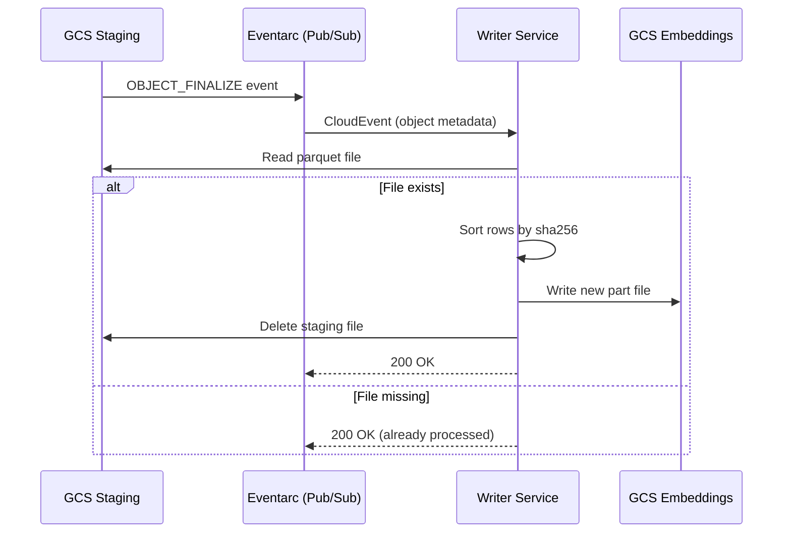

# Cache Merge Flow

How newly computed embeddings move from the staging bucket into the permanent embeddings bucket — the write-behind path that keeps cache and compute on separate IAM boundaries.

## Why This Matters

| Without separate merge | With separate merge |
|------------------------|---------------------|
| Workers need write access to embeddings bucket | Workers write staging only — blast radius contained |
| Concurrent writes to same shard corrupt parquet | Writer appends independent part files — no conflicts |
| Failed writes leave partial files in production | Failed writes leave orphaned staging files, cleaned by lifecycle |

## Trigger

Eventarc delivers a CloudEvent to the writer's merge endpoint when a new object is created in the staging bucket (GCS OBJECT_FINALIZE event, routed via Pub/Sub). The staging file was uploaded by the embedding service after computing new vectors.

In production, the payload is a CloudEvent (detected via the `ce-type` header) containing the GCS object metadata:

```json
{
  "bucket": "repoql-staging-prod",
  "name": "source={hash}/model={model}/instance-abc-3f9a1c.parquet"
}
```

For local development, the writer also accepts direct JSON posts (via `DirectWriterUrl`) with a simple path payload:

```json
{ "path": "source={hash}/model={model}/instance-abc-3f9a1c.parquet" }
```

---

## Stages

### 1. Event Receipt

**Actor**: Writer service (Cloud Run)
**Action**: Receive Eventarc CloudEvent (production) or direct JSON post (local dev). The merge endpoint detects the format via the `ce-type` header — present means CloudEvent, absent means direct JSON.
**Output**: Staging path to process (extracted from CloudEvent object name or direct JSON path)
**Failure**: Pub/Sub retries on non-2xx response (exponential backoff)

### 2. Staging File Read

**Actor**: Writer service → GCS staging bucket
**Action**: Read the parquet file from staging
**Output**: Batch of `(sha256, vector, created_at)` rows (sha256 = hash of context + chunk content) with source and model metadata
**Failure**: File missing (already processed or expired) → acknowledge message, done

The source and model are encoded in the staging file path (`source={hash}/model={model}/`) — the writer extracts them to determine the target embeddings shard. No metadata parsing needed.

### 3. Shard Identification

**Actor**: Writer service
**Action**: Determine target shard path from source and model
**Output**: `gs://embeddings/source={source}/model={model}/`
**Failure**: N/A (path computation)

### 4. Append Part File

**Actor**: Writer service → GCS embeddings bucket
**Action**: Sort staging rows by sha256, write as a new part file in the target shard
**Output**: New part file `part-{timestamp}.parquet` in the shard
**Failure**: GCS write fails → Pub/Sub retries the event

```
Existing shard:     part-0001.parquet (10K rows)
                    part-0002.parquet (8K rows)
New staging file:   42 rows

Result:             part-0003.parquet (42 rows, sorted by sha256)
```

The writer does NOT read or rewrite existing parts — it appends a new part file containing only the staging rows. This keeps the write small and fast. Compaction consolidates parts later.

Deduplication happens at read time (cache lookup takes first match via `DISTINCT ON`) and at compaction time (merge + dedupe into single file). The append only needs to ensure its own rows are sorted.

On first write to a new shard, the writer also creates `_source.json` containing `{ "origin": "{normalized_url}" }` for debugging and diagnostics. This is a best-effort write — missing metadata doesn't affect correctness.

### 5. Staging Cleanup

**Actor**: Writer service → GCS staging bucket
**Action**: Delete the processed staging file
**Output**: Staging file removed
**Failure**: Delete fails → file remains, cleaned by 24h lifecycle policy. No correctness issue.

### 6. Event Acknowledgement

**Actor**: Writer service → Eventarc (Pub/Sub)
**Action**: Return 2xx to acknowledge successful processing
**Output**: Event acknowledged, Pub/Sub removes from subscription
**Failure**: If any prior stage failed and we didn't acknowledge, Pub/Sub retries

---

## Termination

Flow completes when:
- New vectors appended as a part file in the embeddings shard
- `_source.json` created if this is a new shard (best-effort)
- Staging file deleted (best-effort)
- Eventarc event acknowledged (2xx response)

## Flow Diagram



## Failure Semantics

Every failure mode resolves cleanly:

| Failure point | What happens | Resolution |
|---------------|-------------|------------|
| Writer crashes mid-read | Event not acknowledged | Pub/Sub retries → writer re-reads staging file |
| Writer crashes after append, before staging delete | Event not acknowledged | Pub/Sub retries → re-append is idempotent (sha256 dedup at read/compaction) |
| Writer crashes after staging delete, before ack | Event not acknowledged | Pub/Sub retries → staging file gone → ack immediately |
| Staging file expired (24h lifecycle) | File missing on retry | Ack event → embedding will be cached on next request |
| Embeddings write fails (GCS error) | Exception → non-2xx | Pub/Sub retries with backoff |
| Duplicate events (Pub/Sub at-least-once) | Same staging file processed twice | sha256 dedup at compaction → no corruption |

The key property: **at-least-once delivery + idempotent append + sha256 dedup = exactly-once semantics for the cache.**

## Error Handling

| Error | Behaviour |
|-------|-----------|
| Staging file not found | Acknowledge event (already processed or expired) |
| Staging file corrupted | Log error, acknowledge event (don't retry corrupt data) |
| GCS embeddings write timeout | Don't acknowledge → Pub/Sub retries |
| Concurrent writers to same shard | Each writes a separate part file — no conflict. Compaction merges later. |

## Timing

| Phase | Duration |
|-------|----------|
| Staging file read | ~50-100ms |
| Sort + write new part | ~50-200ms (depends on batch size) |
| Staging delete | ~30-50ms |
| End-to-end | ~150-400ms per message |
| Eventarc delivery latency | ~1-10s from staging upload (GCS notification + Pub/Sub) |

## Verification

| Environment | How |
|-------------|-----|
| **Local** | Direct JSON post to the writer's merge endpoint via `DirectWriterUrl`. Same logic, no Eventarc. |
| **Automated tests** | Post known staging file path. Assert part file appears in correct shard. Assert staging file deleted. Assert duplicate event produces no corruption. |
| **Production** | Events processed/second. Staging bucket depth (should trend to zero). Pub/Sub dead-letter count. Shard part file count (input to compaction trigger). |

## Related

- `embedding-request.md` — upstream flow that produces staging files
- `compaction.md` — downstream flow that consolidates part files
