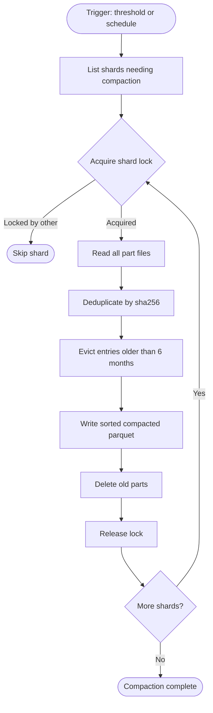

# Cache Compaction & Eviction Flow

How the embeddings bucket stays performant and bounded — consolidating small part files into sorted shards and evicting entries that haven't been useful in 6 months.

## Why This Matters

| Without compaction | With compaction |
|--------------------|-----------------|
| Part files accumulate → cache lookup scans dozens of files | Single sorted file → O(log n) point queries |
| GCS list operations slow down | Fewer objects, faster listing |
| Dead entries from old models persist forever | 6 months TTL evicts naturally stale entries |
| Storage grows unbounded | Size stays proportional to active content |

## Trigger

Two triggers, both leading to the same flow:

1. **Part count threshold**: After the writer appends a new part file, it lists the shard's parts. If the count exceeds 20, the writer enqueues a Cloud Tasks compaction message for that shard: `{ "source": "{hash}", "model": "{model}" }`
2. **Scheduled**: Nightly Cloud Scheduler job iterates all shards

---

## Stages

### 1. Shard Discovery

**Actor**: Compaction job (Cloud Run job)
**Action**: List shards that need compaction
**Output**: List of `(source, model)` shard paths exceeding the part threshold
**Failure**: GCS list error → skip, retry on next schedule

For scheduled runs, all shards are candidates. For threshold-triggered runs, only the shard that just received a new part.

### 2. Shard Lock

**Actor**: Compaction job → GCS
**Action**: Create `_compaction.lock` using GCS `ifGenerationMatch=0` precondition (atomic create-if-not-exists). Lock contains `{ "instance": "...", "started_at": "..." }`
**Output**: Lock acquired
**Failure**: Lock already exists (precondition failed) and is fresh (<1 hour) → skip shard. Lock exists but stale (>1 hour) → overwrite using `ifGenerationMatch={current_generation}` to prevent races.

The `ifGenerationMatch` precondition ensures exactly one compactor wins the lock, even if two check simultaneously. The lock prevents concurrent compaction of the same shard. It doesn't prevent cache merges — new part files can be written while compaction runs. The compactor reads the part list once at the start; parts added during compaction are picked up on the next run.

### 3. Read All Parts

**Actor**: Compaction job → DuckDB → GCS
**Action**: Read all part files for the shard into a single result set
**Output**: All rows across all parts
**Failure**: Corrupted part file → query each file individually with try/catch, skip failures, log for cleanup, compact the rest

```sql
SELECT sha256, vector, created_at
FROM read_parquet('gs://embeddings/source={source}/model={model}/part-*.parquet')
```

### 4. Deduplicate

**Actor**: Compaction job (DuckDB)
**Action**: For duplicate sha256 entries, keep the one with the newest `created_at`
**Output**: Deduplicated row set
**Failure**: N/A (in-memory SQL)

```sql
SELECT sha256, vector, created_at
FROM (
    SELECT *, ROW_NUMBER() OVER (PARTITION BY sha256 ORDER BY created_at DESC) AS rn
    FROM all_parts
)
WHERE rn = 1
```

### 5. Evict Expired Entries

**Actor**: Compaction job (DuckDB)
**Action**: Drop rows where `created_at < NOW() - INTERVAL '6 months'`
**Output**: Rows within the TTL window
**Failure**: N/A (filter operation)

```sql
WHERE created_at >= NOW() - INTERVAL '6 months'
```

Eviction is purely time-based. An entry written last month and an entry written 5 months ago are both kept. An entry last written 7 months ago is dropped — even if it would still be a valid cache hit. This is storage hygiene, not correctness: the next request for that content simply recomputes and re-caches.

The 6 months window is generous. Most active codebases re-index within days, refreshing `created_at`. Entries that survive 6 months without being refreshed are genuinely unused.

### 6. Write Compacted File

**Actor**: Compaction job → GCS embeddings bucket
**Action**: Write a single sorted parquet file as `part-0001.parquet` (the final name, not a temporary)
**Output**: One file, sorted by sha256, zstd-compressed, 50K row groups
**Failure**: Write fails → release lock, retry on next schedule. Old parts remain valid.

```sql
COPY (
    SELECT sha256, vector, created_at
    FROM deduplicated_and_evicted
    ORDER BY sha256
)
TO 'gs://embeddings/source={source}/model={model}/part-0001.parquet'
(FORMAT PARQUET, COMPRESSION zstd, ROW_GROUP_SIZE 50000)
```

Sorting by sha256 is critical — DuckDB's row group min/max statistics turn point queries into O(log n) seeks. Without sorting, every lookup scans every row group.

The file is written with its final name directly. GCS has no rename operation — writing a "temporary" file and renaming would require a copy + delete, which is slower and no more atomic. Since `part-0001.parquet` may already exist (from a previous compaction), the write overwrites it via GCS's single-object atomicity: readers see either the old file or the new file, never a partial write.

### 7. Delete Old Parts

**Actor**: Compaction job → GCS
**Action**: Delete old part files (part-0002 through part-N, plus any `_compacted-*` files from prior incomplete runs)
**Output**: Shard contains a single sorted file (`part-0001.parquet`)
**Failure**: Partial deletion → extra parts remain, deduplicated on next compaction. Not harmful — just slightly more scan work.

The sequence is:
1. New `part-0001.parquet` is already written and readable (stage 6)
2. Delete old part files one by one (part-0002, part-0003, ...)

During deletion, concurrent cache lookups may see both the new `part-0001.parquet` and old parts not yet deleted — but since the compacted file contains all the same sha256s, this only produces duplicate hits (`DISTINCT ON` takes first match, same vectors).

### 8. Release Lock

**Actor**: Compaction job → GCS
**Action**: Delete `_compaction.lock`
**Output**: Shard unlocked for future compaction
**Failure**: Lock delete fails → lock goes stale, overwritten after 1 hour

---

## Termination

Flow completes when:
- All parts merged into single sorted file
- Expired entries evicted
- Old parts deleted
- Lock released

## Flow Diagram



## Error Handling

| Error | Behaviour |
|-------|-----------|
| Lock held by active compactor | `ifGenerationMatch=0` fails → skip shard, pick up on next run |
| Stale lock (>1 hour) | Overwrite using `ifGenerationMatch={generation}` — atomic, no races |
| Corrupted part file | Skip that file, compact the rest |
| GCS write timeout | Release lock, retry next run. Old parts still valid. |
| Partial part deletion | Extra parts remain. Harmless — deduplicated on next compaction. |
| Compaction crashes after write, before cleanup | Compacted file + old parts coexist. Next compaction sees all, deduplicates. |

## Timing

| Phase | Duration |
|-------|----------|
| List shard parts | ~50-100ms |
| Read all parts (typical shard, <100K rows) | ~500ms-2s |
| Dedup + evict (in-memory) | ~100ms |
| Write compacted file | ~500ms-2s |
| Delete old parts | ~50ms per part |
| End-to-end (typical) | ~2-5s per shard |

## Verification

| Environment | How |
|-------------|-----|
| **Local** | Create 25 part files. Run compaction. Assert single sorted file. Assert duplicates removed. Assert old entries evicted. |
| **Automated tests** | Seed shard with known parts including duplicates and entries older than 6 months. Run compaction. Assert row count. Assert sort order. Assert lock lifecycle. |
| **Production** | Part count per shard (should stay under threshold). Compaction duration histogram. Rows evicted per run. Total cache size over time. |

## Configuration

| Setting | Default | Purpose |
|---------|---------|---------|
| Part count threshold | 20 | Trigger compaction when exceeded |
| TTL | 6 months | Evict entries older than this |
| Row group size | 50,000 | Parquet row group for DuckDB statistics |
| Compression | zstd | Balance of speed and ratio |

## Related

- `cache-merge.md` — upstream flow that creates part files
- `embedding-request.md` — downstream flow that reads compacted shards
- `docs/north-star/embedding-cache.md` — storage lifecycle declarations
