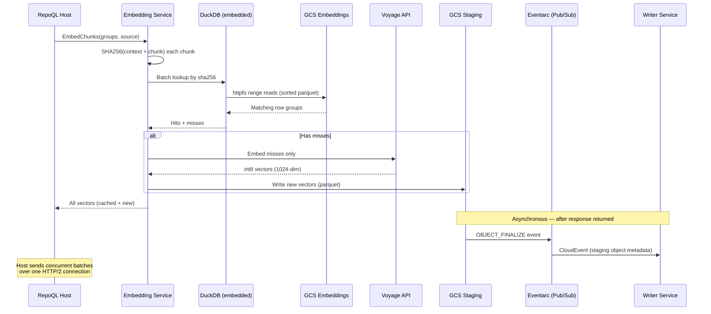

# Cloud Embedding Request Flow

How the embedding service resolves a batch of chunks — returning cached vectors where possible, computing via Voyage only for genuine misses.

## Why This Matters

| Without cloud cache | With cloud cache |
|---------------------|------------------|
| Every customer pays full Voyage cost for shared dependencies | Embed once, serve from cache for all customers |
| 100 developers on the same repo = 100x embedding cost | 1x cost, 99x cache hits |
| Re-indexing unchanged files calls Voyage again | Content unchanged → sha256 match → free |
| Model upgrade requires coordinated purge | Natural key mismatch → recompute → cache warms for everyone |

## Trigger

The embedding service receives a gRPC `EmbedChunks` request containing a batch of text chunks and a `source` field (canonical remote URL, e.g. `github.com/org/repo`). Requests with empty `source` (e.g., `file://` repos without a git remote) skip the cloud cache and go directly to Voyage.

The host sends multiple concurrent unary requests over one HTTP/2 connection for pipeline overlap — no streaming complexity needed.

---

## Stages

### 1. Content Fingerprinting

**Actor**: Embedding service
**Action**: Compute `SHA256(context + "\0" + chunk_content)` for each chunk in the batch, where `context` is the document context from the `ChunkGroup` and `chunk_content` is the individual chunk text
**Output**: List of `(sha256, text, context)` tuples
**Failure**: N/A (pure computation)

The hash includes both context and content because voyage-context-3 produces different vectors for the same chunk depending on document context. A context-unaware key would produce false cache hits — returning vectors computed against a different document.

Model is part of the cache path, not the hash — this means the same content cached under different models lives in separate shards, and a model upgrade is a shard-level miss, not a per-entry key change.

Within a repo, context (x-ray summaries) is stable for unchanged files, so hit rates remain high despite the stricter key.

### 2. Cache Lookup

**Actor**: Embedding service → DuckDB (embedded) → GCS via httpfs
**Action**: Query the source+model shard for matching sha256s
**Output**: Partition into hits (sha256 → vector) and misses (sha256 → text)
**Failure**: GCS unreachable → treat entire batch as misses, proceed to Voyage

```sql
-- source_hash = SHA256(canonical_remote_url), e.g. SHA256("github.com/org/repo")
-- DISTINCT ON sha256 with newest created_at ensures deterministic dedup
-- when duplicates exist across part files (between compaction cycles)
SELECT DISTINCT ON (sha256) sha256, vector
FROM read_parquet('gs://embeddings/source={source_hash}/model={model}/*.parquet')
WHERE sha256 IN (SELECT unnest(?::VARCHAR[]))
ORDER BY sha256, created_at DESC
```

The source identifier is the canonical remote URL, hashed to keep customer repo paths out of GCS object names. `file://` repos without a git remote skip the cloud cache entirely — no stable identity means no shard placement.

DuckDB's `enable_object_cache=true` caches parquet footer metadata in-process — the footer round trip is eliminated on repeat queries to the same shard. Row groups are sorted by sha256, so DuckDB uses min/max statistics to skip irrelevant groups. Point queries against a sorted file are effectively O(log n).

Each query is scoped to a single source shard — GCS never scans across customers.

### 3. Voyage Computation (Misses Only)

**Actor**: Embedding service → Voyage API
**Action**: Send only cache misses to Voyage for embedding
**Output**: New int8 vectors at 1024 dimensions (model max)
**Failure**: Voyage API error → return error to client (no partial results)

Vectors are always computed at the model's maximum dimensionality (1024 for voyage-context-3). Clients requesting lower dimensions truncate on their side — the service stores the richest representation.

### 4. Staging Write

**Actor**: Embedding service → GCS staging bucket
**Action**: Write newly computed embeddings as a parquet file to the staging bucket
**Output**: `gs://staging/source={source_hash}/model={model}/instance-{id}-{uuid}.parquet`
**Failure**: Staging write fails → log warning, continue (results still returned to client)

The staging bucket has a 24h lifecycle policy — incomplete or orphaned files are automatically cleaned up.

Parquet schema per row:

| Column | Type | Purpose |
|--------|------|---------|
| `sha256` | `VARCHAR` | Hash of context + chunk content — lookup key |
| `vector` | `INT8[]` | 1024-dim int8 embedding |
| `created_at` | `TIMESTAMP` | For eviction ordering |

### 5. Eventarc Trigger (Automatic)

**Actor**: GCS → Eventarc (Pub/Sub) → Writer service
**Action**: The staging bucket upload in Stage 4 emits a GCS OBJECT_FINALIZE event. Eventarc routes this event to the writer service as a CloudEvent — no explicit dispatch by the embedding service is needed.
**Output**: CloudEvent delivered to the writer's merge endpoint containing the staging object metadata
**Failure**: Event delivery fails → Pub/Sub retries with exponential backoff. If delivery ultimately fails, the staging file is swept by 24h lifecycle. No data loss — same content will be cached on next request.

The embedding service's responsibility ends at the staging write. The trigger is infrastructure-level, not application code.

### 6. Response

**Actor**: Embedding service
**Action**: Merge cached vectors with newly computed vectors, return to client in original order
**Output**: gRPC response with all vectors
**Failure**: N/A (merge is in-memory)

---

## Termination

Flow completes when:
- All chunks have vectors (from cache or Voyage)
- New vectors written to staging (best-effort)
- Response returned to client

The client always gets vectors. Cache population is fire-and-forget — staging write failures don't affect the response. The writer is triggered automatically by Eventarc when the staging file lands — no explicit dispatch step in the embedding service.

## Flow Diagram



## Error Handling

| Error | Behaviour |
|-------|-----------|
| GCS embeddings unreachable | All cache misses → full Voyage computation. Expensive but correct. |
| Voyage API error | Return error to client. No partial results. |
| Staging write fails | Log warning, continue. Vectors still returned. Cache misses repeat next time. |
| Eventarc delivery fails | Pub/Sub retries with backoff. If all retries exhausted, staging file cleaned by 24h lifecycle. |
| DuckDB parquet read error | Catch per-query exception, fall through to full Voyage computation. Log corrupted file for compaction cleanup. |
| Cold GCS file (200-500ms first read) | Mitigated by background prefetch when repo opened in UI. |

## Timing

| Phase | Duration |
|-------|----------|
| SHA256 computation | <1ms per batch |
| GCS cache lookup (warm) | ~100-150ms |
| GCS cache lookup (cold file) | ~300-600ms |
| Voyage API call | ~500-2000ms depending on batch size |
| Staging write | ~50-100ms |
| Total (cache hit) | ~100-150ms |
| Total (cache miss) | ~600-2200ms |

## Verification

| Environment | How |
|-------------|-----|
| **Local** | DuckDB reads local parquet instead of GCS. No httpfs, no staging bucket. Same flow, different storage. |
| **Automated tests** | Seed parquet with known vectors. Call service. Assert Voyage not called for cached chunks. Assert staging file written for misses. |
| **Production** | Cache hit rate per batch. Voyage API calls saved. P99 latency by hit/miss ratio. Cost savings vs full Voyage. |

## Related

- `cache-merge.md` — how staging files become permanent cache entries
- `compaction.md` — how small parts are consolidated and old entries evicted
- `docs/north-star/embedding-cache.md` — what great looks like
