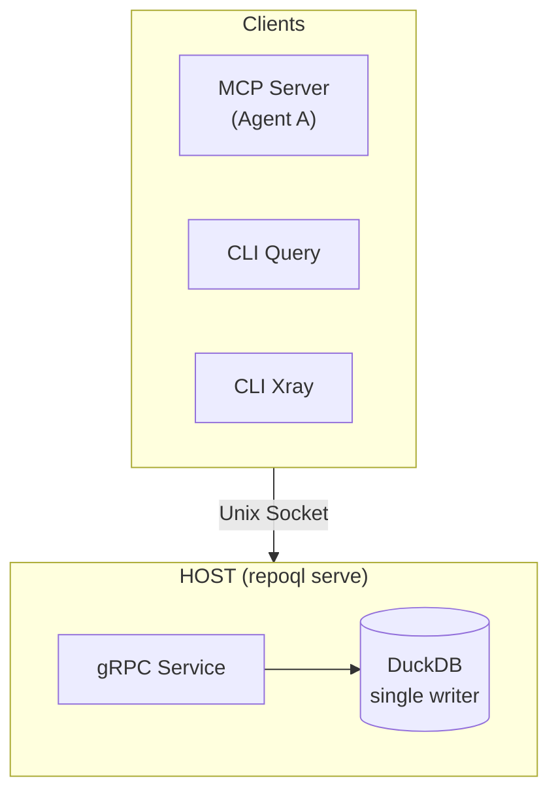
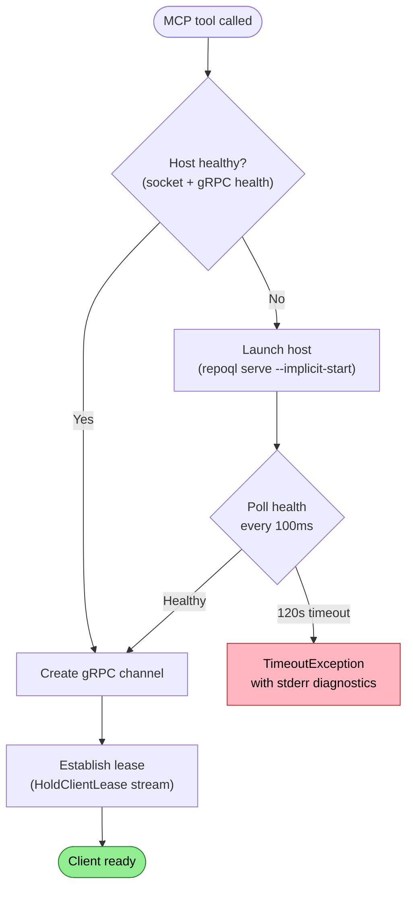
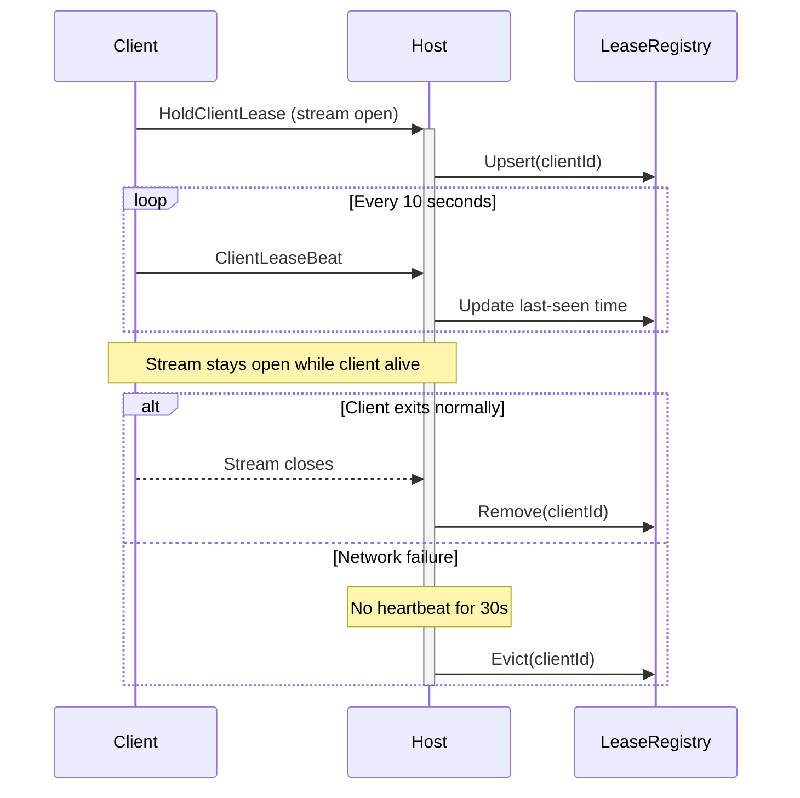
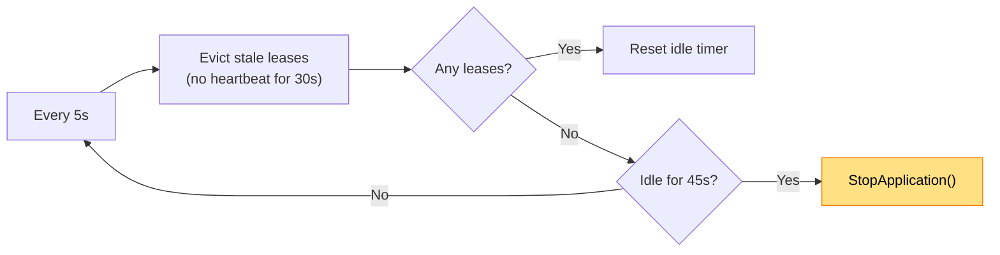

# Host-Client Architecture

How clients connect to, launch, and communicate with the RepoQL host.

## Why This Architecture Exists

DuckDB enforces single-writer access. Two processes writing simultaneously corrupts the database. RepoQL solves this with a client-server split:

| Component | Role | Process |
|-----------|------|---------|
| **Host** | Owns DuckDB, runs indexer, serves queries | `repoql serve` |
| **Clients** | Send queries, receive results | MCP server, CLI commands |

One host per repository. Multiple clients share that host. All writes go through the host.


*Multiple clients share one host. All database writes go through the host.*

This enables:
- **Parallel agents**: Multiple MCP servers query the same index
- **CLI during sessions**: Run `repoql query` while an agent is connected
- **Warm index**: Host persists between client connections

---

## The Connection Flow

When an agent calls an MCP tool, the client connects to the host:


*Green = success path. Red = error path.*

**Socket location**: `.repoql/repoql.sock` under the repository root.

**WSL exception**: On WSL accessing Windows mounts (NTFS via drvfs), Unix sockets don't work. The host writes its actual socket path to `.repoql/socket.path`, and clients read that file first.

**Race condition**: Two clients can simultaneously detect "no host" and both launch. The second host's `serve` command will shut down the first, but there's a window where both are starting. No file lock currently prevents this.

---

## The Lease Protocol

Clients maintain a lease so the host knows when to shut down:



The lease serves two purposes:
1. **Host knows clients exist**: Won't shut down while leases are active
2. **Clean disconnection**: When stream closes, lease is immediately removed

**Silent failure risk**: The heartbeat loop runs fire-and-forget with no error handling. If heartbeats fail, the client doesn't know. Host may evict the lease after 30s while the client thinks it's connected.

---

## Idle Shutdown (Implicit Mode)

Hosts started with `--implicit-start` auto-shutdown when idle:


*Yellow = shutdown path. Grace period keeps host alive during brief disconnections.*

Hosts started explicitly (without `--implicit-start`) never auto-shutdown.

---

## Query Execution

Once connected with a lease, query execution follows these steps:

1. Agent calls MCP tool (query, xray, etc.)
2. Tool calls `client.ExecuteRawQueryAsync(sql)`
3. Client sends `RawQueryRequest` over gRPC
4. Host receives request
5. Host waits for indexer if needed (`QueryBarrier`)
6. Host executes SQL against DuckDB
7. Host returns `RawQueryResponse`
8. Tool formats and returns to agent

The `QueryBarrier` waits for:
- Initial file scan to complete (always)
- Semantic embeddings to be ready (if query uses `search()`)

---

## Error Recovery

**Connection failure mid-session**: If an RPC fails with `Unavailable`, `Internal`, `IOException`, or `SocketException`:

1. Client disposes current channel
2. Re-runs full connection flow (health check → maybe launch → connect → lease)
3. Retries the RPC once

This handles host restarts transparently.

**Stale socket file**: If the host crashed, a socket file exists but nothing is listening:

1. Connect attempt fails with "connection refused"
2. Atomically rename socket to `.stale.{guid}`
3. Verify no new socket appeared (race check)
4. Delete the renamed file

---

## Explicit Shutdown

Two ways to shut down a host:

**ShutdownHost RPC**: Any client can call this. Host responds with its PID, then terminates.

**`repoql serve` startup**: Before binding, the `serve` command:
1. Sends `ShutdownHost` RPC to existing host
2. Waits for process exit (up to 60s)
3. Force-kills if needed
4. Waits for database file to unlock

This ensures only one host per repository.

---

## Verification

**Is the host running?**
```bash
ls -la .repoql/repoql.sock
# If installed: grpcurl -plaintext -unix .repoql/repoql.sock grpc.health.v1.Health/Check
```

**Watch host logs**: When launched implicitly, host stderr prefixed with `[host HH:mm:ss]` goes to client stderr.

**Aspire dashboard**: In development, host runs as managed resource with visible logs/metrics/traces.

**Metrics**: `repoql.host.lease_count` should match expected clients. `repoql.host.idle_seconds_remaining` counts down when idle (-1 when clients connected).

---

## Configuration

| Variable | Default | Effect |
|----------|---------|--------|
| `REPOQL_START_TIMEOUT_MS` | 120000 | How long client waits for host to start |
| `REPOQL_LEASE_TTL_SECONDS` | 30 | Heartbeat must arrive within this window |
| `REPOQL_IDLE_GRACE_SECONDS` | 45 | Time with no clients before shutdown |
| `REPOQL_SOCKET` | (auto) | Override socket path |

---

## Key Files

| File | Role |
|------|------|
| `src/RepoQL.Protocol/RepoQlClient.cs` | Client: auto-launch, lease, reconnection |
| `src/RepoQL.ConsoleApp/Commands/ServeCommands.cs` | Host entry point, existing-host shutdown |
| `src/RepoQL.ConsoleApp/Host/IdleShutdownHostedService.cs` | Idle detection and shutdown |
| `src/RepoQL.ConsoleApp/Host/LeaseRegistry.cs` | Tracks active client leases |
| `src/RepoQL.ConsoleApp/Host/RepoQlServiceImpl.cs` | gRPC service implementation |

---

## Known Reliability Issues

**1. Launch Race Condition**
Two clients can simultaneously detect "no host" and both launch. No file lock coordinates this.

**2. Silent Heartbeat Failures**
The heartbeat loop (`RepoQlClient.cs:629-645`) has no try/catch. Failures are swallowed; client doesn't know its lease is invalid.

**3. Long Timeout on Host Failure**
Client blocks 120 seconds if host can't start. No circuit breaker for repeated failures.

**Proposed simplification**: Remove application-level heartbeats. The lease stream itself is the heartbeat—when it closes, the lease is gone. gRPC keepalive (already configured) handles dead connection detection. This eliminates issue #2 and simplifies the code.

---

## What This Document Doesn't Cover

- **Indexing pipeline**: See `flows/indexing.md`
- **Query execution internals**: SQL parsing, token budgets, result formatting
- **MCP protocol**: Tool registration, stdio transport
- **Orchestrator setup**: Aspire configuration

---

*If you can't trace a query from agent to DuckDB and back, re-read the connection flow.*
