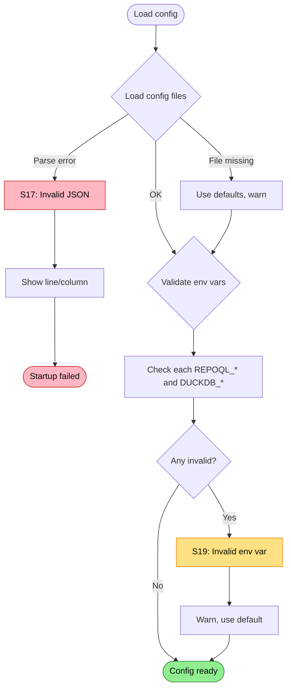

# Configuration Failures

Failures when loading configuration files or environment variables.

Covers: S17, S19 from research.

## Trigger

Host loads configuration during startup before building services.

## Failure Modes

### S17: Malformed Configuration File

**Detection**: JSON/config parse fails
**Current**: Startup exception during config load
**Proposed**: Validate config, report specific errors

```
❌ Configuration file invalid
   File: appsettings.Development.json
   Error: Invalid JSON at line 42, column 15

   Line 42: "Logging": {
                       ^
   Expected: property name or '}'

   Fix the JSON syntax or delete the file to use defaults.
```

```
❌ Configuration file invalid
   File: appsettings.json
   Error: Unexpected token at line 10

   Line 10:   "ConnectionString": undefined
                                  ^^^^^^^^^
   'undefined' is not valid JSON. Use null or a string value.
```

```
⚠️ Configuration file not found
   Expected: appsettings.Production.json

   Using default configuration.
   Create the file to customize production settings.
```

### S19: Invalid Environment Variables

**Detection**: Environment variable has invalid format
**Current**: `SET` statement fails or unexpected behavior
**Proposed**: Validate early, warn and use defaults

#### DuckDB Variables

```
⚠️ Invalid environment variable
   Variable: DUCKDB_MEMORY_LIMIT
   Value: "lots"
   Expected: Memory size like "4GB", "512MB"

   Using default: 4GB
```

```
⚠️ Invalid environment variable
   Variable: DUCKDB_THREADS
   Value: "0"
   Expected: Positive integer

   Using default: (CPU count)
```

#### RepoQL Variables

```
⚠️ Invalid environment variable
   Variable: REPOQL_IDLE_GRACE_SECONDS
   Value: "forever"
   Expected: Positive integer (seconds)

   Using default: 45
```

```
⚠️ Invalid environment variable
   Variable: REPOQL_EMBED_MODE
   Value: "turbo"
   Expected: One of: onnx, openrouter, disabled

   Using default: onnx
```

```
⚠️ Invalid environment variable
   Variable: REPOQL_SOCKET
   Value: "/path/with spaces/socket.sock"
   Warning: Path contains spaces (may cause issues on some platforms)

   Proceeding with provided path.
```

## Environment Variable Reference

Show all recognized variables and their current values:

```
RepoQL Environment Variables
============================

Database:
  DUCKDB_MEMORY_LIMIT     = 4GB (default)
  DUCKDB_THREADS          = 8 (from env)
  DUCKDB_TEMP_DIRECTORY   = (not set, using .repoql/temp)

Embeddings:
  REPOQL_EMBED_MODE       = onnx (default)
  REPOQL_EMBED_MODEL_PATH = (not set)
  REPOQL_EMBED_BATCH_SIZE = 100 (default)

Timeouts:
  REPOQL_IDLE_GRACE_SECONDS   = 45 (default)
  REPOQL_LEASE_TTL_SECONDS    = 30 (default)
  REPOQL_STARTUP_GRACE_SECONDS = 120 (default)

Paths:
  REPOQL_CWD    = (not set)
  REPOQL_SOCKET = (not set)

MCP:
  REPOQL_MCP_INCLUDE_GLOBALS = true (default)
  REPOQL_MCP_ENABLED_AGENTS  = (not set, all enabled)
```

## Flow Diagram



## Diagnostic Data

```
ConfigurationReport
├── ConfigFiles
│   ├── Loaded: string[]              # Successfully loaded
│   ├── Missing: string[]             # Expected but not found
│   ├── Invalid: { path: string, error: string, line: int?, column: int? }[]
│   └── UsedDefaults: bool
│
├── EnvironmentVariables
│   ├── Recognized: { name: string, value: string, source: "env" | "default" }[]
│   ├── Invalid: { name: string, value: string, expected: string, using: string }[]
│   ├── Unknown: string[]             # REPOQL_* vars we don't recognize
│   └── Warnings: string[]
│
└── EffectiveConfig
    ├── MemoryLimit: string
    ├── Threads: int
    ├── EmbedMode: string
    ├── IdleGrace: int
    └── ...
```

## Validation Rules

| Variable | Type | Valid Values | Default |
|----------|------|--------------|---------|
| `DUCKDB_MEMORY_LIMIT` | memory | `\d+[KMGT]B?` | `4GB` |
| `DUCKDB_THREADS` | int | `> 0` | CPU count |
| `DUCKDB_TEMP_DIRECTORY` | path | exists, writable | `.repoql/temp` |
| `DUCKDB_READ_POOL_SIZE` | int | `1-4` | `2` |
| `REPOQL_EMBED_MODE` | enum | `onnx\|openrouter\|disabled` | `onnx` |
| `REPOQL_EMBED_BATCH_SIZE` | int | `> 0` | `100` |
| `REPOQL_IDLE_GRACE_SECONDS` | int | `> 0` | `45` |
| `REPOQL_LEASE_TTL_SECONDS` | int | `> 0` | `30` |
| `REPOQL_SOCKET` | path | valid path | `.repoql/repoql.sock` |
| `REPOQL_CWD` | path | exists, directory | (current dir) |

## Status

⚠️ **Gaps identified**:
- S17: Config parse errors not user-friendly
- S19: No env var validation, just fails at use time

**Proposed**:
1. Validate config files early with line/column error reporting
2. Validate all `REPOQL_*` and `DUCKDB_*` env vars at startup
3. Log effective configuration for diagnostics
4. Warn on unrecognized `REPOQL_*` variables (typos)
