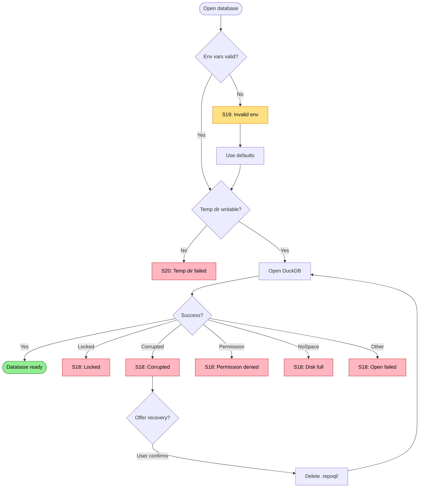

# Database Initialization Failures

Failures when opening or initializing DuckDB.

Covers: S18-S20 from research.

## Trigger

Host attempts to open DuckDB database after socket is bound.

## Failure Modes

### S18: Database Open Fails

**Detection**: DuckDB open throws exception
**Current**: Host exits on startup
**Proposed**: Detect cause, offer recovery paths

#### Locked by Another Process

```
❌ Database locked
   Path: .repoql/index.duckdb
   Lock holder: PID 12345 (DBeaver.exe)

   Close DBeaver to release the lock.
```

#### Corrupted Database

```
❌ Database corrupted
   Path: .repoql/index.duckdb
   Error: Invalid file header / checksum mismatch

   The database file is corrupted.

   Recovery options:
   1. Delete and reindex: rm -rf .repoql/ && repoql serve
   2. Try DuckDB recovery: duckdb .repoql/index.duckdb ".recover"
```

#### Permission Denied

```
❌ Database access denied
   Path: .repoql/index.duckdb
   Error: Permission denied

   Check file permissions: ls -la .repoql/index.duckdb
   The file may be owned by a different user.
```

#### File System Full

```
❌ Cannot open database
   Path: .repoql/index.duckdb
   Error: No space left on device

   Free disk space and retry.
   Current usage: df -h .repoql/
```

### S19: Invalid DuckDB Environment Variables

**Detection**: `SET` statement fails during init
**Current**: Startup exception
**Proposed**: Validate env vars early

```
❌ Invalid DuckDB configuration
   Variable: DUCKDB_MEMORY_LIMIT
   Value: "not-a-number"
   Error: Invalid memory limit format

   Expected format: "4GB", "512MB", etc.
   Unsetting variable and using default.
```

```
❌ Invalid DuckDB configuration
   Variable: DUCKDB_THREADS
   Value: "-5"
   Error: Thread count must be positive

   Using default thread count.
```

### S20: Temp Directory Creation Fails

**Detection**: DuckDB temp directory cannot be created
**Current**: Startup exception
**Proposed**: Detect and suggest alternatives

```
❌ Cannot create temp directory
   Path: .repoql/duckdb_temp
   Error: Permission denied

   DuckDB needs a writable temp directory for large queries.

   Options:
   1. Fix permissions on .repoql/
   2. Set DUCKDB_TEMP_DIRECTORY to writable location
   3. Set TMPDIR/TMP environment variable
```

```
❌ Cannot create temp directory
   Path: .repoql/duckdb_temp
   Error: No space left on device

   DuckDB temp can grow large during complex queries.

   Options:
   1. Free disk space
   2. Set DUCKDB_TEMP_DIRECTORY to volume with more space
```

## Flow Diagram



## Diagnostic Data

```
DatabaseInitReport
├── Path: string
├── Existed: bool
├── SizeBytes: long?
├── EnvVarsValidated: bool
├── InvalidEnvVars: { name: string, value: string, error: string }[]
├── TempDirPath: string
├── TempDirWritable: bool
├── TempDirError: string?
├── OpenAttempted: bool
├── OpenSucceeded: bool
├── OpenError: string?
├── OpenErrorType: "locked" | "corrupted" | "permission" | "disk_full" | "other"
├── LockHolder: ProcessInfo?
├── DiskFreeBytes: long?
└── RecoveryOffered: bool
```

## Status

⚠️ **Gaps identified**:
- S18: Generic error message, no cause detection
- S19: No env var validation
- S20: No temp directory preflight check

**Proposed**:
1. Validate `DUCKDB_*` env vars before opening
2. Check temp directory is writable before opening
3. Classify open errors and provide specific recovery guidance
4. For corruption, offer automatic delete+reindex with user confirmation
