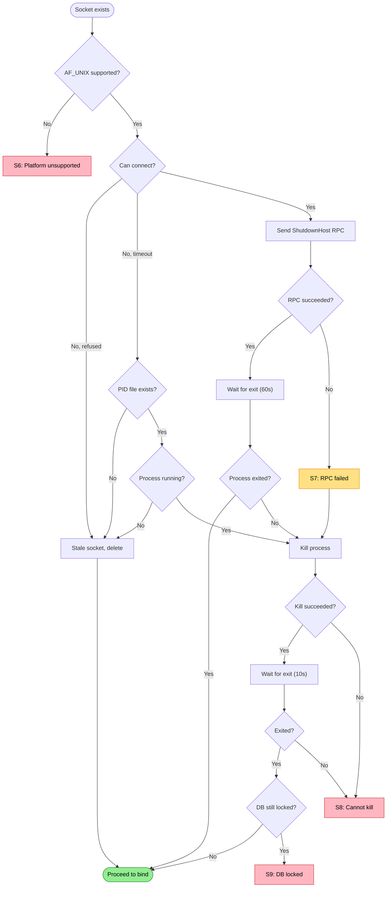

# Existing Host Shutdown Failures

Failures when shutting down a previous host instance before starting.

Covers: S6-S9 from research.

## Trigger

Socket file exists, indicating a previous host may be running. Must shut it down before binding.

## Failure Modes

### S6: AF_UNIX Unsupported During Probe

**Detection**: `PlatformNotSupportedException` when trying to connect to existing socket
**Current**: Unhandled exception, host exits
**Proposed**: Check platform support first, skip probe if unsupported

```
❌ Unix sockets not supported
   Platform: Windows (AF_UNIX not available)

   Unix domain sockets require:
   - Windows 10 version 1803 or later
   - AF_UNIX feature enabled

   Or use TCP transport: repoql serve --transport tcp
```

### S7: Shutdown RPC Fails

**Detection**: `ShutdownHost` RPC returns error other than `Unavailable`
**Current**: Host exits without cleanup
**Proposed**: Handle specific errors, fall back to kill

```
⚠️ Shutdown RPC failed
   Socket: .repoql/repoql.sock
   Error: PermissionDenied - not authorized to shutdown

   Previous host started by different user?
   Falling back to process kill...
```

```
⚠️ Shutdown RPC failed
   Socket: .repoql/repoql.sock
   Error: DeadlineExceeded - host not responding

   Previous host may be hung.
   Falling back to process kill...
```

### S8: Cannot Kill Existing Host

**Detection**: Process kill fails or process refuses to exit
**Current**: `TimeoutException` after waiting
**Proposed**: Escalate with diagnostics

```
❌ Cannot stop existing host
   PID: 12345 (repoql)
   Kill attempted: yes
   Still running after: 60s

   The process may be:
   - Hung in uninterruptible state
   - Protected by elevated privileges
   - Blocked on I/O

   Manual intervention required:
   - Windows: taskkill /F /PID 12345
   - Linux: kill -9 12345
```

### S9: Database Locked by Other Process

**Detection**: After shutdown attempts, DB still locked
**Current**: `TimeoutException` after 45s wait
**Proposed**: Identify lock holder

```
❌ Database locked after shutdown
   Database: .repoql/index.duckdb
   Lock holder: PID 12345 (DBeaver.exe)

   Close DBeaver to release the lock.
```

```
❌ Database locked after shutdown
   Database: .repoql/index.duckdb
   Lock holder: PID 12345 (repoql) - still running

   Previous host did not exit cleanly.
   Kill manually: taskkill /F /PID 12345
```

## Flow Diagram



## Diagnostic Data

```
ExistingHostReport
├── SocketExisted: bool
├── SocketConnectable: bool
├── PidFileFound: bool
├── PreviousPid: int?
├── ProcessRunning: bool
├── ProcessName: string?
├── ShutdownRpcSent: bool
├── ShutdownRpcResult: "success" | "unavailable" | "permission_denied" | "timeout" | "error"
├── ShutdownRpcError: string?
├── KillAttempted: bool
├── KillSucceeded: bool
├── ProcessExited: bool
├── WaitDurationMs: int
├── DbLockedAfter: bool
├── DbLockHolder: ProcessInfo?
└── Errors: string[]
```

## Status

⚠️ **Gaps identified**:
- S6: No `PlatformNotSupportedException` handling
- S7: No fallback when RPC fails with non-Unavailable status
- S8: No escalation diagnostics when kill fails
- S9: No lock holder detection

**Proposed**: Structured shutdown flow with fallbacks at each stage, collecting `ExistingHostReport` for diagnostics.
