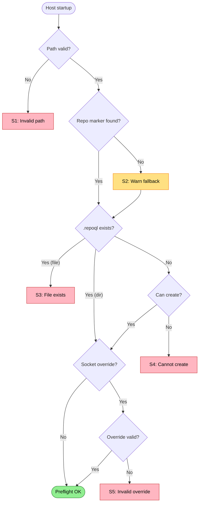

# Preflight Failures

Path validation and repository detection failures before host starts.

Covers: S1-S5 from research.

## Trigger

Host startup begins, preflight checks run before any services start.

## Failure Modes

### S1: Invalid Repository Path

**Detection**: `Path.GetFullPath()` throws or path doesn't exist
**Current**: Unhandled exception, host exits
**Proposed**: Validate early, surface clear error

```
❌ Invalid repository path
   Requested: C:\Source\MyProject
   Error: Path does not exist

   Provide a valid path: repoql serve --repository <path>
```

### S2: No Repository Marker (Silent Fallback)

**Detection**: No `.git` or `.repoql` found, falls back to drive root
**Current**: Host indexes wrong location silently
**Proposed**: Warn when fallback used

```
⚠️ No repository marker found
   Searched from: C:\Users\dev\Downloads
   Fell back to: C:\

   This will index your entire C: drive.

   To index a specific repo:
   - Run from a directory containing .git or .repoql
   - Or specify: repoql serve --repository <path>
```

### S3: .repoql Exists as File

**Detection**: `.repoql` path exists but is a file, not directory
**Current**: Attempts rename, fails with exception
**Proposed**: Clear error with guidance

```
❌ Cannot create .repoql directory
   Path: C:\Source\MyProject\.repoql
   Reason: A file with this name already exists

   Rename or delete the file, then retry.
```

### S4: Cannot Create .repoql Directory

**Detection**: `Directory.CreateDirectory()` fails
**Current**: Unhandled exception
**Proposed**: Detect cause and guide

```
❌ Cannot create .repoql directory
   Path: C:\Source\MyProject\.repoql
   Error: Access denied

   Check permissions on C:\Source\MyProject
   Or set REPOQL_DATA_DIR to an alternate location.
```

```
❌ Cannot create .repoql directory
   Path: \\?\C:\Very\Long\Path\...\.repoql
   Error: Path too long (> MAX_PATH)

   Move the repository to a shorter path
   Or enable long paths in Windows settings.
```

### S5: Invalid Socket Path Override

**Detection**: `REPOQL_SOCKET` or `socket.path` contains invalid path
**Current**: Fails later at bind time with confusing error
**Proposed**: Validate override early

```
❌ Invalid socket path override
   Source: REPOQL_SOCKET environment variable
   Value: /this/path/does/not/exist/repoql.sock
   Error: Parent directory does not exist

   Create the directory or fix the REPOQL_SOCKET value.
```

```
❌ Invalid socket path override
   Source: .repoql/socket.path
   Value: (empty)
   Error: Mapping file is empty

   Delete .repoql/socket.path to use default socket location.
```

## Flow Diagram



## Diagnostic Data

```
PreflightReport
├── RequestedPath: string?        # --repository arg or null
├── ResolvedPath: string          # After Path.GetFullPath
├── PathExists: bool
├── MarkerFound: ".git" | ".repoql" | null
├── MarkerSearchedFrom: string
├── FallbackUsed: bool
├── RepoqlDirState: "exists" | "created" | "blocked_by_file" | "permission_denied" | "path_too_long"
├── SocketOverrideSource: "env" | "file" | null
├── SocketOverrideValue: string?
├── SocketOverrideValid: bool
└── Errors: string[]
```

## Status

⚠️ **Gaps identified**:
- S1: No early path validation
- S2: No warning on fallback to drive root
- S3-S4: Poor error messages
- S5: No validation of socket overrides

**Proposed**: Add preflight validation phase that runs before host build, collecting `PreflightReport` and failing fast with clear errors.
