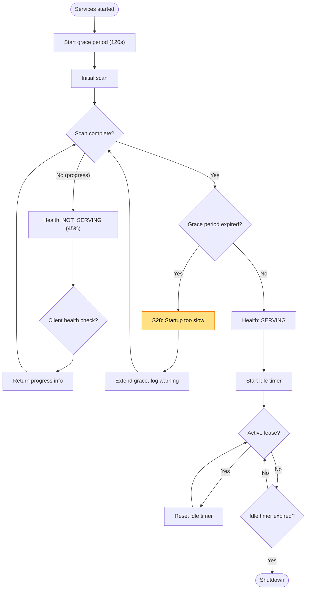

# Readiness Failures

Failures related to startup timing, health reporting, and initialization races.

Covers: S26-S28 from research.

## Trigger

Host has bound socket and started services, but may not be fully ready.

## Failure Modes

### S26: Premature Health Reporting

**Detection**: Health returns SERVING before indexer is ready
**Current**: Client connects to "healthy" host with broken/incomplete indexing
**Proposed**: Readiness gate tied to initial scan success

```
Current (problematic):
  Client: "Is host healthy?"
  Host: "SERVING" (but indexer hasn't started)
  Client: "SELECT * FROM Files"
  Host: "Error: indexer not initialized"
```

```
Proposed:
  Client: "Is host healthy?"
  Host: "NOT_SERVING" (initializing, 45% complete)
  Client: (waits, retries)
  ...
  Client: "Is host healthy?"
  Host: "SERVING" (indexer ready)
  Client: "SELECT * FROM Files"
  Host: (returns results)
```

#### Readiness Phases

```
HealthStatus
├── NOT_SERVING: "starting"           # Socket bound, services initializing
├── NOT_SERVING: "indexing (45%)"     # Initial scan in progress
├── NOT_SERVING: "embedding (80%)"    # Semantic indexing in progress
└── SERVING                           # Ready for queries
```

### S27: Idle Shutdown Race

**Detection**: IdleShutdown timer fires before client establishes lease
**Current**: Host exits during startup
**Proposed**: Startup grace period

```
Current (race condition):
  t=0:    Host starts, IdleShutdown timer begins (45s)
  t=30:   Initial scan still running
  t=45:   IdleShutdown: "No leases, shutting down"
  t=46:   Client finally connects: "Connection refused"
```

```
Proposed:
  t=0:    Host starts, startup grace period begins
  t=30:   Initial scan still running
  t=45:   Grace period: "Startup not complete, extending"
  t=120:  Initial scan completes, normal idle timer begins
  t=121:  Client connects, lease established
```

#### Configuration

```
REPOQL_STARTUP_GRACE_SECONDS=120    # Don't idle-shutdown during startup
REPOQL_IDLE_GRACE_SECONDS=45        # Normal idle timeout after startup
```

### S28: Startup Hang

**Detection**: Long DB init or scan delays
**Current**: Client times out, host appears hung
**Proposed**: Progress reporting during startup

```
Current:
  Client: (connects, waits...)
  Client: (120s timeout)
  Client: "TimeoutException: Host not responding"
```

```
Proposed (health check returns progress):
  Client: "Health check?"
  Host: {
    status: "NOT_SERVING",
    phase: "indexing",
    progress: { files: 5000, total: 12000, percent: 42 },
    started_at: "2024-01-15T10:00:00Z",
    elapsed_seconds: 45
  }

  Client: "Still initializing: 42% (5000/12000 files)"
```

#### Startup Progress Reporting

```
StartupProgress
├── Phase: "preflight" | "shutdown_existing" | "socket_bind" | "db_init" | "services" | "indexing" | "ready"
├── SubPhase: string?                 # "scanning", "parsing", "embedding"
├── Progress: { current: int, total: int, percent: int }?
├── StartedAt: DateTime
├── ElapsedMs: int
├── EstimatedRemainingMs: int?
└── CurrentItem: string?              # "src/big-file.cs"
```

## Flow Diagram



## Diagnostic Data

```
ReadinessReport
├── StartupPhase: string
├── StartupStartedAt: DateTime
├── StartupElapsedMs: int
├── GracePeriodActive: bool
├── GracePeriodRemainingMs: int?
│
├── IndexerState
│   ├── Phase: "idle" | "scanning" | "parsing" | "embedding" | "ready"
│   ├── FilesTotal: int
│   ├── FilesProcessed: int
│   ├── CurrentFile: string?
│   └── ErrorCount: int
│
├── HealthStatus: "SERVING" | "NOT_SERVING"
├── HealthReason: string              # "initializing", "indexing (45%)", etc.
│
├── IdleShutdown
│   ├── TimerActive: bool
│   ├── ActiveLeases: int
│   ├── LastLeaseActivity: DateTime?
│   └── ShutdownIn: int?              # Seconds until shutdown
│
└── Warnings: string[]                # "Startup slower than expected"
```

## Status

⚠️ **Gaps identified**:
- S26: Health returns SERVING before indexer ready
- S27: No startup grace period, can idle-shutdown during init
- S28: No progress reporting during startup

**Proposed**:
1. Health check returns `NOT_SERVING` with progress until indexer ready
2. Add `REPOQL_STARTUP_GRACE_SECONDS` to prevent premature idle shutdown
3. Include startup progress in health check response
4. Log startup phases and timing for diagnostics
