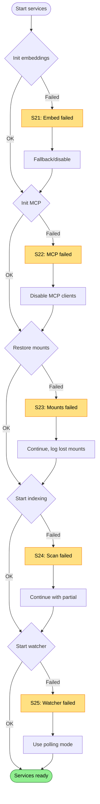

# Services Startup Failures

Failures when starting hosted services after database is ready.

Covers: S21-S25 from research.

## Trigger

Host starts background services: embeddings, MCP, mount restoration, indexing, file watcher.

## Failure Modes

### S21: Embeddings Initialization Fails

**Detection**: ONNX model load fails when explicit path provided
**Current**: `InvalidOperationException` aborts startup
**Proposed**: Fall back to hashed provider or disable embeddings

```
⚠️ Embeddings initialization failed
   Model path: /custom/model.onnx (from REPOQL_EMBED_MODEL_PATH)
   Error: File not found

   Falling back to built-in embeddings.
   Semantic search may be slower.
```

```
⚠️ Embeddings initialization failed
   Model path: /custom/model.onnx
   Error: ONNX Runtime error: Invalid model format

   Model file may be corrupted or incompatible.
   Falling back to built-in embeddings.
```

```
❌ Embeddings unavailable
   Error: No embedding provider could be initialized

   Semantic search will be disabled.
   Queries will use lexical search only.

   To enable embeddings:
   - Ensure ONNX model is valid
   - Or unset REPOQL_EMBED_MODEL_PATH to use defaults
```

### S22: MCP Configuration Invalid

**Detection**: MCP config parse fails during DI build
**Current**: Host start fails
**Proposed**: Isolate MCP, start host without it

```
⚠️ MCP configuration invalid
   Config: ~/.config/claude/claude_desktop_config.json
   Error: Invalid JSON at line 42

   MCP client functionality disabled.
   RepoQL tools will work, but cannot call external MCP servers.

   Fix the config file or remove it to use defaults.
```

```
⚠️ MCP server failed to start
   Server: context7
   Error: Connection refused

   This MCP server is unavailable.
   Other MCP servers and RepoQL tools will work normally.
```

### S23: Mount Restoration Fails

**Detection**: `_db.GetAllMounts()` or restore throws
**Current**: Hosted service fails, host exits
**Proposed**: Continue with warning, mounts can be re-added

```
⚠️ Mount restoration failed
   Error: Table 'file_system_mount' is corrupted

   Previous imports could not be restored.
   They will need to be re-imported.

   List of lost mounts saved to: .repoql/lost-mounts.txt
```

```
⚠️ Mount restoration partially failed
   Restored: 3 of 5 mounts
   Failed:
     - github://owner/repo1: Repository not found
     - github://owner/repo2: Authentication required

   Use 'import' to re-add failed mounts.
```

### S24: Indexing Scan Fails

**Detection**: Full scan enumeration throws (I/O, permission)
**Current**: Background service fails, host stops
**Proposed**: Continue with partial scan, report errors

```
⚠️ Indexing scan partially failed
   Scanned: 1,247 files
   Skipped: 23 files (permission denied)

   Skipped paths:
     - src/secrets/ (permission denied)
     - node_modules/.bin/ (permission denied)

   These directories will not be indexed.
```

```
⚠️ Indexing scan failed
   Error: Too many open files (EMFILE)

   System file descriptor limit reached.

   Options:
   1. Increase ulimit: ulimit -n 65536
   2. Reduce concurrent indexing: REPOQL_INDEX_CONCURRENCY=2
```

### S25: File Watcher Fails

**Detection**: Watcher initialization fails (inotify limits, OS errors)
**Current**: Background service fails, host stops
**Proposed**: Fall back to polling mode

```
⚠️ File watcher failed to start
   Error: inotify watch limit reached

   System limit: 8192 watches
   Required: ~15000 for this repository

   Falling back to polling mode (checks every 5s).
   File changes may take longer to detect.

   To enable watching:
   - Increase limit: echo 65536 | sudo tee /proc/sys/fs/inotify/max_user_watches
   - Or add to /etc/sysctl.conf: fs.inotify.max_user_watches=65536
```

```
⚠️ File watcher unavailable
   Platform: Windows (WSL1)
   Error: inotify not supported

   Using polling mode for file change detection.
```

## Flow Diagram



## Diagnostic Data

```
ServicesStartReport
├── Embeddings
│   ├── Requested: "onnx" | "openrouter" | "default"
│   ├── Initialized: bool
│   ├── FallbackUsed: bool
│   ├── Error: string?
│   └── ModelPath: string?
│
├── Mcp
│   ├── ConfigPath: string?
│   ├── ConfigValid: bool
│   ├── ServersConfigured: int
│   ├── ServersStarted: int
│   ├── FailedServers: { name: string, error: string }[]
│   └── Error: string?
│
├── Mounts
│   ├── PreviousMounts: int
│   ├── RestoredMounts: int
│   ├── FailedMounts: { uri: string, error: string }[]
│   └── Error: string?
│
├── Indexing
│   ├── ScanStarted: bool
│   ├── FilesFound: int
│   ├── FilesSkipped: int
│   ├── SkippedPaths: string[]
│   ├── SkipReasons: string[]
│   └── Error: string?
│
└── Watcher
    ├── Type: "inotify" | "fsevents" | "poll" | "none"
    ├── Started: bool
    ├── FallbackUsed: bool
    ├── WatchLimit: int?
    ├── WatchesNeeded: int?
    └── Error: string?
```

## Principle: Graceful Degradation

Services should degrade gracefully, not fail completely:

| Service | On Failure | Degraded Behavior |
|---------|------------|-------------------|
| Embeddings | Fall back to hashed/disable | Lexical search only |
| MCP | Disable external servers | RepoQL tools work, no external MCP |
| Mounts | Log lost mounts | User can re-import |
| Indexing | Partial scan | Some files not indexed |
| Watcher | Poll mode | Slower change detection |

The host should start and be useful even if some services fail.

## Status

⚠️ **Gaps identified**:
- S21: No fallback when explicit ONNX path fails
- S22: MCP failure crashes host
- S23: Mount restoration failure crashes host
- S24: Scan errors stop indexing entirely
- S25: Watcher failure stops host

**Proposed**: Implement graceful degradation for all services. Host starts even with partial functionality, surfacing warnings about degraded capabilities.
