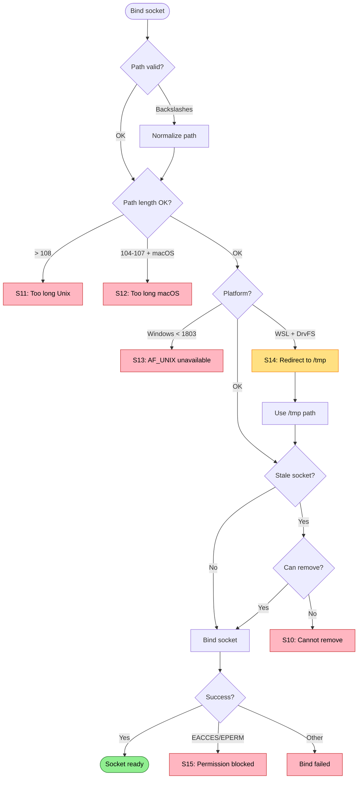

# Socket Binding Failures

Failures when creating and binding the Unix domain socket.

Covers: S10-S16 from research.

## Trigger

Host attempts to bind Unix socket for gRPC communication.

## Failure Modes

### S10: Stale Socket Cannot Be Removed

**Detection**: Socket file exists, delete/rename fails
**Current**: Bind fails with "address in use"
**Proposed**: Retry with alternate strategies

```
❌ Cannot remove stale socket
   Path: .repoql/repoql.sock
   Error: Permission denied (file owned by different user)

   Remove manually: sudo rm .repoql/repoql.sock
   Or use alternate socket: REPOQL_SOCKET=/tmp/repoql-$USER.sock
```

```
❌ Cannot remove stale socket
   Path: .repoql/repoql.sock
   Error: File is locked

   Another process may have the socket open.
   Check: lsof .repoql/repoql.sock
```

### S11: Socket Path Too Long (Unix)

**Detection**: Path length >= 108 characters
**Current**: `ArgumentException` from transport
**Proposed**: Detect early, suggest alternatives

```
❌ Socket path too long
   Path: /very/long/path/to/repository/.repoql/repoql.sock
   Length: 112 characters
   Limit: 108 (Unix domain socket limit)

   Options:
   1. Move repository to shorter path
   2. Set REPOQL_SOCKET=/tmp/repoql.sock
   3. Create symlink to repository
```

### S12: Socket Path Too Long (macOS)

**Detection**: Path length 104-107 characters on macOS
**Current**: Bind fails with ENAMETOOLONG (guard is 108, not 104)
**Proposed**: Platform-aware length check

```
❌ Socket path too long for macOS
   Path: /path/to/repo/.repoql/repoql.sock
   Length: 106 characters
   Limit: 104 (macOS limit, stricter than Linux 108)

   Options:
   1. Move repository to shorter path
   2. Set REPOQL_SOCKET=/tmp/repoql.sock
```

### S13: Windows AF_UNIX Not Available

**Detection**: Socket bind fails on Windows
**Current**: Host exits with bind error
**Proposed**: Check platform support upfront, offer fallback

```
❌ Unix sockets not available on this Windows version
   Windows version: 10.0.17134 (1803 required: 10.0.17763)

   Options:
   1. Update Windows to version 1803 or later
   2. Use TCP transport: repoql serve --transport tcp --port 50051
```

### S14: WSL2 DrvFS Socket Path

**Detection**: Socket path on `/mnt/c/...` (Windows mount in WSL)
**Current**: ENOTSUP or bind failure
**Proposed**: Detect and redirect automatically

```
⚠️ Socket path on Windows filesystem
   Path: /mnt/c/Source/MyProject/.repoql/repoql.sock
   Filesystem: DrvFS (Windows mount)

   Unix sockets don't work on DrvFS.
   Redirecting to: /tmp/repoql-abc123/repoql.sock
```

### S15: Permission/Policy Blocks Socket

**Detection**: Bind fails with EACCES or EPERM
**Current**: Generic bind error
**Proposed**: Detect security context

```
❌ Socket creation blocked
   Path: .repoql/repoql.sock
   Error: Permission denied

   Possible causes:
   - SELinux/AppArmor policy blocking Unix sockets
   - Sandboxed environment (Flatpak, Snap)
   - Directory permissions

   Check:
   - getenforce (SELinux status)
   - ls -la .repoql/ (directory permissions)
```

### S16: Path Normalization Issues

**Detection**: Backslashes on Unix, colons in WSL paths
**Current**: Inconsistent bind/connect behavior
**Proposed**: Normalize paths early

```
⚠️ Socket path contains backslashes
   Original: .repoql\repoql.sock
   Normalized: .repoql/repoql.sock

   Using normalized path.
```

## Flow Diagram



## Diagnostic Data

```
SocketBindReport
├── OriginalPath: string
├── NormalizedPath: string
├── PathLength: int
├── Platform: "windows" | "macos" | "linux" | "wsl"
├── PlatformLimit: int              # 108 or 104
├── WindowsVersion: string?         # For AF_UNIX check
├── WslFilesystem: "lxfs" | "drvfs" | null
├── StaleSocketFound: bool
├── StaleSocketRemoved: bool
├── StaleSocketRemoveError: string?
├── RedirectedTo: string?           # If WSL redirect
├── BindAttempted: bool
├── BindSucceeded: bool
├── BindError: string?
├── BindErrno: int?                 # EACCES, EPERM, etc.
└── SecurityContext: string?        # SELinux, AppArmor status
```

## Status

⚠️ **Gaps identified**:
- S11: No early length validation
- S12: macOS 104-char limit not checked (uses 108)
- S13: No Windows version check before attempting AF_UNIX
- S14: WSL DrvFS detection not comprehensive
- S15: No security context detection
- S16: No path normalization

**Proposed**: Pre-bind validation phase checking platform, length, and permissions before attempting bind.
