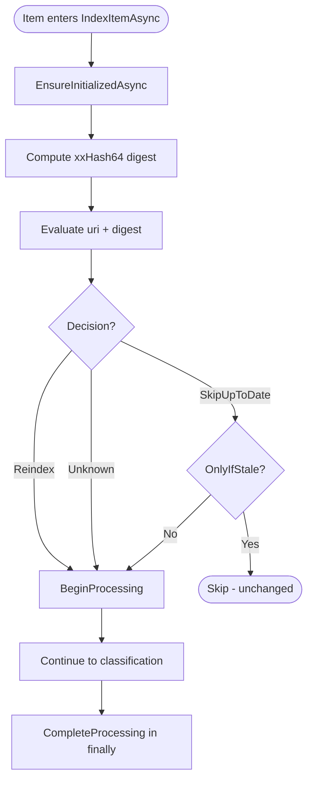

# Catalog Gating Flow

Compares file digests to skip unchanged files, enabling incremental indexing.

## Why This Matters

| Without catalog gating | With catalog gating |
|-----------------------|---------------------|
| Every file reprocessed on every scan | Only changed files reprocessed |
| Startup takes minutes | Startup takes seconds (warm cache) |
| Wasted CPU and I/O | Resources spent only on actual changes |

## Trigger

Item enters `IndexItemAsync()` after passing filter check.

## Stages

### 1. Catalog Initialization

**Actor**: DocumentCatalog
**Action**: `EnsureInitializedAsync()` - lazy load from database on first call
**Output**: `_entries` dictionary populated from `artifact` table
**Failure**: Exception propagates, item fails

```csharp
await DocumentCatalog.EnsureInitializedAsync(cancellationToken);
```

Initialization is idempotent - safe to call multiple times. Uses `SemaphoreSlim` to ensure single initialization.

### 2. Digest Computation

**Actor**: RawArtifact
**Action**: `await item.RawArtifact.Digest` computes xxHash64 of file content
**Output**: `digestHex` string (16 hex characters)
**Failure**: I/O error propagates, item fails

```csharp
var digestBytes = await item.RawArtifact.Digest.WithCancellation(cancellationToken);
var digestHex = Convert.ToHexString(digestBytes);
item.DigestHex = digestHex;
```

Digest is lazy-computed on first access and cached.

### 3. Catalog Evaluation

**Actor**: DocumentCatalog
**Action**: `Evaluate(uri, digestHex)` compares against committed and pending digests
**Output**: `DocumentCatalogEvaluation` with `Decision` and `Existing` entry

```csharp
var evaluation = DocumentCatalog.Evaluate(item.Uri, digestHex);
```

Evaluation checks in order:
1. Is URI+digest in `_pendingDigests`? → `SkipUpToDate` (duplicate in-flight)
2. Is URI in `_entries` with matching digest? → `SkipUpToDate` (unchanged)
3. Is URI in `_entries` with different digest? → `Reindex` (file changed)
4. URI not in catalog? → `Unknown` (new file)

### 4. Decision Branch

**Actor**: IndexingEngine
**Action**: Check `OnlyIfStale` flag and decision
**Output**: Skip or continue processing

| Decision | OnlyIfStale | Result |
|----------|-------------|--------|
| `SkipUpToDate` | true | Return immediately, item skipped |
| `SkipUpToDate` | false | Continue (forced reindex) |
| `Reindex` | any | Continue with existing entry for merge |
| `Unknown` | any | Continue (new file) |

```csharp
if (item.Options.HasFlag(IndexItemOptions.OnlyIfStale) &&
    evaluation.Decision == DocumentCatalogDecision.SkipUpToDate)
{
    RecordResult(item.Epoch, PipelineResult.Filtered);
    return;
}
```

### 5. Processing Registration

**Actor**: DocumentCatalog
**Action**: `BeginProcessing(uri, digestHex)` adds to `_pendingDigests`
**Output**: Concurrent same-file enqueues will see `SkipUpToDate`
**Failure**: N/A

```csharp
DocumentCatalog.BeginProcessing(item.Uri, digestHex);
catalogRegistered = true;
```

This prevents duplicate work when the same file is enqueued twice before the first completes.

### 6. Processing Cleanup

**Actor**: DocumentCatalog
**Action**: `CompleteProcessing(uri)` removes from `_pendingDigests` (in finally block)
**Output**: URI available for future processing
**Failure**: N/A (always runs via finally)

```csharp
finally
{
    if (catalogRegistered)
        DocumentCatalog.CompleteProcessing(item.Uri);
}
```

## Termination

Flow completes with one of:
- **Skip**: Decision is `SkipUpToDate` and `OnlyIfStale` flag set
- **Continue**: Item proceeds to classification stage

## Flow Diagram



## Deduplication Logic

```
┌─────────────────────────────────────────────────────────────┐
│                    Evaluate(uri, digest)                     │
├─────────────────────────────────────────────────────────────┤
│                                                             │
│  1. Check _pendingDigests[uri]                              │
│     ├── Found with matching digest → SkipUpToDate           │
│     └── Not found → continue                                │
│                                                             │
│  2. Check _entries[uri]                                     │
│     ├── Found with matching digest → SkipUpToDate           │
│     ├── Found with different digest → Reindex               │
│     └── Not found → Unknown                                 │
│                                                             │
└─────────────────────────────────────────────────────────────┘
```

## Catalog Update

The catalog is updated AFTER successful database commit, not during processing:

```
BeginProcessing(uri, digest)     ← marks as pending
    ↓
[Pipeline stages...]
    ↓
Committer.CommitAsync()
    ↓
_catalog.ApplyUpsert(entry)      ← updates committed state
    ↓
CompleteProcessing(uri)          ← clears pending state
```

This ensures the catalog reflects committed database state, not in-progress state.

## Thread Safety

| Component | Mechanism |
|-----------|-----------|
| `_entries` | `ConcurrentDictionary` - lock-free reads/writes |
| `_pendingDigests` | `ConcurrentDictionary` - lock-free reads/writes |
| Initialization | `SemaphoreSlim` - single initialization |

## Error Handling

| Error | Behaviour |
|-------|-----------|
| Initialization fails | Exception propagates, item fails |
| Digest I/O error | Exception propagates, item fails |
| Evaluation | Never throws - pure comparison |
| Any pipeline error | `CompleteProcessing()` always called via finally |

## Key Files

| File | Role |
|------|------|
| `src/Indexing/RepoQL.Indexing/Indexing/State/DocumentCatalog.cs` | Catalog implementation |
| `src/Indexing/RepoQL.Indexing/Indexing/State/DocumentCatalogEntry.cs` | Entry record type |
| `src/Indexing/RepoQL.Indexing/Indexing/IndexingEngine.cs` | `IndexItemAsync()` orchestration |

## Related

- `commit-batching.md` - How `ApplyUpsert()` is called after commit
- `startup-scan.md` - Uses `OnlyIfStale` to skip unchanged files
- `reindex.md` - Bypasses `OnlyIfStale` for forced reprocessing
