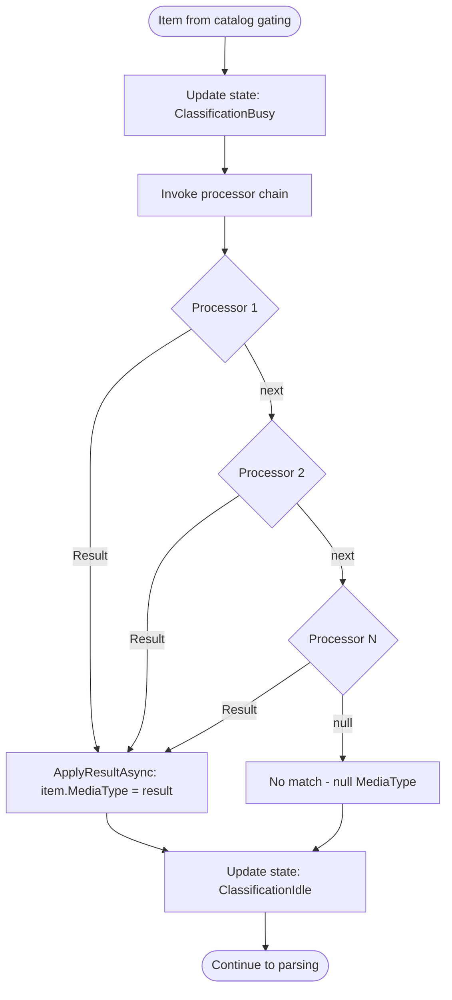

# Classification Flow

Determines the semantic media type of a file, enabling format-specific parsing.

## Why This Matters

| Without classification | With classification |
|-----------------------|---------------------|
| All files treated as plain text | Format-specific parsing extracts structure |
| No code intelligence | Classes, functions, imports recognized |
| Generic search only | Semantic search over structured content |

## Trigger

Item passes catalog gating and enters `ApplyIndexerPipeline()`.

## Stages

### 1. Stage Entry

**Actor**: StageContext
**Action**: `RunAsync()` increments `_stageCounters[ClassificationBusy]`
**Output**: State changed to include `ClassificationBusy` flag
**Failure**: N/A

```csharp
updateState(ClassificationBusy, ClassificationIdle, true);
```

### 2. Processor Chain Invocation

**Actor**: ClassificationPipeline
**Action**: Invoke registered `IAsyncPipeline<IDiscoveredArtifact, SemanticMediaType?>` processors
**Output**: First processor returning non-null result wins
**Failure**: Exception → `PipelineResult.Error`

Processors are invoked in registration order. Each can:
- Return a result (processing stops)
- Call `next()` to delegate to subsequent processor
- Return null (same as calling next)

### 3. Media Type Resolution

**Actor**: Classification Processors
**Action**: Examine file properties to determine type
**Output**: `SemanticMediaType` with kind parameter

Resolution strategies by processor type:

| Processor | Strategy | Example |
|-----------|----------|---------|
| ExtensionClassifier | File extension lookup | `.cs` → `text/plain;kind=code.csharp` |
| MimeClassifier | MIME type mapping | `application/json` → JSON kind |
| ContentSniffer | Magic bytes / content patterns | Shebang → script type |

### 4. Result Application

**Actor**: ClassificationPipeline
**Action**: `ApplyResultAsync()` sets `item.MediaType = result`
**Output**: Item has resolved semantic media type
**Failure**: N/A

```csharp
protected override Task ApplyResultAsync(IndexItem item, SemanticMediaType? result, CancellationToken ct)
{
    item.MediaType = result;
    return Task.CompletedTask;
}
```

### 5. Stage Exit

**Actor**: StageContext (finally block)
**Action**: Decrements `_stageCounters[ClassificationBusy]`
**Output**: State may transition to `ClassificationIdle` if counter reaches zero
**Failure**: N/A (guaranteed via finally)

## Termination

Flow completes when:
- MediaType set on item → `PipelineResult.Success`
- Exception thrown → `PipelineResult.Error`
- Cancellation → `PipelineResult.Cancelled`

## Flow Diagram



## SemanticMediaType Format

```
base/subtype;kind=domain.entity

Examples:
  text/plain;kind=code.csharp
  text/markdown;kind=markdown.doc
  application/json;kind=config.package-json
  application/xml;kind=dotnet.csproj
```

| Component | Purpose |
|-----------|---------|
| `base/subtype` | Standard MIME type (wire format) |
| `kind` | Semantic representation (what the bytes mean) |

The `kind` parameter enables format-specific parsing while maintaining MIME compatibility.

## Processor Chain Pattern

```csharp
public async Task<(TResult?, PipelineResult)> ProcessAsync(
    TInput item,
    Func<TInput, Task<(TResult?, PipelineResult)>> next,
    CancellationToken ct)
{
    // Check if this processor handles the item
    if (!CanHandle(item))
        return await next(item);  // Delegate to next processor

    // Process and return result
    var result = DoClassification(item);
    return (result, PipelineResult.Success);
}
```

First processor to return a non-null result wins. If all processors return null or call next, the item proceeds with null MediaType.

## Error Handling

| Error | Behaviour |
|-------|-----------|
| Processor exception | Caught by PipelinePhase, returns `PipelineResult.Error` |
| Cancellation | Returns `PipelineResult.Cancelled` |
| No matching processor | Null MediaType, parsing uses fallback |

## Telemetry

| Metric | Description |
|--------|-------------|
| `repoql.indexing.classification.processing` | UpDownCounter of items in-flight |
| `repoql.indexing.classification.processed` | Counter of items completed |
| `repoql.indexing.classification.duration` | Histogram of processing time |

## Key Files

| File | Role |
|------|------|
| `src/Indexing/RepoQL.Indexing/Indexing/Pipelines/Classification/ClassificationPipeline.cs` | Pipeline orchestration |
| `src/Indexing/RepoQL.Indexing/Indexing/Pipelines/PipelinePhase.cs` | Base class with processor chain logic |
| `src/Indexing/Formats/*/Processors/*Classifier.cs` | Format-specific classifiers |

## Related

- `parsing.md` - Uses MediaType to select parser
- `state-machine.md` - How ClassificationBusy/Idle flags work
- `commit-batching.md` - MediaType stored in artifact record
