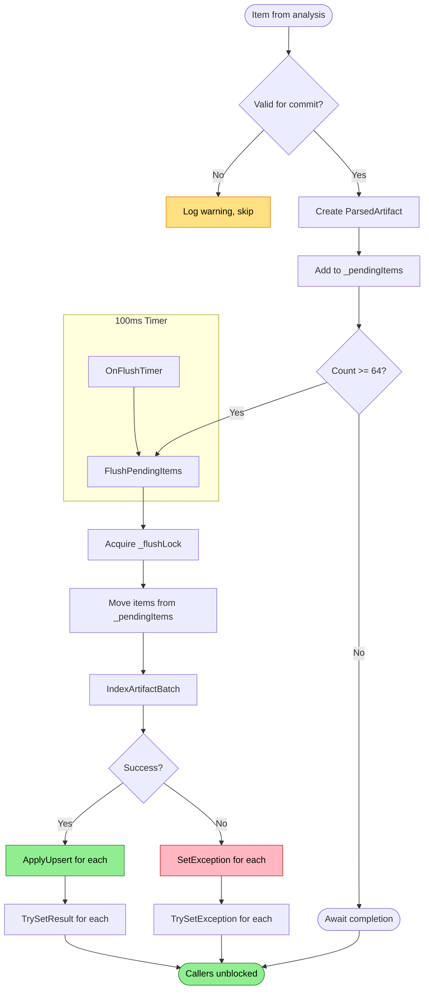

# Commit Batching Flow

Persists parsed items to DuckDB in batches for efficient writes.

## Why This Matters

| Without batching | With batching |
|------------------|---------------|
| One transaction per file | One transaction per 64 files |
| High transaction overhead | Amortized transaction cost |
| Slow indexing | Fast bulk inserts |

## Trigger

Item completes single-file analysis with `PipelineResult.Success`.

## Stages

### 1. Validation

**Actor**: IndexingCommitter
**Action**: Verify item has required data for commit
**Output**: Proceed or skip with warning
**Failure**: Missing data → log warning, return early (no exception)

Validation checks:
- `item.Records` is not null
- `item.DigestHex` is not empty
- `item.MediaType` is resolved (or provisional available)
- Records contain a document node

```csharp
if (item.Records is null)
{
    _logger.LogWarning("Skipping commit for {Uri} because no records were produced.", item.Uri);
    return;
}
```

### 2. ParsedArtifact Creation

**Actor**: IndexingCommitter
**Action**: `CreateCommitRecords()` merges parser and analyzer annotations
**Output**: `ParsedArtifact` ready for database write
**Failure**: N/A

```csharp
var combinedAnnotations = existingAnnotations.Length == 0
    ? analyzerAnnotations
    : analyzerAnnotations.Length == 0
        ? existingAnnotations
        : [.. existingAnnotations, .. analyzerAnnotations];
```

### 3. Batch Queueing

**Actor**: IndexingCommitter
**Action**: Add `PendingCommit` to `_pendingItems` list
**Output**: Item in batch, caller receives `TaskCompletionSource` to await
**Failure**: Disposed → `ObjectDisposedException`

```csharp
lock (_batchLock)
{
    _pendingItems.Add(pending);
    shouldFlush = _pendingItems.Count >= MaxBatchSize;
}
```

### 4. Batch Trigger

**Actor**: IndexingCommitter
**Action**: Flush when batch size reached OR timer fires
**Output**: Batch ready for write
**Failure**: N/A

| Trigger | Condition |
|---------|-----------|
| Size | `_pendingItems.Count >= 64` |
| Time | 100ms timer fires |

### 5. Flush Serialization

**Actor**: IndexingCommitter
**Action**: Acquire `_flushLock` to serialize all database writes
**Output**: Single writer guaranteed
**Failure**: N/A

```csharp
lock (_flushLock)
{
    // Only one flush at a time
    // Prevents DuckDB write-write conflicts
}
```

### 6. Database Write

**Actor**: DuckDbDataStore
**Action**: `IndexArtifactBatch()` writes all entities in single transaction
**Output**: Data persisted to artifact, node, edge, span, annotation tables
**Failure**: Exception → all items in batch get exception

Write order within transaction:
1. Artifact record (document metadata)
2. Nodes (graph vertices)
3. Edges (graph relationships)
4. Spans (location references)
5. Annotations (lint, metrics, todos)

### 7. Catalog Update

**Actor**: IndexingCommitter
**Action**: `_catalog.ApplyUpsert(entry)` for each committed item
**Output**: DocumentCatalog reflects committed state
**Failure**: N/A (after successful DB write)

```csharp
var entry = new DocumentCatalogEntry(
    item.Uri,
    item.DigestHex!,
    mediaType!,
    item.RawArtifact.PhysicalPath,
    item.LastModified);
_catalog.ApplyUpsert(entry);
```

### 8. Caller Notification

**Actor**: IndexingCommitter
**Action**: `pending.Completion.TrySetResult()` for each item
**Output**: All waiting callers unblocked
**Failure**: N/A

## Termination

Flow completes when:
- Database write succeeds → all callers notified with success
- Database write fails → all callers receive exception

## Flow Diagram


*Colors: Green = success path, Red = error path, Yellow = validation skip*

## Batching Configuration

| Constant | Value | Purpose |
|----------|-------|---------|
| `MaxBatchSize` | 64 | Items before immediate flush |
| `FlushIntervalMs` | 100 | Timer interval for time-based flush |

Trade-off: Larger batches = better throughput, higher latency for individual items.

## Write Serialization

All database writes go through `_flushLock`:

```
Thread A: CommitAsync() → Queue → Wait on TCS
Thread B: CommitAsync() → Queue → Triggers flush
Thread B: FlushPendingItems() → Acquires _flushLock
Thread C: CommitAsync() → Queue → Size triggers flush
Thread C: FlushPendingItems() → Blocked on _flushLock
Thread B: Completes write → Releases lock → Notifies A and B
Thread C: Acquires lock → Writes → Notifies C
```

This ensures single-writer access to DuckDB, preventing corruption.

## Error Handling

| Error | Behaviour |
|-------|-----------|
| Validation fails | Log warning, skip item (no exception) |
| Database write fails | All items in batch receive exception |
| Disposed during commit | `ObjectDisposedException` |

## Telemetry

Logged per batch:
```
Committed batch of {Count} items in {ElapsedMs:F1}ms ({PerItem:F1}ms/item)
```

## Key Files

| File | Role |
|------|------|
| `src/Indexing/RepoQL.Indexing/Indexing/Commit/IndexingCommitter.cs` | Batching and write orchestration |
| `src/Data/RepoQL.Data.DuckDB/DuckDbDataStore.cs` | `IndexArtifactBatch()` implementation |
| `src/Indexing/RepoQL.Indexing/Indexing/State/DocumentCatalog.cs` | `ApplyUpsert()` updates |

## Related

- `catalog-gating.md` - How catalog state is used for incremental indexing
- `epoch-tracking.md` - How committed items transition to idle processing
- `state-machine.md` - Commit stage has no dedicated state flag (runs inline)
