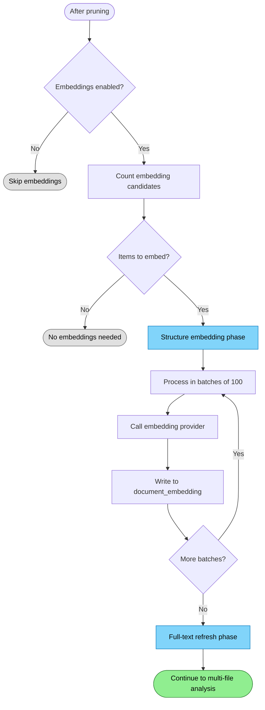

# Embedding Generation Flow

Generates embeddings for semantic search capabilities.

## Why This Matters

| Without embeddings | With embeddings |
|-------------------|-----------------|
| Keyword search only | Semantic "meaning" search |
| Exact matches required | Conceptually similar results |
| No code understanding | "Find authentication code" works |

## Trigger

After pruning completes in `ReleaseAnalysisAsync(epoch)`.

## Stages

### 1. Mode Check

**Actor**: EmbeddingCoordinator
**Action**: Check `_embeddingMode` configuration
**Output**: Skip if embeddings disabled
**Failure**: N/A

```csharp
if (!_embeddingMode.IncludesStructure())
{
    _logger.LogDebug("Structure embedding skipped: mode={Mode}", _embeddingMode);
    return;
}
```

Embedding modes:
- `None` - No embeddings
- `StructureOnly` - Only headline + structure
- `Full` - Structure + full document text

### 2. Structure Embedding Generation

**Actor**: EmbeddingCoordinator
**Action**: `GenerateStructureEmbeddingsAsync(items)` for ALL items including read-only imports
**Output**: Vector embeddings for headline + structure text
**Failure**: Provider failure logged, continues

```csharp
// Structure embeddings include ALL items, even read-only imports
await EmbeddingCoordinator.GenerateStructureEmbeddingsAsync(structureEmbedItems, ct);
```

Structure embeddings enable fast semantic search without reading file content.

### 3. Payload Construction

**Actor**: EmbeddingCoordinator
**Action**: Build embedding payload from artifact metadata
**Output**: Text payload for embedding provider
**Failure**: Empty payload → skip item

```csharp
private static string BuildStructurePayload(string uri, string? headline, string? structure)
{
    // Format: relativePath\n\nheadline\n\nstructure
    var relativeUri = uri.Replace("file:///", "").Replace('\\', '/');

    if (!hasHeadline && !hasStructure)
        return relativeUri;

    return string.Concat(relativeUri, "\n\n", headline, "\n\n", structure);
}
```

Example payload:
```
src/Services/UserService.cs

UserService.cs | UserService : IUserService | CreateAsync, GetById

- UserService : IUserService
  - CreateAsync(CreateUserRequest) → Task<User>
  - GetById(Guid) → Task<User?>
  - UpdateAsync(Guid, UpdateUserRequest) → Task<User>
```

### 4. Batch Processing

**Actor**: EmbeddingCoordinator
**Action**: Process in batches of 100, call embedding provider
**Output**: `float[][]` embeddings from provider
**Failure**: Batch failure logged, continue with next batch

```csharp
const int StructureEmbeddingBatchSize = 100;

foreach (var item in items)
{
    batch.Add(work);
    if (batch.Count >= StructureEmbeddingBatchSize)
    {
        await EmbedStructureBatchAsync(batch, ...);
        batch.Clear();
    }
}
```

### 5. Embedding Storage

**Actor**: DuckDbDataStore
**Action**: `WriteEmbeddings()` inserts `DocumentEmbedding` records
**Output**: `document_embedding` table populated
**Failure**: Write error propagates

```csharp
documentEmbeddings.Add(new DocumentEmbedding(
    work.DocId,
    work.NodeId,
    ChunkIndex: 0,  // Structure embeddings are always chunk 0
    DocumentEmbedding.TypeStructure,  // Type = 0
    work.Uri,
    DocumentEmbedding.ScopeDocument,
    vec,
    _embeddingProvider.Model,
    _embeddingProvider.Dimension));

_db.WriteEmbeddings(documentEmbeddings);
```

### 6. Full-Text Refresh

**Actor**: EmbeddingCoordinator
**Action**: `ApplyAsync(latestItem)` triggers full-text embedding refresh
**Output**: Full document content embedded
**Failure**: Logged, continues

```csharp
if (pendingItems.Length > 0)
{
    await EmbeddingCoordinator.ApplyAsync(latest, ct);
}
```

Full-text embeddings enable deeper semantic search but are more expensive.

### 7. Search Readiness

**Actor**: Search macros over `document_embedding`
**Action**: semantic search reads refreshed embeddings directly
**Output**: exact linear cosine similarity over current embeddings
**Failure**: missing embeddings reduce recall until next refresh

## Termination

Flow completes when:
- All structure embeddings generated and stored
- Full-text refresh triggered
- refreshed embeddings available for semantic search

## Flow Diagram


*Colors: Green = continue to next phase, Blue = embedding phase active, Gray = skipped*

## Embedding Types

| Type | Value | Content | Purpose |
|------|-------|---------|---------|
| Structure | 0 | headline + structure | Fast semantic search |
| FullText | 1 | Document content chunks | Deep semantic search |

## DocumentEmbedding Schema

```
DocumentEmbedding
├── DocId            GUID of document node
├── NodeId           GUID of embedded node (same as DocId for structure)
├── ChunkIndex       0 for structure, 0..N for full-text chunks
├── Type             0=Structure, 1=FullText
├── Uri              File URI
├── Scope            "document" or symbol scope
├── Vector           float[] embedding vector
├── Model            Embedding model name
└── Dimension        Vector dimension (e.g., 1536)
```

## ReadOnly Items Get Embeddings

Unlike analysis, embeddings are generated for ALL items including read-only imports:

| Item Type | Analysis | Embeddings |
|-----------|----------|------------|
| Local files (`file://`) | Yes | Yes |
| Imports (`github://`) | No | Yes |

Imports need embeddings for search but don't need local code quality analysis.

## Concurrency Control

```csharp
private static readonly int RefreshConcurrency = GetRefreshConcurrency();
private readonly SemaphoreSlim _refreshGate = new(RefreshConcurrency, RefreshConcurrency);

// Default: 2 concurrent batches
// Override via REPOQL_EMBED_CONCURRENCY env var
```

## Progress Reporting

```csharp
_logger.LogInformation(
    "Structure embeddings: {Batch}/{Total} ({Percent}%) - {BatchSize} items in {Time}{Eta}",
    batchNumber, totalBatches, percentComplete, batchCount, elapsed, etaStr);
```

Example output:
```
Structure embeddings: 5/12 (41%) - 100 items in 2.3s, ETA 5s
```

## Error Handling

| Error | Behaviour |
|-------|-----------|
| Provider unavailable | Skip embeddings, log debug |
| Batch embedding fails | Log error, continue with next batch |
| DB write fails | Exception propagates |
| Full refresh fails | Warning logged, continues |

## Configuration

| Variable | Default | Effect |
|----------|---------|--------|
| `REPOQL_EMBED_CONCURRENCY` | 2 | Concurrent embedding batches |
| `EmbeddingMode` | `Full` | Which embeddings to generate |

## Key Files

| File | Role |
|------|------|
| `src/Indexing/RepoQL.Indexing/Indexing/PostProcessing/EmbeddingCoordinator.cs` | Orchestration |
| `src/Indexing/RepoQL.Indexing/Indexing/PostProcessing/DuckDbEmbeddingRefreshRunner.cs` | Full-text refresh |
| `src/Data/RepoQL.Data.DuckDB/DuckDbDataStore.cs` | `WriteEmbeddings()` |

## Related

- `pruning.md` - Runs before embedding generation
- `multi-file-analysis.md` - Runs after embeddings
- `import.md` - Imports get embeddings but not analysis
