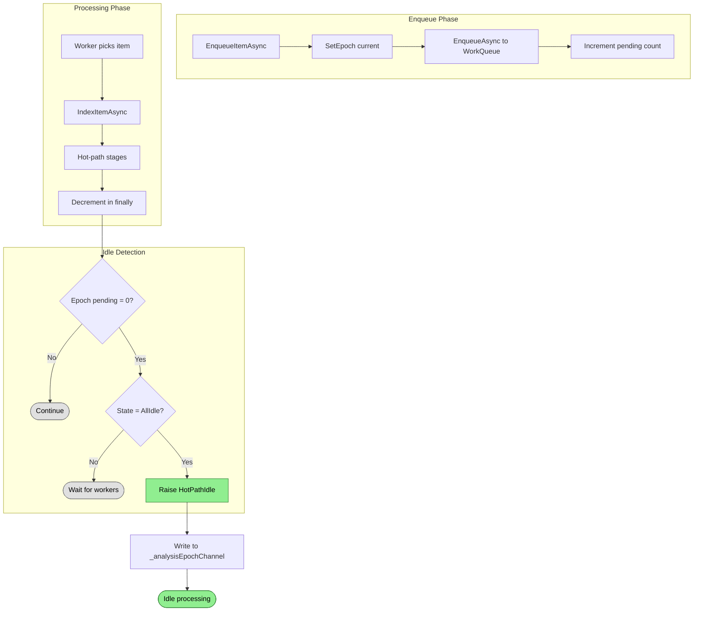

# Epoch Tracking Flow

Batches work items by epoch to coordinate hot-path completion and idle processing.

## Why This Matters

| Without epochs | With epochs |
|----------------|-------------|
| No way to know when "done" | Clear boundary when work batch completes |
| Idle processing runs constantly | Idle processing runs once per batch |
| No progress tracking | Measurable progress per epoch |

## Trigger

Items enqueued via `EnqueueItemAsync()` or completed via `IndexItemAsync()`.

## Stages

### 1. Epoch Assignment

**Actor**: IndexingEngine
**Action**: Stamp item with current epoch number
**Output**: `item.Epoch = _epochTracker.CurrentEpoch`
**Failure**: N/A

```csharp
internal async ValueTask<bool> EnqueueIndexItemAsync(IndexItem indexItem, CancellationToken ct)
{
    var epoch = _epochTracker.CurrentEpoch;
    indexItem.SetEpoch(epoch);
    ...
}
```

All items enqueued before `BeginNewEpoch()` share the same epoch number.

### 2. Pending Increment

**Actor**: EpochTracker
**Action**: `Increment(epoch)` after successful queue add
**Output**: `_pendingByEpoch[epoch]++`, peak tracked
**Failure**: N/A

```csharp
var enqueued = await IndexerQueue.EnqueueAsync(indexItem, ct);
if (!enqueued)
    return false;

_epochTracker.Increment(epoch);
```

Increment happens AFTER successful enqueue to ensure count accuracy.

### 3. Item Processing

**Actor**: WorkQueue workers
**Action**: Process item through hot-path stages (classify → parse → analyze → commit)
**Output**: Item completed with some `PipelineResult`
**Failure**: Exception logged per-item, epoch continues

### 4. Pending Decrement

**Actor**: IndexingEngine (finally block of `IndexItemAsync`)
**Action**: `_epochTracker.Decrement(item.Epoch)`
**Output**: Returns `true` if epoch pending count reaches zero
**Failure**: N/A (always runs via finally)

```csharp
finally
{
    ...
    var epochComplete = _epochTracker.Decrement(item.Epoch);
    if (epochComplete && State == IndexingState.AllIdle)
    {
        HotPathIdle?.Invoke(this, new HotPathIdleEventArgs(item.Epoch));
    }
}
```

### 5. Idle Detection

**Actor**: IndexingEngine
**Action**: Check if `Decrement` returned true AND `State == AllIdle`
**Output**: `HotPathIdle` event raised with epoch number
**Failure**: N/A

Both conditions must be true:
- Epoch pending count is zero (all items for this epoch processed)
- All stage counters are zero (no workers in any stage)

### 6. Idle Epoch Enqueue

**Actor**: IndexingEngine
**Action**: `EnqueueIdleEpoch(epoch)` writes to `_analysisEpochChannel`
**Output**: Epoch queued for idle processing
**Failure**: N/A

```csharp
private void OnHotPathIdle(object? sender, HotPathIdleEventArgs args)
{
    EnqueueIdleEpoch(args.Epoch);
}

internal void EnqueueIdleEpoch(long epoch)
{
    _analysisEpochChannel.Writer.TryWrite(epoch);
}
```

## Termination

Epoch tracking is continuous. Individual epochs complete when:
- All items processed (pending count → 0)
- All workers idle (state → AllIdle)
- Epoch written to idle processing channel

## Flow Diagram


*Colors: Green = idle triggered, Gray = continue processing*

## EpochTracker Internals

```csharp
private sealed class EpochTracker
{
    private long _currentEpoch;
    private readonly Dictionary<long, int> _pendingByEpoch = new();
    private readonly Dictionary<long, int> _peakByEpoch = new();
    private readonly object _lock = new();

    public long BeginNewEpoch() => Interlocked.Increment(ref _currentEpoch);

    public void Increment(long epoch)
    {
        lock (_lock)
        {
            _pendingByEpoch[epoch] = _pendingByEpoch.GetValueOrDefault(epoch) + 1;
            // Track peak for progress reporting
            var newCount = _pendingByEpoch[epoch];
            if (newCount > _peakByEpoch.GetValueOrDefault(epoch))
                _peakByEpoch[epoch] = newCount;
        }
    }

    public bool Decrement(long epoch)
    {
        lock (_lock)
        {
            if (!_pendingByEpoch.TryGetValue(epoch, out var count))
                return false;
            if (count <= 1)
            {
                _pendingByEpoch.Remove(epoch);
                return true;  // Epoch complete
            }
            _pendingByEpoch[epoch] = count - 1;
            return false;
        }
    }
}
```

## Key Invariants

| Invariant | Consequence of Violation |
|-----------|--------------------------|
| Epochs are monotonically increasing | Reusing epoch numbers breaks idle coordination |
| Increment only after successful enqueue | Count would include items never processed |
| Decrement in finally block | Items could leak, epoch never completes |
| Check both pending=0 AND AllIdle | Premature idle triggers corrupt analysis |

## Peak Tracking

Peak tracking enables progress reporting:

```csharp
var total = _epochTracker.GetEpochTotalItems(epoch);  // Peak count
var remaining = _epochTracker.CurrentPendingItems;     // Current count
var processed = total - remaining;
var progress = processed * 100 / total;
```

`_peakByEpoch` tracks the maximum pending count for each epoch, representing the total items that will be processed.

## New Epoch Creation

New epochs are created:
- At startup before initial scan
- After `HotPathIdle` fires (before idle processing)
- Explicitly via `BeginNewEpoch()` for reindex operations

```csharp
public long BeginNewEpoch() => Interlocked.Increment(ref _currentEpoch);
```

## Error Handling

| Error | Behaviour |
|-------|-----------|
| Item processing fails | Decrement still runs (finally), epoch continues |
| All items fail | Epoch still completes (pending → 0) |
| Idle processing fails | Logged, next epoch continues |

## Key Files

| File | Role |
|------|------|
| `src/Indexing/RepoQL.Indexing/Indexing/IndexingEngine.cs` | EpochTracker inner class, idle coordination |
| `src/Indexing/RepoQL.Indexing/Hosting/IndexingCoordinator.cs` | Progress tracking using epoch counts |

## Related

- `state-machine.md` - How AllIdle state is determined
- `pruning.md` - First step of idle processing
- `embedding-generation.md` - Runs after pruning in idle phase
