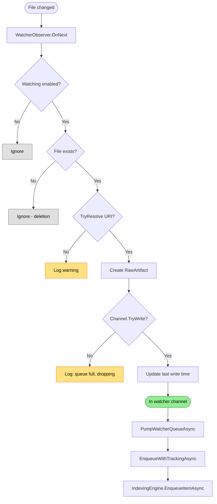

# File Watcher Flow

Detects filesystem changes and feeds them to the indexing pipeline for incremental updates.

## Why This Matters

| Without watcher | With watcher |
|-----------------|--------------|
| Manual reindex needed after edits | Index updates automatically |
| Stale query results | Query results reflect current files |
| Full scan on every change | Only changed files reprocessed |

## Trigger

File system event (create, modify) detected by OS-level file watcher.

Deletions are NOT handled here - they're detected by the pruner during idle processing.

## Stages

### 1. Event Reception

**Actor**: `WatcherObserver` (implements `IObserver<ResourceChange>`)
**Action**: `OnNext(ResourceChange)` receives file system event
**Output**: `ResourceChange` with `CurrentUri` and `File` info
**Failure**: `OnError()` with `InternalBufferOverflowException` marks host dirty for full rescan

```csharp
public void OnNext(ResourceChange value)
{
    if (!_host._watchingEnabled)
        return;

    if (!value.File.Exists)
        return; // deletions handled by pruners when idle
    ...
}
```

### 2. Existence Check

**Actor**: WatcherObserver
**Action**: Check `value.File.Exists`
**Output**: Skip if file doesn't exist (deletion event)
**Failure**: N/A

### 3. Store Resolution

**Actor**: WatcherObserver
**Action**: `_fileSystem.TryResolve(uri)` to get backing store
**Output**: `RawArtifact` created with file and store
**Failure**: Warning logged, event skipped

### 4. Channel Write

**Actor**: RepoqlHost
**Action**: `EnqueueWatcherArtifact()` writes to bounded channel via `TryWrite()`
**Output**: Artifact in watcher channel (capacity: 10,000)
**Failure**: Queue full - log warning, drop change (oldest-drop policy)

```csharp
if (!channel.Writer.TryWrite(artifact) && !_isStopping)
{
    _logger.LogWarning("Watcher queue is full; dropping change for {Uri}", uri);
}
```

### 5. Queue Pump

**Actor**: `PumpWatcherQueueAsync` background task
**Action**: Read from channel, call `EnqueueWithTrackingAsync()`
**Output**: Item enqueued to IndexingEngine
**Failure**: Exception logged per-item, pump continues

```csharp
while (await reader.WaitToReadAsync(stoppingToken))
{
    while (reader.TryRead(out var artifact))
    {
        await EnqueueWithTrackingAsync(artifact, stoppingToken);
    }
}
```

### 6. Last Write Tracking

**Actor**: RepoqlHost
**Action**: `UpdateLastWrite(uri, lastModified)` records timestamp
**Output**: `_lastWriteByUri` dictionary updated
**Failure**: N/A

Used by dirty scan to avoid re-enqueueing unchanged files.

## Termination

Continuous flow until `StopAsync()`:
1. Disposes watcher subscription
2. Stops watcher via `StopAsync()`
3. Completes channel writer
4. Awaits pump task completion

## Flow Diagram


*Colors: Green = success path, Yellow = warning/drop logged, Gray = silently ignored*

## Buffer Overflow Handling

When the OS file watcher buffer overflows:

1. `OnError(InternalBufferOverflowException)` called
2. `MarkDirtyFromWatcher()` sets `_dirty = true`
3. `DirtyScanLoopAsync` (1-second timer) detects dirty flag when indexer idle
4. Full enumeration via `RunDirtyScanAsync()` - only files newer than `_lastWriteByUri` enqueued

```csharp
private void MarkDirtyFromWatcher()
{
    Volatile.Write(ref _dirty, true);
    _logger.LogInformation("File system watcher overflow detected; scheduling dirty scan.");
}
```

## Polling Fallback

If watcher fails to start (e.g., unsupported filesystem):

1. `EnablePollingFallback()` sets `_pollingEnabled = true`
2. `DirtyScanLoopAsync` polls every `PollingInterval` (default: 5 seconds)
3. Each poll runs `RunDirtyScanAsync()` comparing file timestamps

```csharp
if (_pollingEnabled && DateTimeOffset.UtcNow >= _nextPollAt)
{
    if (!IsIndexerBusy())
    {
        _nextPollAt = DateTimeOffset.UtcNow.Add(_options.PollingInterval);
        await RunDirtyScanAsync(stoppingToken);
    }
}
```

## Error Handling

| Error | Behaviour |
|-------|-----------|
| Buffer overflow | Mark dirty, full rescan when idle |
| Watcher fails to start | Fall back to polling (if enabled) |
| TryResolve fails | Log warning, skip event |
| Channel full | Log warning, drop event (DropOldest) |
| Enqueue exception | Log error, pump continues |

## Configuration

| Option | Default | Effect |
|--------|---------|--------|
| `EnableWatching` | `true` | Whether to watch for changes |
| `EnablePollingFallback` | `true` | Poll when watcher unavailable |
| `PollingInterval` | 5 seconds | How often to poll in fallback mode |
| `WatcherQueueCapacity` | 10,000 | Bounded channel capacity |

## Backpressure

| Component | Strategy |
|-----------|----------|
| Watcher channel | `BoundedChannelFullMode.DropOldest` - newest changes preserved |
| IndexerQueue | `BoundedChannelFullMode.Wait` - pump blocks until space |
| `_activeEnqueue` counter | Tracks in-flight work for idle detection |

## Key Files

| File | Role |
|------|------|
| `src/Indexing/RepoQL.Indexing/Hosting/RepoqlHost.cs` | Watcher setup, observer, channel pump |
| `src/Indexing/RepoQL.Indexing/FileSystems/CompositeFileSystem.cs` | `WatchAll()` creates composite watcher |

## Related

- `startup-scan.md` - Initial enumeration before watcher starts
- `pruning.md` - How deletions are detected during idle processing
- `epoch-tracking.md` - How changes are batched
