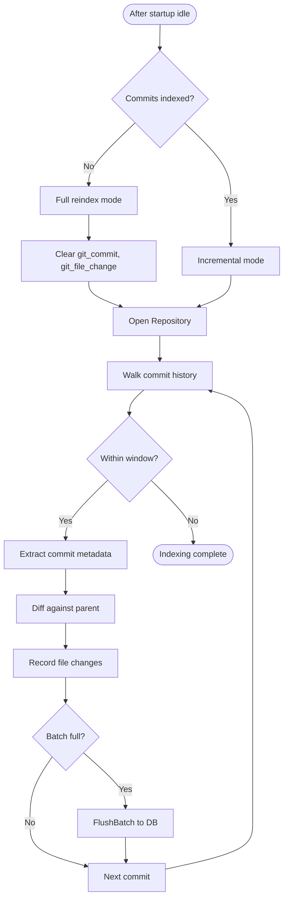

# Git History Indexing Flow

Indexes git commit history for SQL-based code archaeology.

## Why This Matters

| Without git indexing | With git indexing |
|---------------------|-------------------|
| No commit history in queries | Query commits, authors, changes |
| Manual git log parsing | SQL aggregations over history |
| No hotspot detection | Identify frequently-changed files |

## Trigger

`TriggerIncrementalGitIndexingAsync()` called after startup scan and watcher initialization.

## Stages

### 1. Idle Wait

**Actor**: IndexingCoordinator
**Action**: Wait for indexing pipeline to reach idle state
**Output**: Pipeline idle, safe to run git indexing
**Failure**: Timeout or cancellation

```csharp
public async Task TriggerIncrementalGitIndexingAsync(CancellationToken ct)
{
    // Wait for file indexing to complete first
    await WaitForIdleAsync(ct);

    // Then index git history
    await _gitIndexer.IndexIncrementalAsync(repoPath, ct);
}
```

### 2. Mode Selection

**Actor**: GitHistoryIndexer
**Action**: Check if commits already indexed
**Output**: Full reindex or incremental mode
**Failure**: N/A

```csharp
var latestHash = GetLatestIndexedCommitHash();
if (latestHash == null)
{
    // Full index: clear and repopulate 12 months
    await IndexCoreAsync(repoPath, fullReindex: true, ct);
}
else
{
    // Incremental: only new commits since latestHash
    await IndexCoreAsync(repoPath, fullReindex: false, ct);
}
```

### 3. Repository Open

**Actor**: GitHistoryIndexer (via LibGit2Sharp)
**Action**: Open git repository at path
**Output**: `Repository` object for traversal
**Failure**: Not a git repo → exception

```csharp
using var repo = new Repository(repoPath);
```

### 4. Commit Traversal

**Actor**: GitHistoryIndexer
**Action**: Walk commit history with time/hash filter
**Output**: `CommitRecord` objects with metadata
**Failure**: N/A

For full reindex:
```csharp
var cutoff = DateTimeOffset.UtcNow.AddMonths(-HistoryMonths);  // 12 months
var commits = repo.Commits
    .Where(c => c.Author.When >= cutoff)
    .ToList();
```

For incremental:
```csharp
var commits = repo.Commits
    .TakeWhile(c => c.Sha != latestHash)
    .ToList();
```

### 5. File Change Extraction

**Actor**: GitHistoryIndexer
**Action**: `GetFileChanges()` diffs each commit against parent
**Output**: `FileChangeRecord` objects
**Failure**: Diff error logged, continue

```csharp
private List<FileChangeRecord> GetFileChanges(Repository repo, Commit commit, Commit? parent)
{
    var changes = new List<FileChangeRecord>();
    var diff = repo.Diff.Compare<TreeChanges>(
        parent?.Tree,
        commit.Tree);

    foreach (var entry in diff)
    {
        changes.Add(new FileChangeRecord
        {
            CommitHash = commit.Sha,
            FileUri = PathToUri(entry.Path),
            ChangeType = MapChangeType(entry.Status),
            Insertions = entry.LinesAdded,
            Deletions = entry.LinesDeleted
        });
    }
    return changes;
}
```

### 6. Batch Insert

**Actor**: GitHistoryIndexer
**Action**: `FlushBatch()` every 100 commits
**Output**: `git_commit` and `git_file_change` tables populated
**Failure**: Insert error → exception

```csharp
const int BatchSize = 100;

if (commits.Count >= BatchSize || fileChanges.Count >= BatchSize * 10)
{
    FlushBatch(commits, fileChanges);
    commits.Clear();
    fileChanges.Clear();
}
```

## Termination

Flow completes when:
- All commits (within time window) indexed
- All file changes recorded
- Final batch flushed

## Flow Diagram



## Database Schema

### git_commit

| Column | Type | Description |
|--------|------|-------------|
| `hash` | VARCHAR | Commit SHA (primary key) |
| `author_name` | VARCHAR | Author name |
| `author_email` | VARCHAR | Author email |
| `author_date` | TIMESTAMP | When authored |
| `committer_name` | VARCHAR | Committer name |
| `committer_email` | VARCHAR | Committer email |
| `committer_date` | TIMESTAMP | When committed |
| `message` | VARCHAR | Commit message |
| `parent_hashes` | VARCHAR[] | Parent commit SHAs |
| `files_changed` | INTEGER | Number of files changed |
| `insertions` | INTEGER | Lines added |
| `deletions` | INTEGER | Lines deleted |

### git_file_change

| Column | Type | Description |
|--------|------|-------------|
| `commit_hash` | VARCHAR | Foreign key to git_commit |
| `file_uri` | VARCHAR | File URI (file:///path) |
| `change_type` | VARCHAR | added, modified, deleted, renamed |
| `insertions` | INTEGER | Lines added in this file |
| `deletions` | INTEGER | Lines deleted in this file |

## Query Examples

```sql
-- Hotspot analysis: most frequently changed files
SELECT file_uri, COUNT(*) as change_count
FROM git_file_change
GROUP BY file_uri
ORDER BY change_count DESC
LIMIT 10;

-- Author contributions
SELECT author_name, COUNT(*) as commits
FROM git_commit
GROUP BY author_name
ORDER BY commits DESC;

-- Recent activity
SELECT hash, message, author_date
FROM git_commit
ORDER BY author_date DESC
LIMIT 20;
```

## Configuration

| Constant | Value | Purpose |
|----------|-------|---------|
| `BatchSize` | 100 | Commits per batch insert |
| `HistoryMonths` | 12 | Months of history for full reindex |

## LibGit2Sharp Dependency

Uses LibGit2Sharp for cross-platform git access without CLI dependency:
- Pure .NET git implementation
- No `git` binary required
- Consistent behaviour across platforms

## Error Handling

| Error | Behaviour |
|-------|-----------|
| Not a git repo | Exception propagates (logged by coordinator) |
| Diff fails | Log warning, skip file changes for commit |
| Insert fails | Exception propagates |
| Cancellation | Stop traversal, flush partial batch |

## Key Files

| File | Role |
|------|------|
| `src/Indexing/RepoQL.Indexing/Git/GitHistoryIndexer.cs` | Traversal and indexing logic |
| `src/Indexing/RepoQL.Indexing/Hosting/IndexingCoordinator.cs` | `TriggerIncrementalGitIndexingAsync()` |

## Related

- `startup-scan.md` - Git indexing runs after startup scan completes
- `reindex.md` - Git reindex can be triggered explicitly
