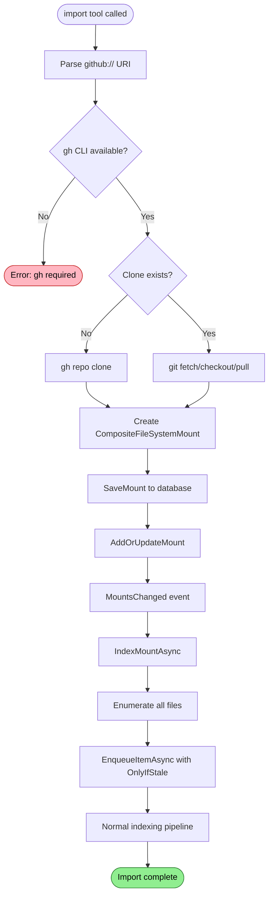

# Import Flow

Clones external repositories and mounts them for indexing.

## Why This Matters

| Without imports | With imports |
|-----------------|--------------|
| Query local code only | Query dependencies and examples |
| Manual context switching | Unified search across codebases |
| No dependency visibility | See how libraries work |

## Trigger

`import` MCP tool called with `github://` URI.

Supported URI formats:
- `github://owner/repo`
- `github://owner/repo@branch`
- `https://github.com/owner/repo`

## Stages

### 1. URI Parsing

**Actor**: GithubRepositoryImporter
**Action**: `ParseSource()` extracts owner, repository, and optional ref
**Output**: `RepositorySpec` record
**Failure**: Invalid URI → exception

```csharp
private readonly record struct RepositorySpec(
    string Owner,
    string Repository,
    string? Ref);

// github://anthropics/claude-code@main
// → Owner: anthropics, Repository: claude-code, Ref: main
```

Ref can be specified via:
- Path segment: `github://owner/repo@branch`
- Query parameter: `github://owner/repo?ref=branch`

### 2. GitHub CLI Check

**Actor**: GithubRepositoryImporter
**Action**: `EnsureGhAvailable()` verifies `gh` CLI installed
**Output**: Proceed or throw
**Failure**: `gh` not found → `InvalidOperationException`

```csharp
private static void EnsureGhAvailable()
{
    // Check once, cache result
    var psi = new ProcessStartInfo { FileName = "gh" };
    psi.ArgumentList.Add("--version");
    using var process = Process.Start(psi);
    if (process.ExitCode != 0)
        throw new InvalidOperationException("GitHub CLI (gh) is required...");
}
```

### 3. Clone or Update

**Actor**: GithubRepositoryImporter
**Action**: Clone new repo or update existing
**Output**: Repository files at `.repoql/imports/github/{owner}/{repo}`
**Failure**: git/gh error → exception with stderr

For new repositories:
```bash
gh repo clone owner/repo .repoql/imports/github/owner/repo -- --branch main --depth 1
```

For existing repositories:
```bash
git fetch --all --depth=1
git checkout {ref}
git pull --depth=1
```

### 4. Mount Creation

**Actor**: GithubRepositoryImporter
**Action**: Create `CompositeFileSystemMount` with import settings
**Output**: Mount descriptor ready for registration
**Failure**: N/A

```csharp
var mount = CompositeFileSystemMount.ForScheme(
    id: $"github:{spec.Owner}/{spec.Repository}",
    fileSystem: fs,
    scheme: "github",
    authority: spec.Owner,
    pathPrefix: spec.Repository,
    includeInEnumeration: true,   // Include in startup scan
    enableWatching: false,        // No file watcher
    enableAnalysis: false);       // Skip analysis
```

### 5. Mount Persistence

**Actor**: DuckDbDataStore
**Action**: `SaveMount()` persists mount record for restart survival
**Output**: `filesystem_mount` table entry
**Failure**: Write error → exception

```csharp
_db.SaveMount(new FileSystemMountRecord
{
    Id = mount.Id,
    Scheme = "github",
    Authority = spec.Owner,
    PathPrefix = spec.Repository,
    SourceUri = source.AbsoluteUri,
    LocalPath = targetRoot,
    IncludeInEnumeration = true,
    EnableWatching = false,
    EnableAnalysis = false
});
```

### 6. Mount Registration

**Actor**: CompositeFileSystemManager
**Action**: `AddOrUpdateMount()` registers with file system
**Output**: `MountsChanged` event fired
**Failure**: N/A

### 7. Automatic Indexing

**Actor**: IndexingCoordinator
**Action**: `OnMountChanged()` → `IndexMountAsync()` enumerates and indexes
**Output**: All import files indexed with `IsReadOnly = true`
**Failure**: Logged, continues

```csharp
private async Task IndexMountAsync(CompositeFileSystemMount mount, CancellationToken ct)
{
    await foreach (var resource in _fileSystem.EnumerateAsync(mount.Id, ct))
    {
        var artifact = new RawArtifact(resource.File, store);
        await _engine.EnqueueItemAsync(artifact, IndexItemOptions.OnlyIfStale, ct);
    }
}
```

## Termination

Flow completes when:
- Repository cloned/updated
- Mount persisted and registered
- All files indexed and embeddings generated

## Flow Diagram


*Colors: Green = success, Red = error*

## Mount Properties

| Property | Value | Purpose |
|----------|-------|---------|
| `includeInEnumeration` | `true` | Include in startup scan |
| `enableWatching` | `false` | No file watcher (static snapshot) |
| `enableAnalysis` | `false` | Skip lint/metrics (external code) |

## Import Items vs Local Items

| Behaviour | Local Files | Import Files |
|-----------|-------------|--------------|
| Classification | Yes | Yes |
| Parsing | Yes | Yes |
| Single-file analysis | Yes | No (`enableAnalysis = false`) |
| Structure embeddings | Yes | Yes |
| Multi-file analysis | Yes | No (`IsReadOnly = true`) |

Imports get search capabilities (parsing + embeddings) without code quality analysis.

## Clone Location

```
.repoql/
└── imports/
    └── github/
        └── owner/
            └── repo/
                ├── .git/
                └── src/...
```

Same folder used regardless of branch - branch switching via `git checkout`.

## Restart Survival

Mounts are persisted to `filesystem_mount` table:

```sql
SELECT id, scheme, authority, path_prefix, source_uri, local_path
FROM filesystem_mount;
```

On restart, mounts are restored from this table and re-registered.

## Error Handling

| Error | Behaviour |
|-------|-----------|
| gh CLI not found | `InvalidOperationException` with install instructions |
| Clone fails | Exception with git/gh stderr |
| Directory exists but not git repo | Delete and re-clone |
| Mount write fails | Exception propagates |

## Key Files

| File | Role |
|------|------|
| `src/Indexing/RepoQL.Indexing/FileSystems/Imports/GithubRepositoryImporter.cs` | Clone/update logic |
| `src/Indexing/RepoQL.Indexing/FileSystems/CompositeFileSystemManager.cs` | Mount registration |
| `src/Indexing/RepoQL.Indexing/Hosting/IndexingCoordinator.cs` | `OnMountChanged()`, `IndexMountAsync()` |

## Related

- `startup-scan.md` - Imports included in startup enumeration
- `embedding-generation.md` - Imports get embeddings
- `multi-file-analysis.md` - Imports excluded from analysis
