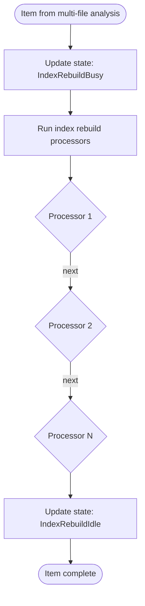

# Index Rebuild Flow

Maintains database indexes during idle processing.

## Why This Matters

| Without index maintenance | With index maintenance |
|--------------------------|------------------------|
| Query performance degrades over time | Consistent query speed |
| Fragmented indexes | Optimized data structures |
| Stale derived data | Up-to-date computed values |

## Trigger

Same items flowing through `AnalyzeItemAsync()` after multi-file analysis stage.

## Stages

### 1. Stage Entry

**Actor**: StageContext
**Action**: Increments `_stageCounters[IndexRebuildBusy]`
**Output**: State includes `IndexRebuildBusy` flag
**Failure**: N/A

### 2. Processor Execution

**Actor**: IndexRebuildPipeline
**Action**: Run registered `IAsyncPipeline<IAnnotatedArtifact, string>` processors
**Output**: Index maintenance operations performed
**Failure**: Processor error logged, continues

```csharp
public class IndexRebuildPipeline(
    IEnumerable<IAsyncPipeline<IAnnotatedArtifact, string>> processors,
    ILogger<IndexRebuildPipeline>? logger = null)
    : PipelinePhase<IAnnotatedArtifact, string>("IndexRebuild", processors, logger)
{
    protected override Task ApplyResultAsync(IndexItem item, string result, CancellationToken ct)
    {
        return Task.CompletedTask;  // Results are side effects
    }
}
```

### 3. Stage Exit

**Actor**: StageContext (finally block)
**Action**: Decrements `_stageCounters[IndexRebuildBusy]`
**Output**: State may include `IndexRebuildIdle`
**Failure**: N/A

## Termination

Flow completes when all items processed through index rebuild processors.

## Flow Diagram



## Parallel Execution

Index rebuild runs in the SAME `AnalyzeItemAsync` call as multi-file analysis:

```csharp
internal async Task AnalyzeItemAsync(IndexItem item, CancellationToken ct)
{
    // Stage 1: Multi-file analysis
    await StageContextExtensions.RunAsync(_multiFileStage, item, ct, UpdateStateFlags);

    // Stage 2: Index rebuild (sequential after multi-file)
    await StageContextExtensions.RunAsync(_indexRebuildStage, item, ct, UpdateStateFlags);
}
```

Both stages have separate state tracking but process items sequentially within each worker.

## Index Rebuild Processor Types

| Processor | Purpose |
|-----------|---------|
| Statistics updater | Update table statistics for query planner |
| Derived table refresher | Recompute materialized views |
| Constraint validator | Verify referential integrity |
| Compaction trigger | Signal need for database compaction |

## Result Type

Unlike other pipelines, index rebuild returns `string` (typically empty or status message):

```csharp
protected override Task ApplyResultAsync(IndexItem item, string result, CancellationToken ct)
{
    return Task.CompletedTask;  // Side effects only, no state change
}
```

The actual work happens as side effects within processors (database operations).

## ReadOnly Items

Index rebuild follows the same filtering as multi-file analysis:
- Only items from `_pendingAnalysis` (excludes read-only)
- Imports don't trigger index maintenance

## Error Handling

| Error | Behaviour |
|-------|-----------|
| Processor throws | Exception logged, other processors continue |
| All processors fail | Item still completes |

## Telemetry

| Metric | Description |
|--------|-------------|
| `repoql.indexing.indexrebuild.processing` | Items in index rebuild |
| `repoql.indexing.indexrebuild.processed` | Items completed |
| `repoql.indexing.indexrebuild.duration` | Rebuild time histogram |

## Key Files

| File | Role |
|------|------|
| `src/Indexing/RepoQL.Indexing/Indexing/Pipelines/Analysis/IndexRebuildPipeline.cs` | Pipeline orchestration |
| `src/Indexing/RepoQL.Indexing/Indexing/IndexingEngine.cs` | `AnalyzeItemAsync()` |

## Related

- `multi-file-analysis.md` - Runs before index rebuild (same AnalyzeItemAsync call)
- `state-machine.md` - IndexRebuildBusy/Idle tracking
- `epoch-tracking.md` - Epoch completes when both analysis stages idle
