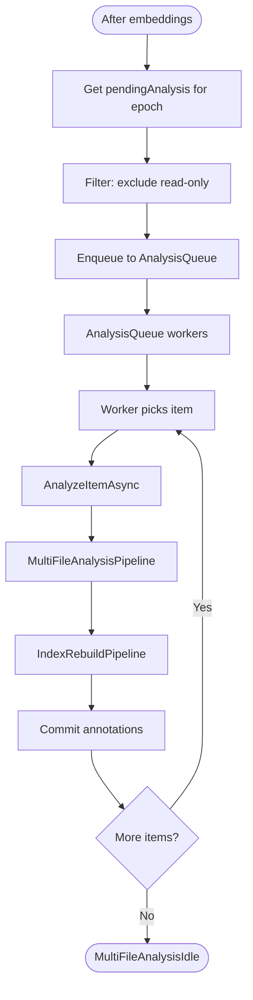

# Multi-File Analysis Flow

Generates cross-file annotations after all files in an epoch are indexed.

## Why This Matters

| Without multi-file analysis | With multi-file analysis |
|----------------------------|--------------------------|
| No cross-file relationships | Dependencies, imports tracked |
| No project-wide metrics | Aggregate quality metrics |
| Single-file view only | Architectural understanding |

## Trigger

After embedding generation completes in `ReleaseAnalysisAsync(epoch)`.

## Stages

### 1. ReadOnly Filter

**Actor**: IndexingEngine
**Action**: Filter out read-only items from analysis queue
**Output**: Only local files proceed to analysis
**Failure**: N/A

```csharp
// _pendingAnalysis excludes read-only items
// _pendingStructureEmbeddings includes ALL items
lock (_analysisLock)
{
    _pendingStructureEmbeddings.Remove(epoch, out structureEmbedQueue);
    _pendingAnalysis.Remove(epoch, out analysisQueue);  // Only non-read-only
}
```

Imports get embeddings (for search) but skip analysis (no external code quality).

### 2. Queue Enqueue

**Actor**: IndexingEngine
**Action**: Enqueue items to `AnalysisQueue`
**Output**: Items in analysis work queue
**Failure**: Backpressure if queue full

```csharp
foreach (var item in pendingItems)
{
    await AnalysisQueue.EnqueueAsync(item, ct);
}
```

AnalysisQueue has 100,000 capacity (larger than hot-path queue).

### 3. Worker Processing

**Actor**: AnalysisQueue workers
**Action**: Call `AnalyzeItemAsync(item)`
**Output**: Multi-file annotations generated
**Failure**: Exception logged, item skipped

```csharp
internal async Task AnalyzeItemAsync(IndexItem item, CancellationToken ct)
{
    try
    {
        var result = await _multiFileStage.Processor(item, ct);
        // Then index rebuild...
    }
    catch (Exception ex)
    {
        LogUriFailedDuringAnalysis(Logger, ex, item.Uri);
    }
}
```

### 4. MultiFileAnalysisPipeline Execution

**Actor**: MultiFileAnalysisPipeline
**Action**: Run registered multi-file analyzers
**Output**: `Annotation[]` for cross-file relationships
**Failure**: Analyzer error logged, continues

Multi-file analyzers have access to the full indexed state and can:
- Resolve imports/dependencies
- Detect cross-file references
- Calculate aggregate metrics
- Identify architectural patterns

### 5. Stage Tracking

**Actor**: StageContext
**Action**: Track `MultiFileAnalysisBusy` / `MultiFileAnalysisIdle` state
**Output**: State machine reflects analysis activity
**Failure**: N/A

### 6. Result Persistence

**Actor**: AnalyzeItemAsync
**Action**: Commit additional annotations to database
**Output**: Cross-file annotations persisted
**Failure**: Write error logged

## Termination

Flow completes when:
- All items processed through multi-file analyzers
- All cross-file annotations committed
- State transitions to `MultiFileAnalysisIdle`

## Flow Diagram



## Parallel with Index Rebuild

Multi-file analysis and index rebuild run in the same `AnalyzeItemAsync` call:

```csharp
internal async Task AnalyzeItemAsync(IndexItem item, CancellationToken ct)
{
    // Multi-file analysis
    await StageContextExtensions.RunAsync(_multiFileStage, item, ct, UpdateStateFlags);

    // Index rebuild (parallel stage)
    await StageContextExtensions.RunAsync(_indexRebuildStage, item, ct, UpdateStateFlags);
}
```

Both stages have their own state tracking but process the same items.

## Analysis vs Structure Embedding Items

```
┌─────────────────────────────────────────────────────────┐
│                   All Indexed Items                      │
├─────────────────────────────────────────────────────────┤
│                                                         │
│  _pendingStructureEmbeddings                            │
│  ├── file:///src/App.cs          (local)               │
│  ├── file:///src/Utils.cs        (local)               │
│  ├── github://owner/repo/Lib.cs  (import, read-only)   │
│  └── help:///guide.md     (embedded docs)       │
│                                                         │
│  _pendingAnalysis (excludes read-only)                  │
│  ├── file:///src/App.cs          (local)               │
│  └── file:///src/Utils.cs        (local)               │
│                                                         │
└─────────────────────────────────────────────────────────┘
```

## Worker Configuration

| Option | Default | Purpose |
|--------|---------|---------|
| `AnalysisWorkers` | `ProcessorCount` | Concurrent analysis workers |
| `AnalysisQueueSize` | 100,000 | Queue capacity |

Analysis workers are fewer than indexing workers because analysis is typically faster.

## Multi-File Analyzer Types

| Analyzer | Produces |
|----------|----------|
| Dependency resolver | Import/reference relationships |
| API surface analyzer | Public API annotations |
| Complexity aggregator | Project-wide metrics |
| Coupling detector | Cross-file dependencies |

## Error Handling

| Error | Behaviour |
|-------|-----------|
| Analyzer throws | Exception logged, item skipped |
| Queue full | Backpressure blocks enqueue |
| DB write fails | Logged, item continues |

## Telemetry

| Metric | Description |
|--------|-------------|
| `repoql.indexing.multifileanalysis.processing` | Items in multi-file analysis |
| `repoql.indexing.multifileanalysis.processed` | Items completed |
| `repoql.indexing.multifileanalysis.duration` | Analysis time histogram |

## Key Files

| File | Role |
|------|------|
| `src/Indexing/RepoQL.Indexing/Indexing/Pipelines/Analysis/MultiFileAnalysisPipeline.cs` | Pipeline orchestration |
| `src/Indexing/RepoQL.Indexing/Indexing/IndexingEngine.cs` | `AnalyzeItemAsync()`, `ReleaseAnalysisAsync()` |

## Related

- `embedding-generation.md` - Runs before multi-file analysis
- `single-file-analysis.md` - Per-file analysis in hot path
- `index-rebuild.md` - Runs parallel with multi-file analysis
