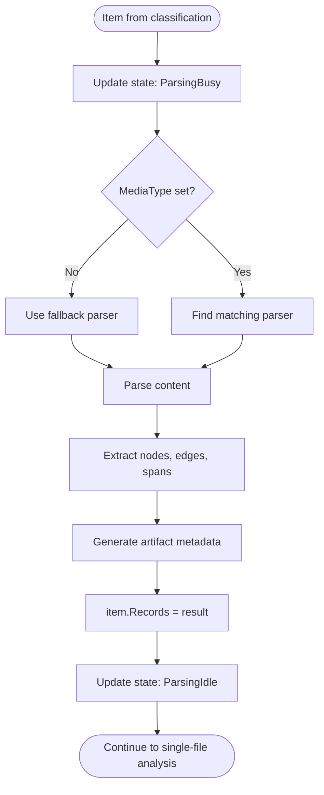

# Parsing Flow

Transforms file content into graph structure (nodes, edges, spans) for querying.

## Why This Matters

| Without parsing | With parsing |
|-----------------|--------------|
| Files are opaque blobs | Files have queryable structure |
| No symbol search | Find classes, functions, imports |
| No cross-file navigation | Follow references between files |
| No structure summaries | Headline + structure enable semantic search |

## Trigger

Item completes classification with a `MediaType` set.

## Stages

### 1. Stage Entry

**Actor**: StageContext
**Action**: Increments `_stageCounters[ParsingBusy]`
**Output**: State includes `ParsingBusy` flag
**Failure**: N/A

### 2. Parser Selection

**Actor**: ParsingPipeline
**Action**: Each registered parser checks if it handles the item's MediaType
**Output**: Matching parser processes item, others call `next()`
**Failure**: No parser matches → empty Records

```csharp
// Parser checks MediaType kind parameter
if (item.MediaType?.Kind != "code.csharp")
    return await next(item);  // Not my format

// Parse the content
var records = await ParseCSharpAsync(item, ct);
return (records, PipelineResult.Success);
```

### 3. Content Reading

**Actor**: Parser
**Action**: Read file content via `item.RawArtifact.CreateReadStream()`
**Output**: File content as stream or string
**Failure**: I/O error → `PipelineResult.Error`

### 4. Structure Extraction

**Actor**: Format-specific Parser
**Action**: Parse content into graph structure
**Output**: `Records` object containing extracted data

| Format | Parser | Extracts |
|--------|--------|----------|
| C# | Roslyn | Classes, methods, properties, using statements |
| Markdown | Markdig | Headings, code blocks, links |
| JSON | System.Text.Json | Object structure, arrays |
| TypeScript | Tree-sitter | Functions, classes, imports |
| GraphQL | GraphQL.NET | Types, queries, mutations |

### 5. Result Application

**Actor**: ParsingPipeline
**Action**: `item.Records = result`
**Output**: Item has parsed graph structure
**Failure**: N/A

```csharp
protected override Task ApplyResultAsync(IndexItem item, Records? result, CancellationToken ct)
{
    item.Records = result;
    return Task.CompletedTask;
}
```

### 6. Stage Exit

**Actor**: StageContext (finally block)
**Action**: Decrements `_stageCounters[ParsingBusy]`
**Output**: State may include `ParsingIdle` if counter reaches zero
**Failure**: N/A

## Termination

Flow completes when:
- Records set on item → `PipelineResult.Success`
- Parse error → `PipelineResult.Error` (logged, item skipped)
- Cancellation → `PipelineResult.Cancelled`

## Flow Diagram



## Records Structure

```
Records
├── Artifacts[]           Document metadata
│   ├── Uri               File URI
│   ├── Headline          One-line summary
│   ├── Summary           Multi-line description
│   └── Structure         ASCII outline of content
│
├── Nodes[]               Graph nodes
│   ├── Id                Unique GUID
│   ├── Kind              "document", "class", "function", etc.
│   ├── Name              Display name
│   └── QualifiedName     Fully qualified name
│
├── Spans[]               Location references
│   ├── NodeId            Owning node
│   ├── StartLine         1-based line number
│   ├── EndLine           1-based line number
│   └── StartChar         0-based character offset
│
├── Edges[]               Relationships
│   ├── SourceId          From node
│   ├── TargetId          To node
│   └── Type              "CONTAINS", "IMPORTS", "CALLS"
│
└── Annotations[]         Parser-generated annotations
    ├── Kind              "lint", "todo", "complexity"
    ├── Severity          "error", "warning", "info"
    └── Message           Human-readable text
```

## Artifact Metadata

Every parsed file gets an artifact with X-ray metadata:

| Field | Purpose | Example |
|-------|---------|---------|
| `Headline` | One-line file summary | `UserService.cs \| UserService : IUserService \| CreateAsync, GetById` |
| `Summary` | Multi-paragraph description | Extracted from doc comments |
| `Structure` | ASCII hierarchy | Indented outline of classes/functions |

This metadata powers semantic search without reading full file content.

## Error Handling

| Error | Behaviour |
|-------|-----------|
| Parse exception | Logged, `PipelineResult.Error`, item skipped |
| Partial parse failure | Return partial Records, log warning |
| No matching parser | Empty Records, item continues |
| I/O error | Exception propagates, item fails |

## Telemetry

| Metric | Description |
|--------|-------------|
| `repoql.indexing.parsing.processing` | Items currently being parsed |
| `repoql.indexing.parsing.processed` | Total items parsed |
| `repoql.indexing.parsing.duration` | Parse time histogram |

Tagged with `mime_type` for per-format analysis.

## Key Files

| File | Role |
|------|------|
| `src/Indexing/RepoQL.Indexing/Indexing/Pipelines/Parsing/ParsingPipeline.cs` | Pipeline orchestration |
| `src/Indexing/Formats/*/Processors/*Parser.cs` | Format-specific parsers |
| `src/Indexing/RepoQL.Contracts/Models/Records.cs` | Records data structure |

## Related

- `classification.md` - Determines which parser to use
- `single-file-analysis.md` - Adds annotations to parsed Records
- `commit-batching.md` - Persists Records to database
