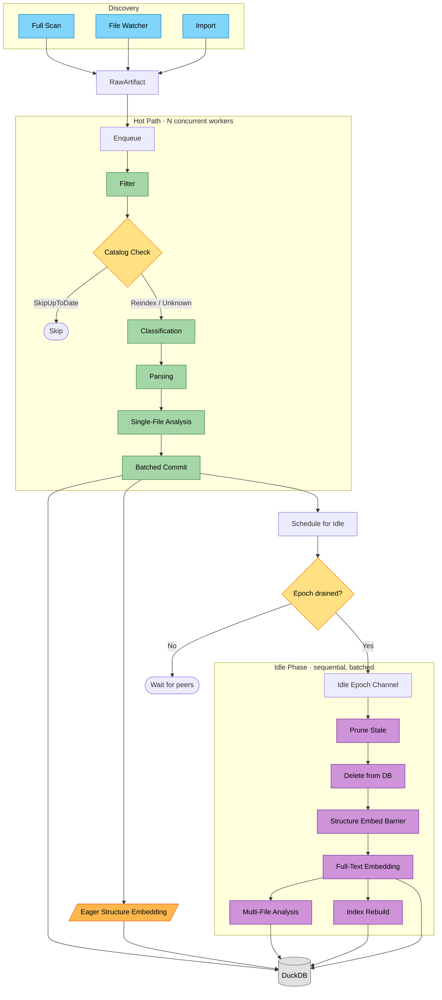
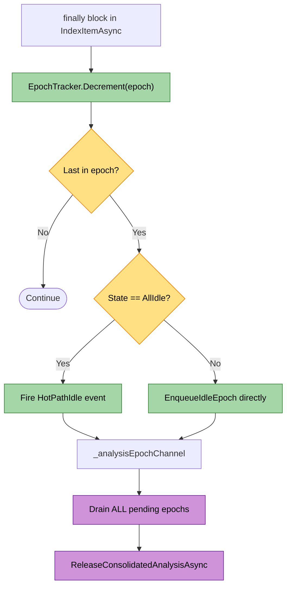
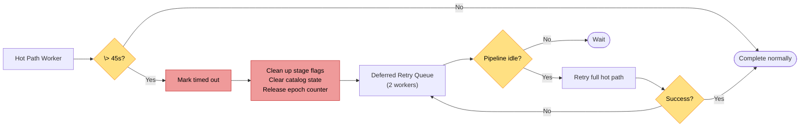
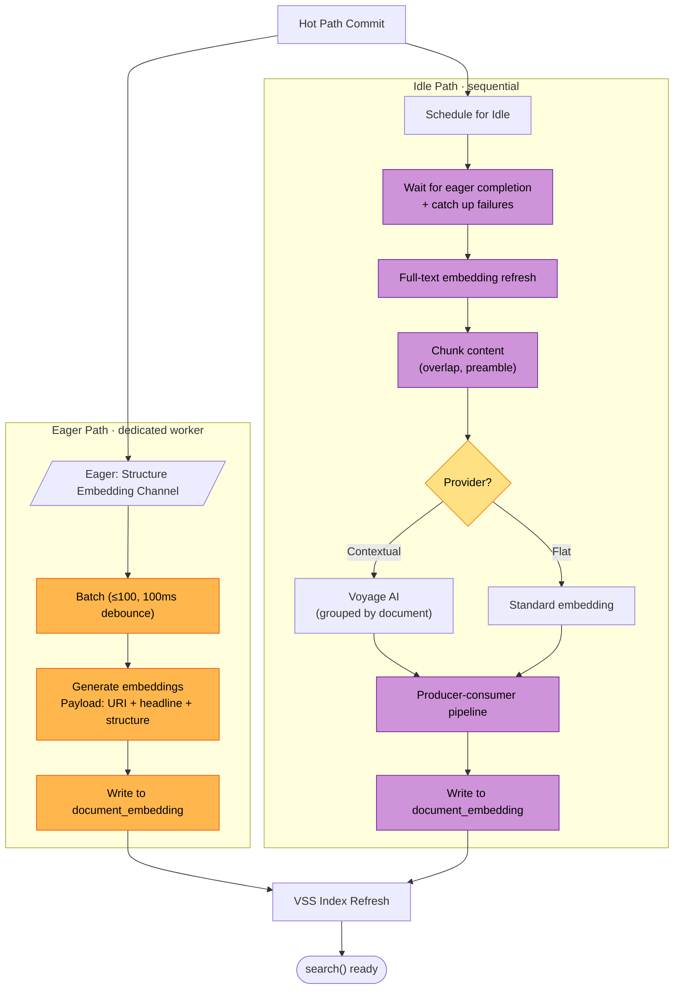
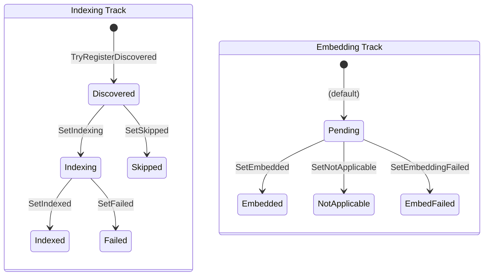

# Indexing Pipeline

Files become a queryable graph through two phases: a **hot path** that processes files concurrently through classification, parsing, analysis, and batched commit, and an **idle phase** that runs batched post-processing once the hot path drains. Epoch tracking coordinates the handoff between phases.



## Trigger

Three discovery mechanisms feed files into the pipeline.

| Source | When | Mechanism |
|--------|------|-----------|
| Full scan | Host startup | `RepoqlHost.EnqueueFullScanAsync` enumerates all mounted filesystems |
| File watcher | Continuous | OS file notifications → bounded channel (10K capacity, drop-oldest) → pump task |
| Import | On demand | External repos cloned and mounted via VFS, then scanned |

**Actor**: `RepoqlHost` (BackgroundService)

`RepoqlHost.ExecuteAsync` runs full scan, starts the watcher, starts a dirty-scan loop, then triggers git history indexing. If the watcher fails to start, it falls back to periodic polling (`EnablePollingFallback`). If the watcher channel overflows, it marks the state dirty; the dirty-scan loop performs a full re-enumeration when the pipeline is idle.

For each discovered file, RepoqlHost creates a `RawArtifact` (wrapping `IFileInfo` with lazy xxHash64 digest and provisional media type from file extension) and calls `IndexingEngine.EnqueueItemAsync`.

## The Flow Object

`IndexItem` is a mutable accumulator that carries state through the entire pipeline. Created once per file, it is progressively enriched by each stage.

| Field | Set by | Purpose |
|-------|--------|---------|
| `RawArtifact` | Constructor | File info, lazy digest, provisional media type |
| `Epoch` | `EnqueueIndexItemAsync` | Batch coordination |
| `DigestHex` | Hot path (digest step) | xxHash64 for change detection |
| `MediaType` | Classification | Resolved semantic type |
| `Records` | Parsing | Graph structure (artifacts, nodes, edges, spans) |
| `AnnotationsList` | Analysis | Lint, metrics, diagnostics |
| `StructureEmbedding` | Eager embedding | Pre-computed structure vector |
| `IsLightweight` | Pre-parsing | Vendor/minified files get simplified parsing |
| `IsReadOnly` | Discovery | Imported repos skip analysis |

IndexItem also implements `IDictionary<string, object>` as a property bag for processor-specific temporary data (e.g., parsed ASTs). Two-phase memory release frees heavy data as early as possible:
- `ReleasePostCommitPayload()` — clears property bag (DocumentModel, syntax trees) after commit
- `ReleasePostIdlePayload()` — clears Records after idle processing completes

## Hot Path

Each file flows sequentially through stages on a single worker thread. Multiple files run concurrently across `IndexingWorkers` workers (default: `Environment.ProcessorCount`).

### 1. Enqueue

**Actor**: `IndexingEngine.EnqueueIndexItemAsync`
**Action**: Stamp the item with the current epoch, increment the epoch counter, enqueue to the hot-path `WorkQueue`.
**Output**: Item in queue, epoch counter incremented.
**Failure**: If the URI is already in the deferred-retry queue, the item is marked for requeue when the original completes (via `_requeueRequested`). WorkQueue deduplication prevents duplicate processing of the same URI.

### 2. Filter

**Actor**: `IndexingEngine.IndexItemAsync`
**Action**: Check `.gitignore` patterns via `IUriFilter`. Skip excluded files.
**Output**: `PipelineResult.Filtered` or continue.
**Failure**: N/A

### 3. Catalog Check

**Actor**: `DocumentCatalog`
**Action**: Compute xxHash64 digest (lazy, computed on demand). Call `Evaluate(uri, digestHex)` against the in-memory digest cache.
**Output**: One of three decisions:

| Decision | Meaning | Action |
|----------|---------|--------|
| `SkipUpToDate` | Digest matches committed state | Early exit (file unchanged) |
| `Reindex` | Digest differs from committed state | Continue processing |
| `Unknown` | File never indexed | Continue processing |

If continuing, `BeginProcessing(uri, digestHex)` registers a pending digest to prevent duplicate work if the same file is enqueued again.

**Failure**: N/A

### 4. Classification

**Actor**: `ClassificationPipeline` (chain of `IAsyncPipeline<IDiscoveredArtifact, SemanticMediaType?>` processors)
**Action**: Determine the file's semantic media type. Processors form a chain-of-responsibility — each processor either handles the item and returns a result, or calls `next(item)` to delegate to the next processor. First handler wins.
**Output**: `IndexItem.MediaType` set (e.g., `text/x-csharp`, `text/markdown.doc`). If no classifier handles it, the provisional media type from the file extension is used.
**Failure**: Processing errors are caught by `PipelinePhase`, which sets `PipelineResult.Error` and records the failure detail on the IndexItem.

**Stage boundary**: After classification, queue commands can mark a URI as Failed/Skipped, aborting further processing.

### 5. Parsing

**Actor**: `ParsingPipeline` (chain of `IAsyncPipeline<IClassifiedArtifact, Records?>` processors)
**Action**: Convert file content into graph structure. Each format has a processor that:
1. Checks if it handles the media type (delegates via `next()` if not)
2. Calls `IFormatLoader.LoadAsync()` to parse into a `DocumentModel` (format-specific AST)
3. Calls `IFormatMaterializer.Materialize()` to convert into `Records`

Before parsing, `IsLightweight` is set for vendor/minified/sourcemap files — these get simplified parsing (content searchable, minimal graph structure).

**Output**: `IndexItem.Records` populated with:
- **Artifacts**: Content bytes + x-ray summaries (headline, summary, structure)
- **Nodes**: Graph vertices — document, symbols, sections, endpoints
- **Edges**: Directed relationships — HAS_PART, CALLS, REFERS_TO
- **Spans**: Locations — line ranges, byte offsets
- **Annotations**: Parser-level diagnostics

**Failure**: Format errors are caught per-item. One bad file never stops other files from indexing.

**Stage boundary**: Queue commands can abort between parsing and analysis.

### 6. Single-File Analysis

**Actor**: `SingleFileAnalysisPipeline` (chain of `IAsyncPipeline<IParsedArtifact, Annotation[]>` processors)
**Action**: Per-file validation and enrichment. Analyzers add annotations to `IndexItem.AnnotationsList`. Example: `MarkdownLinkAnalyzer` checks if relative links resolve and emits warnings for broken links.
**Output**: Annotations added to `IndexItem.AnnotationsList`.
**Failure**: Caught per-processor. Failed analyzers don't prevent commit.

**Skip**: ReadOnly items (imported repos) skip single-file analysis entirely.

### 7. Commit

**Actor**: `IndexingCommitter`
**Action**: Validate that Records, DigestHex, MediaType, and a document node all exist. Combine parser annotations with analyzer annotations. Queue the item for batched database write.
**Output**: Graph data persisted to DuckDB. Catalog updated with new digest.

The committer uses **batched writes** — items accumulate in a pending list and are flushed together (up to `MaxBatchSize` items per batch, or on a timer). Each batch calls `DuckDbDataStore.IndexArtifactBatchIsolated`, which provides **per-item error isolation** within the batch — one item's failure doesn't prevent others from committing.

After successful commit:
- `DocumentCatalog.ApplyUpsert` updates the in-memory digest cache
- `UriRegistry.SetIndexed` records the file's indexed state with symbol URIs, line count, headline, and structure
- Structure embeddings are written alongside artifact data if available
- `ReleasePostCommitPayload()` frees heavy payload data

**Failure**: Commit failures are isolated per-item. Failed items get `SetFailed` in the UriRegistry. Successful items in the same batch proceed normally.

### 8. Post-Commit Scheduling

**Actor**: `IndexingEngine`
**Action**: Two things happen after commit:
1. `ScheduleEagerStructureEmbedding(item)` — immediately enqueues the item for structure embedding on a dedicated channel (asynchronous, doesn't block the hot path)
2. `ScheduleAnalysis(item)` — adds the item to `_pendingAnalysis[epoch]` for idle processing

### 9. Epoch Completion

**Actor**: `EpochTracker` + `IndexingEngine`
**Action**: In the `finally` block of `IndexItemAsync`, `_epochTracker.Decrement(epoch)` checks if this was the last item in the epoch.



**Failure**: Timed-out items call `ReleaseEpochAfterHotPathTimeout` to maintain epoch counter balance.

## Timeout and Deferred Retry

**Actor**: `WorkQueue` timeout handler → `HandleHotPathItemTimeout`



**Ownership tracking**: `_deferredRetryOwnership` prevents the same URI from being in both the hot-path queue and the deferred retry queue simultaneously. If a new change arrives for a URI in deferred retry, it's marked for requeue.

## Idle Phase

**Actor**: `IndexingEngine.ProcessIdleEpochsAsync` (single background task)

### Epoch Consolidation (FM-010)

When epochs arrive on `_analysisEpochChannel`, the idle processor drains **all** pending epochs from the channel and consolidates their items into a single batch. This prevents embedding starvation during rapid file changes — without consolidation, epochs queue up faster than embedding can process them.

```
ProcessIdleEpochsAsync:
  drain ALL epochs from channel → List<long> epochsToDrain
  if multiple: log FM-010 consolidation
  ReleaseConsolidatedAnalysisAsync(epochsToDrain)
```

### Idle Processing Sequence

**Order matters for correctness.**

| Step | Actor | Purpose | Why this order |
|------|-------|---------|----------------|
| 1. Prune | `IArtifactPruner` | Identify files deleted from filesystem | Must happen before embedding (don't embed deleted files) |
| 2. Delete stale | `DuckDbDataStore` | Remove stale documents from DB + their embeddings | Must happen before analysis (analysis shouldn't see stale data) |
| 3. Structure embedding barrier | `EmbeddingCoordinator` | Wait for eager structure embeddings to complete; catch up any failures | Structure embeddings are needed for search before full-text is ready |
| 4. Full-text embedding refresh | `EmbeddingCoordinator` | Generate/update content chunk embeddings | Enables deep semantic search |
| 5. Multi-file analysis + index rebuild | `AnalysisQueue` | Cross-file analysis runs **in parallel** with index rebuild via `Task.WhenAll` | Both operate on committed graph state |

Each step has independent error handling — embedding failures don't prevent analysis from running. Failed idle batches are requeued via `RequeueIdleBacklogAfterFailure`.

After multi-file analysis completes, `ReleasePostIdlePayload()` frees the remaining Records data.

## Embedding Generation

Embeddings enable semantic search (`search()` UDF) by converting document content into vectors stored in the `document_embedding` table. The system has two embedding paths — structure embeddings that run eagerly after commit, and full-text embeddings that run during idle processing.



### EmbeddingMode

| Mode | Structure | Full-text | Use case |
|------|-----------|-----------|----------|
| `Disabled` | No | No | No embedding provider configured |
| `StructureOnly` | Yes | No | Fast search from x-ray summaries only |
| `Full` | Yes | Yes | Deep semantic search with chunked content |
| `Hybrid` | Yes | Yes | Contextual embeddings with Voyage AI when available, flat fallback |

### Structure Embeddings (Eager)

**When**: Immediately after hot-path commit, before idle processing.
**Actor**: Dedicated channel worker in `IndexingEngine` (`ProcessStructureEmbeddingBatchLoopAsync`).
**What gets embedded**: A lightweight payload built from x-ray summaries:

```
{relative_uri}\n\n{headline}\n\n{structure}
```

Example: `src/Auth/TokenService.cs\n\nTokenService.cs | class | 245 lines\n\n- ValidateToken(string) : bool\n- RefreshToken(string) : Token`

**How**: Items are enqueued to `_structureEmbeddingChannel` immediately after commit. The dedicated worker batches them (up to 100 items, 100ms debounce), calls `EmbeddingCoordinator.GenerateStructureEmbeddingsAsync`, and writes results to `document_embedding`. Structure embeddings are also written alongside artifact data during `CommitBatchAsync` when the `StructureEmbedding` field is set on IndexItem.

**Epoch coordination**: Each eager embedding is tracked via `TrackEagerStructureEmbedding` / `CompleteEagerStructureEmbedding`. During idle processing, `WaitForEagerStructureEmbeddingsAsync` blocks until all eager embeddings for the consolidated epochs complete. Any items that failed eagerly are retried as a "catchup" batch.

**Why eager**: Structure embeddings are cheap (small payload, no chunking) and make files searchable immediately after indexing, without waiting for the full idle cycle.

**Failure**: Non-fatal. Items are marked `SetEmbeddingFailed` in UriRegistry. The catchup mechanism in idle processing retries failures.

### Full-Text Embeddings (Idle)

**When**: During idle processing, after pruning and the structure embedding barrier.
**Actor**: `EmbeddingCoordinator.ApplyAsync` → `EmbeddingRefresher`.
**What gets embedded**: Document content, chunked for long files.

**Chunking**: `EmbeddingRefresher` splits content into overlapping chunks (`ChunkSizeChars` with `ChunkOverlapChars` overlap). Small files (below `SmallFileThresholdChars`) are embedded whole. Each chunk gets a preamble with file metadata (URI, headline).

**Refresh modes**:
- **Targeted**: Only documents changed in this epoch batch (`CollectDirtyDocumentIds`). Normal case.
- **Full**: All documents. Triggered when `_needsRefresh` is set (e.g., after deletes) or on startup when content embeddings are missing.

**Provider hierarchy**:
1. **Contextual** (`IContextualEmbeddingProvider` — Voyage AI): Groups chunks by document with shared context. Splits oversized groups. Connection-level failures disable contextual for the run.
2. **Flat** (`IEmbeddingProvider`): Standard embedding without document context. Fallback when contextual is unavailable.

**Pipeline**: Producer-consumer pattern via channels — embedding generation runs concurrently with DB writes for the previous batch. This maximizes throughput during large refreshes.

**After refresh**: `SyncRegistryEmbeddingStatus` updates UriRegistry to reflect actual embedding counts (including chunked documents), allowing operations to track completion.

**Failure**: Caught and logged. Search may be incomplete until next refresh. Does not prevent multi-file analysis from running.

### VectorIndexCoordinator

`VectorIndexCoordinator` extends `EmbeddingCoordinator`'s functionality with VSS (Vector Similarity Search) index management. After embedding writes, it signals a debounced VSS refresh worker that rebuilds in-memory HNSW indexes. This makes new embeddings queryable via `search()`.

## Coordination Mechanisms

### State Machine

Five stages tracked via counter-based flags. `StageContext` wraps each processor with automatic busy/idle transitions (set busy on entry, clear on exit in `finally`). Counters allow tracking concurrent workers per stage.

```
IndexingState (bit flags):
  ClassificationBusy/Idle, ParsingBusy/Idle, SingleFileAnalysisBusy/Idle,
  MultiFileAnalysisBusy/Idle, IndexRebuildBusy/Idle
  Started = any busy flag | AllIdle = all idle flags
```

`WaitForAsync(state)` enables precise coordination — callers can wait for specific stages or full quiescence.

### Epoch Tracking

Monotonic epoch counter. Items enqueued together share the same epoch. When the last item in an epoch completes and all stages are idle, idle processing triggers. Epochs are never reused.

### UriRegistry

In-memory source of truth for file state. Two parallel state tracks:



Operations (awaitable batches) poll UriRegistry to determine when scoped work completes.

### DocumentCatalog

In-memory digest cache. `Evaluate` returns SkipUpToDate/Reindex/Unknown. `BeginProcessing` registers pending work. `ApplyUpsert` updates after successful commit. The catalog is the gatekeeper for incremental indexing — unchanged files never enter the pipeline.

## Concurrency Model

| Path | Workers | Queue Capacity | Timeout |
|------|---------|----------------|---------|
| Hot path | `ProcessorCount` | 10,000 | 45s per item |
| Deferred retry | 2 | Unbounded | 45s per item |
| Analysis | `min(ProcessorCount, 8)` | 100,000 | 10m per item |
| Idle processing | 1 (sequential) | Channel-based | None |
| Structure embedding | 1 (dedicated) | Channel-based | None |

WorkQueue provides deduplication via `ConcurrentDictionary<T, byte>` — the same URI can't be enqueued while already pending or in-flight. Backpressure is applied when queues reach capacity.

## Error Isolation

| Failure | Mitigation |
|---------|------------|
| Parse error | Caught per-item. File marked Failed in UriRegistry. Other files proceed. |
| Commit error | Per-item isolation within batch (`IndexArtifactBatchIsolated`). Failed items don't prevent others. |
| Hot-path timeout (FM-001) | Item moved to deferred retry queue. Epoch counter released. Stage flags cleaned up. |
| Embedding error | Logged but non-fatal. Search may be incomplete until next refresh. |
| Idle processing failure | Batch requeued via `RequeueIdleBacklogAfterFailure`. |
| Watcher overflow | State marked dirty. Dirty-scan loop performs full re-enumeration when idle. |
| Watcher failure | Falls back to periodic polling. |
| File deleted during indexing | `FileNotFoundException` caught. URI removed from registry. Not an error. |

## Observability

- **Metrics**: OpenTelemetry counters, histograms, and gauges on every stage (enqueued, classified, parsed, enriched, committed, pruned, errored, skipped)
- **Tracing**: Activity spans per epoch and per idle phase
- **State events**: `StateChanged` fires on every busy/idle transition
- **Milestone callbacks**: `MilestoneCallback` fires at idle-phase checkpoints (prune, structure_embeddings, embedding_refresh, ready)
- **Diagnostics**: `IndexingEngineDiagnosticsProvider` exposes queue snapshots, in-flight items, and pending analysis counts
- **Slow operation warnings**: Operations exceeding `SlowOperationThresholdSeconds` are logged

## Key Files

| Component | Location |
|-----------|----------|
| RepoqlHost | `src/Indexing/RepoQL.Indexing/Hosting/RepoqlHost.cs` |
| IndexingEngine | `src/Indexing/RepoQL.Indexing/Indexing/IndexingEngine.cs` |
| IndexItem | `src/Indexing/RepoQL.Indexing/Indexing/Pipelines/IndexItem.cs` |
| PipelinePhase | `src/Indexing/RepoQL.Indexing/Indexing/Pipelines/PipelinePhase.cs` |
| ClassificationPipeline | `src/Indexing/RepoQL.Indexing/Indexing/Pipelines/Classification/ClassificationPipeline.cs` |
| ParsingPipeline | `src/Indexing/RepoQL.Indexing/Indexing/Pipelines/Parsing/ParsingPipeline.cs` |
| SingleFileAnalysisPipeline | `src/Indexing/RepoQL.Indexing/Indexing/Pipelines/Analysis/SingleFileAnalysisPipeline.cs` |
| IndexingCommitter | `src/Indexing/RepoQL.Indexing/Indexing/Commit/IndexingCommitter.cs` |
| DocumentCatalog | `src/Indexing/RepoQL.Indexing/Indexing/State/DocumentCatalog.cs` |
| EmbeddingCoordinator | `src/Indexing/RepoQL.Indexing/Indexing/PostProcessing/EmbeddingCoordinator.cs` |
| VectorIndexCoordinator | `src/Indexing/RepoQL.Indexing/Indexing/PostProcessing/VectorIndexCoordinator.cs` |
| EmbeddingRefresher | `src/RepoQL.Data.DuckDB/EmbeddingRefresher.cs` |
| StorageBackedArtifactPruner | `src/Indexing/RepoQL.Indexing/Indexing/PostProcessing/StorageBackedArtifactPruner.cs` |
| UriRegistry | `src/RepoQL.Contracts/UriRegistry/UriRegistry.cs` |

## Invariants

- Writer ALWAYS single-threaded (DuckDB safety) — enforced by commit batching with `_flushLock`
- Catalog updates ONLY after successful commit (authoritative after persistence)
- Epochs monotonically increasing (never reused)
- Pruner runs BEFORE embeddings (don't embed deleted files)
- Analysis sees ONLY committed graph state (consistent view)
- One bad file never breaks anything else (per-item error isolation at every stage)
- Structure embeddings start eagerly after commit (don't wait for idle)
