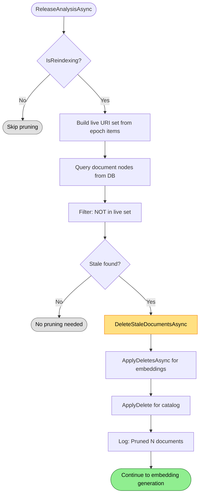

# Pruning Flow

Detects and removes documents that no longer exist on disk.

## Why This Matters

| Without pruning | With pruning |
|-----------------|--------------|
| Deleted files remain in index | Index reflects actual repository |
| Stale query results | Queries return only existing files |
| Embeddings for deleted files | No wasted vector storage |

## Trigger

`ReleaseAnalysisAsync(epoch)` called when epoch completes and state is AllIdle.

## Stages

### 1. Reindex Check

**Actor**: StorageBackedArtifactPruner
**Action**: `_isReindexingAccessor()` checks if reindex operation active
**Output**: Skip pruning if not reindexing
**Failure**: N/A

```csharp
if (!_isReindexingAccessor())
{
    _logger.LogDebug("Pruning skipped because no reindex operation is active.");
    return Task.FromResult(PruningResult.None);
}
```

Pruning only runs during explicit reindex operations. File watcher flow relies on the watcher to detect deletions.

### 2. Live Set Construction

**Actor**: StorageBackedArtifactPruner
**Action**: Build HashSet of URIs from epoch's processed items
**Output**: Set of all files seen in this epoch
**Failure**: N/A

```csharp
var live = new HashSet<string>(StringComparer.OrdinalIgnoreCase);
foreach (var item in pendingItems)
{
    live.Add(item.Uri.AbsoluteUri);
}
```

### 3. Stale Detection

**Actor**: StorageBackedArtifactPruner
**Action**: Query database for document nodes NOT in live set
**Output**: List of `RepoUri` for stale documents
**Failure**: Database query error propagates

```csharp
var stale = _store.Read(
    "SELECT uri FROM node WHERE kind = 'document'",
    reader =>
    {
        var uriText = reader.GetString(0);
        if (live.Contains(uriText))
            return null;  // Still exists
        return RepoUri.TryParse(uriText, out var parsed) ? parsed : null;
    })
    .Where(u => u is not null)
    .Cast<RepoUri>()
    .ToList();
```

### 4. Database Deletion

**Actor**: IndexingEngine
**Action**: `DeleteStaleDocumentsAsync()` removes all data for stale URIs
**Output**: Artifact, nodes, edges, spans, annotations removed
**Failure**: Write error propagates

Deletion cascades through all tables:
- `artifact` (document metadata)
- `node` (graph vertices)
- `edge` (relationships)
- `span` (location references)
- `annotation` (lint, metrics)

### 5. Embedding Deletion

**Actor**: EmbeddingCoordinator
**Action**: `ApplyDeletesAsync(deletedArtifacts)` marks embeddings for removal
**Output**: `_needsRefresh = true` signals embedding refresh needed
**Failure**: Logged, continues

```csharp
if (pruningResult.DeletedArtifacts.Count > 0)
{
    await DeleteStaleDocumentsAsync(pruningResult.DeletedArtifacts, ct);
    await EmbeddingCoordinator.ApplyDeletesAsync(pruningResult.DeletedArtifacts, ct);
}
```

### 6. Catalog Update

**Actor**: DocumentCatalog (via delete callback)
**Action**: `ApplyDelete(uri)` removes entries from catalog
**Output**: Catalog no longer tracks deleted files
**Failure**: N/A

## Termination

Flow completes when:
- No stale documents found → immediate return
- All stale documents removed from DB, embeddings, and catalog

## Flow Diagram


*Colors: Green = continue to next phase, Yellow = deletion occurring, Gray = skipped*

## Pruning Result

```csharp
public record PruningResult(IReadOnlyList<RepoUri> DeletedArtifacts)
{
    public static PruningResult None { get; } = new(Array.Empty<RepoUri>());
}
```

## When Pruning Runs

| Scenario | IsReindexing | Pruning |
|----------|--------------|---------|
| Startup scan | false | Skipped |
| File watcher change | false | Skipped |
| Explicit reindex (`ReindexAsync`) | true | Runs |
| Mount removal | true | Runs |

Pruning requires full enumeration to build the live set. File watcher flow doesn't enumerate - it only processes changed files.

## Key Invariant

**Pruner runs BEFORE embedding refresh.**

Deleting stale embeddings before generating new ones ensures:
- No embeddings for deleted files remain in semantic search input
- Embedding refresh sees clean state
- No orphaned embeddings accumulate

```csharp
// In ReleaseAnalysisAsync - order matters
await ArtifactPruner.PruneAsync(items, ct);           // 1. Prune
await EmbeddingCoordinator.ApplyDeletesAsync(deleted, ct); // 2. Mark embeddings stale
await EmbeddingCoordinator.GenerateStructureEmbeddingsAsync(items, ct);  // 3. Generate
```

## Metrics

| Metric | Description |
|--------|-------------|
| `_lastPrunedCount` | Documents pruned in last idle cycle |
| `_totalPrunedCount` | Cumulative documents pruned |
| `repoql.indexing.pruned` | Counter incremented per prune |

## Error Handling

| Error | Behaviour |
|-------|-----------|
| DB query fails | Exception propagates, epoch fails |
| DB delete fails | Exception propagates |
| Embedding delete fails | Logged, continues |
| Empty live set | All documents would be stale - likely indicates enumeration failure |

## Key Files

| File | Role |
|------|------|
| `src/Indexing/RepoQL.Indexing/Indexing/PostProcessing/StorageBackedArtifactPruner.cs` | Stale detection |
| `src/Indexing/RepoQL.Indexing/Indexing/IndexingEngine.cs` | `ReleaseAnalysisAsync()`, `DeleteStaleDocumentsAsync()` |
| `src/Indexing/RepoQL.Indexing/Indexing/PostProcessing/EmbeddingCoordinator.cs` | `ApplyDeletesAsync()` |

## Related

- `reindex.md` - Sets `IsReindexing` flag to enable pruning
- `embedding-generation.md` - Runs after pruning
- `file-watcher.md` - Alternative deletion handling via watcher events
