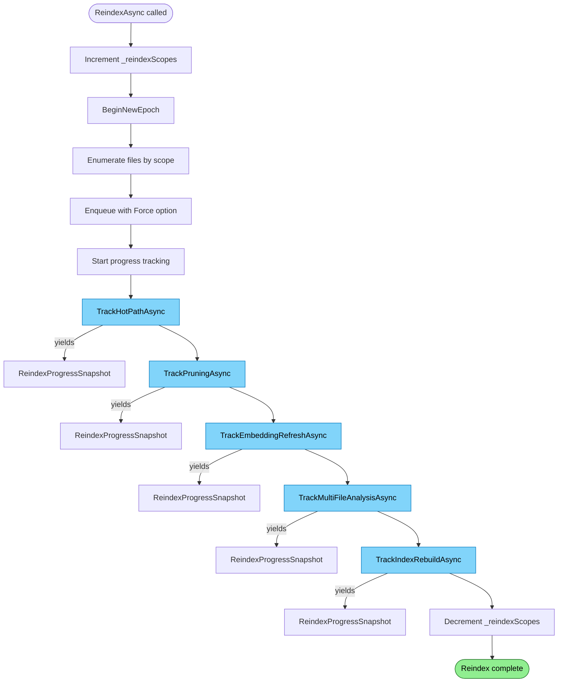

# Reindex Flow

Forced re-processing of files with progress tracking.

## Why This Matters

| Without explicit reindex | With explicit reindex |
|-------------------------|----------------------|
| Only changed files processed | All files reprocessed |
| Stale data persists | Fresh index guaranteed |
| No progress visibility | Progress streaming via IAsyncEnumerable |

## Trigger

`ReindexAsync()` called via MCP tool or API.

## Stages

### 1. Scope Activation

**Actor**: IndexingCoordinator
**Action**: Increment `_reindexScopes` counter
**Output**: `IsReindexing = true` enables pruning
**Failure**: N/A

```csharp
Interlocked.Increment(ref _reindexScopes);
// IsReindexing = _reindexScopes > 0
```

Scope counter allows nested reindex operations (e.g., mount reindex during global reindex).

### 2. New Epoch

**Actor**: IndexingEngine
**Action**: `BeginNewEpoch()` creates fresh epoch number
**Output**: Clean epoch for tracking this reindex
**Failure**: N/A

```csharp
var epoch = _engine.BeginNewEpoch();
```

### 3. File Enumeration

**Actor**: IndexingCoordinator
**Action**: Enumerate files based on `ReindexRequestOptions`
**Output**: Files matching scope criteria
**Failure**: Enumeration error logged

```csharp
public record ReindexRequestOptions
{
    public string? Scope { get; init; }    // URI pattern filter
    public bool Force { get; init; }       // Bypass OnlyIfStale
}
```

### 4. Forced Enqueue

**Actor**: IndexingCoordinator
**Action**: Enqueue with `IndexItemOptions.None` (bypasses stale check)
**Output**: All matching files queued regardless of digest
**Failure**: Backpressure blocks

```csharp
var options = request.Force
    ? IndexItemOptions.None                    // Force reprocess
    : IndexItemOptions.OnlyIfStale;            // Normal incremental

await _engine.EnqueueItemAsync(artifact, options, ct);
```

### 5. Progress Tracking

**Actor**: IndexingCoordinator
**Action**: Yield `ReindexProgressSnapshot` via `IAsyncEnumerable`
**Output**: Stream of progress updates for caller
**Failure**: N/A

```csharp
public async IAsyncEnumerable<ReindexProgressSnapshot> ReindexAsync(
    ReindexRequestOptions options,
    [EnumeratorCancellation] CancellationToken ct)
{
    // ... enumerate and enqueue ...

    await foreach (var snapshot in TrackHotPathAsync(total, epoch, ct))
        yield return snapshot;

    await foreach (var snapshot in TrackPruningAsync(epoch, total, ct))
        yield return snapshot;

    // ... more phases ...
}
```

### 6. Hot Path Processing

**Actor**: IndexingEngine workers
**Action**: Normal pipeline (classify → parse → analyze → commit)
**Output**: Files reprocessed
**Failure**: Per-item errors logged, continue

Progress tracked via epoch pending counts.

### 7. Idle Processing

**Actor**: IndexingEngine
**Action**: Prune, embed, analyze (normal idle flow)
**Output**: Stale files pruned (because `IsReindexing = true`)
**Failure**: Logged, continues

Pruning runs because `IsReindexing` is true.

### 8. Scope Deactivation

**Actor**: IndexingCoordinator (finally block)
**Action**: Decrement `_reindexScopes` counter
**Output**: `IsReindexing` may become false
**Failure**: N/A (always runs)

```csharp
finally
{
    Interlocked.Decrement(ref _reindexScopes);
}
```

## Termination

Flow completes when:
- All phases report complete
- Progress stream ends
- Scope counter decremented

## Flow Diagram


*Colors: Green = complete, Blue = phase with progress tracking*

## ReindexProgressSnapshot

```csharp
public record ReindexProgressSnapshot
{
    public CoordinatorReindexPhase Phase { get; init; }
    public long Processed { get; init; }
    public long Total { get; init; }
    public long? Remaining { get; init; }
    public double? ProgressPercent { get; init; }
    public string? CurrentFile { get; init; }
}
```

## Reindex Phases

| Phase | Description |
|-------|-------------|
| `Discovery` | Enumerating files |
| `Indexing` | Hot-path processing |
| `Pruning` | Detecting stale documents |
| `SemanticIndexing` | Generating embeddings |
| `Analysis` | Multi-file analysis |
| `Complete` | All phases done |

## Force vs Normal Reindex

| Mode | `Force` | Behaviour |
|------|---------|-----------|
| Normal | `false` | `OnlyIfStale` - skip unchanged files |
| Forced | `true` | `None` - reprocess all files |

Force mode useful when:
- Parser/analyzer changed
- Index corruption suspected
- Format support added

## Pruning Enablement

Pruning only runs when `IsReindexing = true`:

```csharp
// In StorageBackedArtifactPruner
if (!_isReindexingAccessor())
{
    return Task.FromResult(PruningResult.None);
}
```

This prevents pruning during normal file watcher flow (which doesn't enumerate all files).

## Progress Tracking Implementation

Each phase tracker polls pipeline state:

```csharp
private async IAsyncEnumerable<ReindexProgressSnapshot> TrackHotPathAsync(
    long total, long epoch,
    [EnumeratorCancellation] CancellationToken ct)
{
    while (true)
    {
        var snapshot = _engine.GetHotPathQueueSnapshot();
        var remaining = snapshot.Depth;
        var processed = total - remaining;

        yield return new ReindexProgressSnapshot
        {
            Phase = CoordinatorReindexPhase.Indexing,
            Total = total,
            Processed = processed,
            ProgressPercent = total > 0 ? processed * 100.0 / total : 100
        };

        if (remaining == 0)
            yield break;

        await Task.Delay(StatusPollInterval, ct);
    }
}
```

## Error Handling

| Error | Behaviour |
|-------|-----------|
| Enumeration fails | Exception propagates |
| Item processing fails | Logged, other items continue |
| Pruning fails | Logged, continues |
| Cancellation | Progress stream ends, finally still runs |

## Key Files

| File | Role |
|------|------|
| `src/Indexing/RepoQL.Indexing/Hosting/IndexingCoordinator.cs` | `ReindexAsync()`, progress tracking |
| `src/Indexing/RepoQL.Indexing/Indexing/IndexingEngine.cs` | Pipeline processing |

## Related

- `catalog-gating.md` - How `Force` bypasses stale check
- `pruning.md` - Only runs when `IsReindexing = true`
- `epoch-tracking.md` - New epoch isolates reindex work
