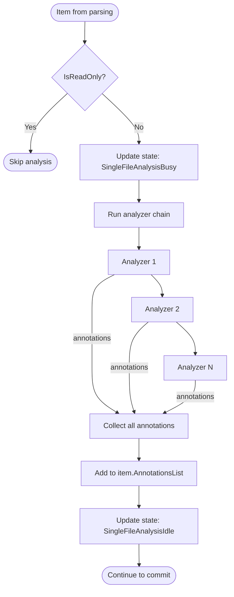

# Single-File Analysis Flow

Generates annotations (lint warnings, metrics, TODOs) for individual files.

## Why This Matters

| Without analysis | With analysis |
|------------------|---------------|
| No lint warnings in query results | Annotations surface code quality issues |
| No complexity metrics | Queryable metrics for hotspot detection |
| Manual TODO tracking | Automated TODO extraction |

## Trigger

Item completes parsing with `Records` populated.

## Stages

### 1. ReadOnly Check

**Actor**: IndexingEngine
**Action**: Check `item.IsReadOnly` flag
**Output**: Skip analysis if true
**Failure**: N/A

```csharp
// In ApplyIndexerPipeline context - read-only items skip analysis
if (item.IsReadOnly)
{
    // Analysis skipped for imports
}
```

Imports (`github://` URIs) are marked read-only. They get parsing and embeddings but not analysis to avoid processing external code quality.

### 2. Stage Entry

**Actor**: StageContext
**Action**: Increments `_stageCounters[SingleFileAnalysisBusy]`
**Output**: State includes `SingleFileAnalysisBusy` flag
**Failure**: N/A

### 3. Analyzer Execution

**Actor**: SingleFileAnalysisPipeline
**Action**: Run registered `IAsyncPipeline<IParsedArtifact, Annotation[]>` analyzers
**Output**: Array of annotations from all analyzers
**Failure**: Analyzer exception logged, continue with other analyzers

Each analyzer examines the parsed Records and generates annotations:

| Analyzer Type | Produces |
|--------------|----------|
| Lint | Error/warning annotations from static analysis |
| TODO extractor | Info annotations for TODO/FIXME comments |
| Complexity | Metric annotations for cyclomatic complexity |
| Documentation | Warnings for missing doc comments |

### 4. Result Aggregation

**Actor**: SingleFileAnalysisPipeline
**Action**: Combine annotations from all analyzers
**Output**: Merged annotation array
**Failure**: N/A

Unlike other pipelines where first result wins, analysis aggregates all results.

### 5. Result Application

**Actor**: SingleFileAnalysisPipeline
**Action**: Annotations added to `item.AnnotationsList`
**Output**: Item accumulates analysis annotations
**Failure**: N/A

```csharp
protected override Task ApplyResultAsync(IndexItem item, Annotation[]? result, CancellationToken ct)
{
    if (result is { Length: > 0 })
    {
        foreach (var annotation in result)
            item.AnnotationsList.Add(annotation);
    }
    return Task.CompletedTask;
}
```

### 6. Stage Exit

**Actor**: StageContext (finally block)
**Action**: Decrements `_stageCounters[SingleFileAnalysisBusy]`
**Output**: State may include `SingleFileAnalysisIdle`
**Failure**: N/A

## Termination

Flow completes when:
- All analyzers run → `PipelineResult.Success`
- Exception in analyzer → logged, other analyzers continue
- Item is read-only → analysis skipped entirely

## Flow Diagram



## Annotation Structure

```
Annotation
├── Kind              Category: "lint", "todo", "metric", "doc"
├── Severity          Level: "error", "warning", "info", "hint"
├── RuleId            Identifier: "CS0168", "TODO", "complexity"
├── Message           Human-readable text
├── TargetUri         File URI
├── StartLine         1-based line number
├── EndLine           1-based line number
└── Source            Analyzer that produced it
```

## Annotation Sources

Annotations can come from two places, merged at commit:

1. **Parser annotations** (`item.Records.Annotations`)
   - Generated during parsing
   - Format-specific (e.g., syntax errors)

2. **Analyzer annotations** (`item.AnnotationsList`)
   - Generated during analysis
   - Cross-format (e.g., TODO extraction)

```csharp
// In IndexingCommitter.CreateCommitRecords
var combinedAnnotations = existingAnnotations.Length == 0
    ? analyzerAnnotations
    : analyzerAnnotations.Length == 0
        ? existingAnnotations
        : [.. existingAnnotations, .. analyzerAnnotations];
```

## ReadOnly Items

| Item Type | IsReadOnly | Analysis |
|-----------|------------|----------|
| Local files (`file://`) | false | Full analysis |
| Imports (`github://`) | true | Skipped |
| Embedded docs (`help://`) | varies | Depends on mount config |

ReadOnly is set via mount configuration (`enableAnalysis = false`).

## Error Handling

| Error | Behaviour |
|-------|-----------|
| Analyzer throws | Exception logged, other analyzers continue |
| All analyzers fail | Empty annotations, item continues to commit |
| Cancellation | `PipelineResult.Cancelled` |

## Key Files

| File | Role |
|------|------|
| `src/Indexing/RepoQL.Indexing/Indexing/Pipelines/Analysis/SingleFileAnalysisPipeline.cs` | Pipeline orchestration |
| `src/Indexing/Formats/*/Analyzers/*.cs` | Format-specific analyzers |

## Related

- `parsing.md` - Provides Records for analysis
- `commit-batching.md` - Persists annotations to database
- `multi-file-analysis.md` - Cross-file analysis in idle phase
