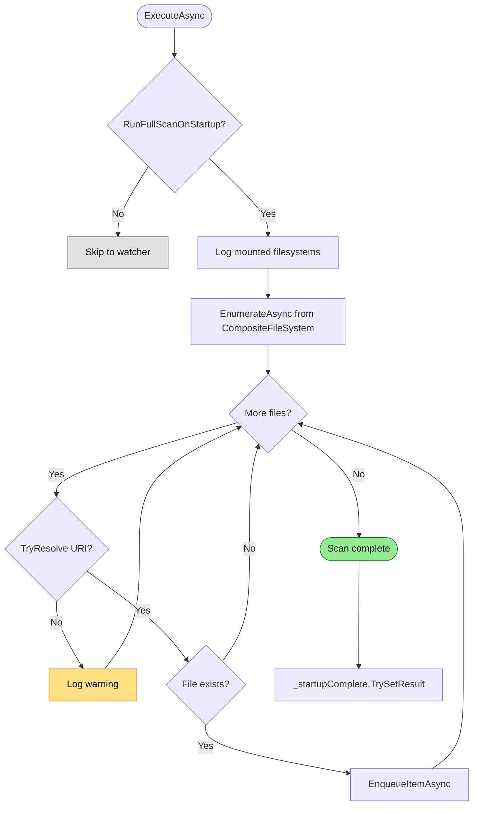

# Startup Scan Flow

Enumerates all files from mounted filesystems at host startup, feeding the indexing pipeline.

## Why This Matters

| Without startup scan | With startup scan |
|---------------------|-------------------|
| Index starts empty | Index reflects current repository state |
| Agent queries return nothing | Agent queries return results immediately |
| File watcher only catches changes | All files indexed regardless of change history |

## Trigger

`RepoqlHost.ExecuteAsync()` called when host starts with `RunFullScanOnStartup = true` (default).

## Stages

### 1. Mount Logging

**Actor**: RepoqlHost
**Action**: Log all registered mounts for diagnostics
**Output**: Log entries with mount id, scheme, includeInEnumeration flag
**Failure**: N/A

```
RepoqlHost mount: id=primary scheme=file includeInEnum=true
RepoqlHost mount: id=repoql-docs scheme=repoql-docs includeInEnum=true
```

### 2. Filesystem Enumeration

**Actor**: CompositeFileSystem
**Action**: `EnumerateAsync()` yields files from all mounts where `includeInEnumeration = true`
**Output**: Stream of `(RepoUri, IFileInfo)` tuples
**Failure**: Mount enumeration error logged, scan continues with other mounts

Each mount contributes files with its URI scheme:
- `file:///` - Physical repository files
- `repoql-docs:///` - Embedded documentation
- `github://owner/repo/` - Imported repositories

### 3. Store Resolution

**Actor**: RepoqlHost
**Action**: `_fileSystem.TryResolve(uri)` maps URI to backing `IVirtualFileSystem`
**Output**: `RawArtifact` containing file info and store reference
**Failure**: Warning logged, file skipped

```csharp
if (!_fileSystem.TryResolve(resource.Uri, out var store))
{
    _logger.LogWarning("No file system registered for URI {Uri}", resource.Uri);
    continue;
}
```

### 4. Existence Check

**Actor**: RepoqlHost
**Action**: Skip files where `!resource.File.Exists`
**Output**: Only existing files proceed
**Failure**: N/A (deleted files handled by pruner)

### 5. Enqueue

**Actor**: IndexingEngine
**Action**: `EnqueueItemAsync(artifact, DefaultIndexItemOptions)`
**Output**: Item added to IndexerQueue, stamped with current epoch
**Failure**: Backpressure blocks caller until queue has capacity

```csharp
var artifact = new RawArtifact(resource.File, store);
await _enqueue(artifact, _options.DefaultIndexItemOptions, cancellationToken);
```

## Termination

Flow completes when:
- All files from all mounts enumerated
- All items enqueued to IndexerQueue
- `_startupComplete.TrySetResult()` signals startup done

## Flow Diagram


*Colors: Green = success path, Yellow = warning logged, Gray = skipped*

## Error Handling

| Error | Behaviour |
|-------|-----------|
| Scan throws exception | Log warning, mark `Indexer` degraded via `IServiceDegradationTracker`, continue with existing index |
| TryResolve fails | Log warning, skip file |
| Enqueue blocked | Backpressure waits for queue space |

## Configuration

| Option | Default | Effect |
|--------|---------|--------|
| `RunFullScanOnStartup` | `true` | Whether to enumerate all files at startup |
| `DefaultIndexItemOptions` | `OnlyIfStale \| OnlyIfNotExcluded` | Skip unchanged files, respect gitignore |

## Key Files

| File | Role |
|------|------|
| `src/Indexing/RepoQL.Indexing/Hosting/RepoqlHost.cs` | Orchestrates scan via `EnqueueFullScanAsync()` |
| `src/Indexing/RepoQL.Indexing/FileSystems/CompositeFileSystem.cs` | `EnumerateAsync()` yields files from mounts |
| `src/Indexing/RepoQL.Indexing/Indexing/IndexingEngine.cs` | `EnqueueItemAsync()` adds to pipeline |

## Related

- `file-watcher.md` - Handles changes after startup scan completes
- `catalog-gating.md` - How `OnlyIfStale` skips unchanged files
- `epoch-tracking.md` - How items are batched by epoch
