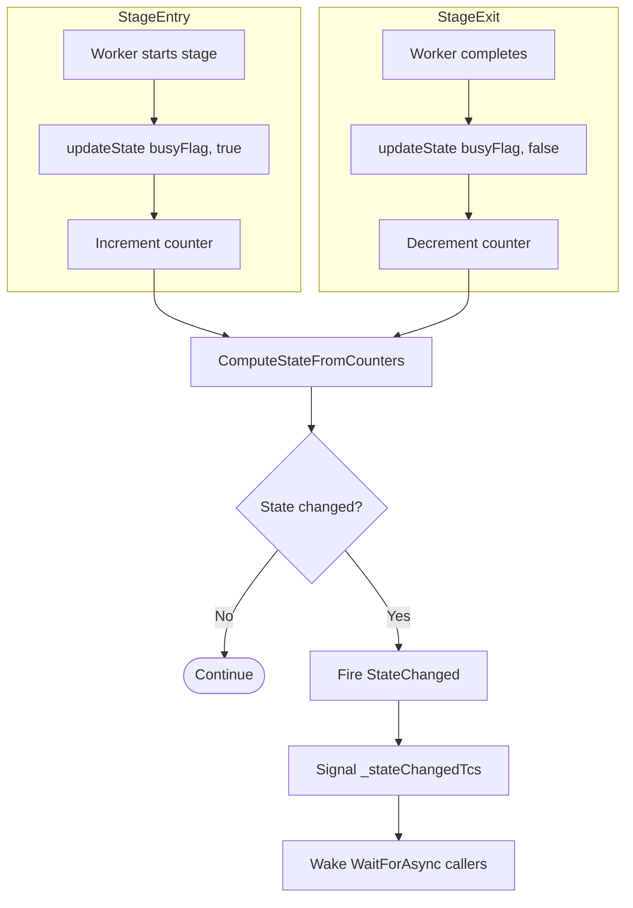

# State Machine Flow

Tracks worker activity across pipeline stages to detect idle conditions.

## Why This Matters

| Without state tracking | With state tracking |
|-----------------------|---------------------|
| No way to know when pipeline is idle | Clear signal when all work complete |
| Can't wait for specific stages | `WaitForAsync()` enables precise coordination |
| No observability into pipeline activity | State flags reveal bottlenecks |

## Trigger

Workers entering or exiting pipeline stages.

## Stages

### 1. Stage Entry

**Actor**: `StageContext.RunAsync()`
**Action**: Call `updateState(busyFlag, idleFlag, true)` before processing
**Output**: Stage counter incremented, state recomputed
**Failure**: N/A

```csharp
public static async Task<PipelineResult> RunAsync(
    StageContext stage,
    IndexItem item,
    CancellationToken ct,
    Action<IndexingState, IndexingState, bool> updateState)
{
    updateState(stage.BusyFlag, stage.IdleFlag, true);  // Entering
    try
    {
        return await stage.Processor(item, ct);
    }
    finally
    {
        updateState(stage.BusyFlag, stage.IdleFlag, false);  // Exiting
    }
}
```

### 2. Counter Update

**Actor**: IndexingEngine
**Action**: Increment or decrement stage counter
**Output**: `_stageCounters[busyFlag]` updated
**Failure**: N/A

```csharp
private void UpdateStateFlags(IndexingState busyFlag, IndexingState idleFlag, bool isBusy)
{
    lock (_stateLock)
    {
        var counter = _stageCounters[busyFlag];
        if (isBusy)
            counter.Increment();
        else
            counter.Decrement();
        ...
    }
}
```

### 3. State Computation

**Actor**: IndexingEngine
**Action**: OR all busy flags where counter > 0
**Output**: New `IndexingState` enum value
**Failure**: N/A

```csharp
private IndexingState ComputeStateFromCounters()
{
    var state = IndexingState.None;
    foreach (var (flag, counter) in _stageCounters)
    {
        if (counter.Value > 0)
            state |= flag;
        else
            state |= GetIdleFlag(flag);  // Corresponding idle flag
    }

    if (state == AllIdleFlags)
        state = IndexingState.AllIdle;
    else
        state |= IndexingState.Started;

    return state;
}
```

### 4. State Changed Event

**Actor**: IndexingEngine
**Action**: Fire `StateChanged` event if state differs
**Output**: Observers notified
**Failure**: N/A

```csharp
if (newState != _currentState)
{
    _currentState = newState;
    StateChanged?.Invoke(this, new IndexingStateChangedEventArgs(newState));
    _stateChangedTcs.TrySetResult(true);
    _stateChangedTcs = new TaskCompletionSource<bool>(...);
}
```

### 5. Wait Notification

**Actor**: IndexingEngine
**Action**: Signal `_stateChangedTcs` for waiters
**Output**: Tasks waiting on `WaitForAsync()` may complete
**Failure**: N/A

## Termination

State machine runs continuously. State transitions occur whenever workers enter/exit stages.

## Flow Diagram



## IndexingState Flags

```csharp
[Flags]
public enum IndexingState
{
    None = 0,

    // Busy flags (counter > 0)
    ClassificationBusy = 1 << 0,
    ParsingBusy = 1 << 1,
    SingleFileAnalysisBusy = 1 << 2,
    MultiFileAnalysisBusy = 1 << 3,
    IndexRebuildBusy = 1 << 4,

    // Idle flags (counter = 0)
    ClassificationIdle = 1 << 5,
    ParsingIdle = 1 << 6,
    SingleFileAnalysisIdle = 1 << 7,
    MultiFileAnalysisIdle = 1 << 8,
    IndexRebuildIdle = 1 << 9,

    // Composite flags
    Started = 1 << 10,      // Any stage busy
    AllIdle = ClassificationIdle | ParsingIdle | SingleFileAnalysisIdle
            | MultiFileAnalysisIdle | IndexRebuildIdle
}
```

## Stage Counter Registry

Five stages are tracked, registered at engine construction:

| Stage | Busy Flag | Idle Flag |
|-------|-----------|-----------|
| Classification | `ClassificationBusy` | `ClassificationIdle` |
| Parsing | `ParsingBusy` | `ParsingIdle` |
| SingleFileAnalysis | `SingleFileAnalysisBusy` | `SingleFileAnalysisIdle` |
| MultiFileAnalysis | `MultiFileAnalysisBusy` | `MultiFileAnalysisIdle` |
| IndexRebuild | `IndexRebuildBusy` | `IndexRebuildIdle` |

```csharp
RegisterStageCounter(IndexingState.ClassificationBusy, IndexingState.ClassificationIdle);
RegisterStageCounter(IndexingState.ParsingBusy, IndexingState.ParsingIdle);
// ... etc
```

## WaitForAsync API

Callers can wait for specific state conditions:

```csharp
public async ValueTask<bool> WaitForAsync(IndexingState state, CancellationToken ct)
{
    while (true)
    {
        if ((State & state) == state)
            return true;

        var tcs = Volatile.Read(ref _stateChangedTcs);
        await tcs.Task.WaitAsync(ct);
    }
}
```

Common wait patterns:

| Wait For | Meaning |
|----------|---------|
| `AllIdle` | All stages idle, no workers active |
| `ParsingIdle` | Parsing stage idle (may have other stages busy) |
| `ClassificationIdle & ParsingIdle` | First two stages idle |

## Thread Safety

| Component | Mechanism |
|-----------|-----------|
| `_stageCounters` | `lock (_stateLock)` for all updates |
| `_stateChangedTcs` | `Volatile.Read/Write` for safe publication |
| Counter values | Atomic via lock |

## State Transition Guarantees

| Guarantee | Implementation |
|-----------|---------------|
| Entry always has matching exit | `finally` block in `RunAsync` |
| State reflects actual worker count | Counter-based, not boolean |
| Concurrent workers tracked | Counter allows > 1 per stage |
| No lost updates | Single lock for all counter operations |

## AllIdle Detection

`AllIdle` requires ALL five stage counters to be zero:

```
AllIdle = (Classification.Count == 0)
        & (Parsing.Count == 0)
        & (SingleFileAnalysis.Count == 0)
        & (MultiFileAnalysis.Count == 0)
        & (IndexRebuild.Count == 0)
```

Used by epoch tracking to trigger idle processing.

## Error Handling

| Error | Behaviour |
|-------|-----------|
| Stage processor throws | Exit still runs (finally), counter decremented |
| Counter underflow | Would indicate bug - counter never goes negative |

## Key Files

| File | Role |
|------|------|
| `src/Indexing/RepoQL.Indexing/Indexing/IndexingEngine.cs` | State computation, wait API |
| `src/Indexing/RepoQL.Indexing/Indexing/StageContext.cs` | Stage entry/exit wrapper |
| `src/Indexing/RepoQL.Indexing/docs/STATE-MACHINE.md` | Detailed state transition documentation |

## Related

- `epoch-tracking.md` - Uses AllIdle to trigger idle processing
- `classification.md` - Example of stage with busy/idle tracking
- `multi-file-analysis.md` - Idle-phase stage tracking
