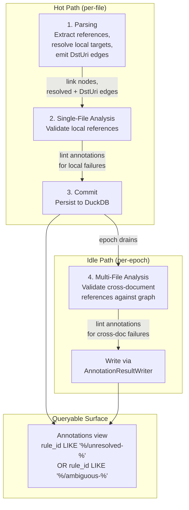

# Unresolved Reference Detection Flow

How references flow from extraction through validation to lint annotations. A reference is any link, import, or dependency that names a target — a file path, anchor, URL, or symbol.

Detection spans three pipeline stages: parsing extracts references and resolves what it can, single-file analysis validates local references, and multi-file analysis validates cross-document references against the full graph.

## Trigger

A file containing references enters the indexing pipeline and completes classification.

## Stages

### 1. Reference Extraction (Parsing)

**Actor**: Format loader (`MarkdownLoader`, `DocxFormatLoader`, `PdfFormatLoader`, etc.)
**Action**: Extract all references from the document, create graph nodes for each, resolve what's possible within the document
**Output**: Link nodes with `href` in properties, REFERS_TO edges for resolved local references
**Failure**: Parse error isolates the file; no references extracted, no false annotations

Each format extracts references in its own way, but the output is uniform:

| Format | Reference sources | What's extracted |
|--------|------------------|-----------------|
| Markdown | `LinkInline` elements | `md_link` nodes with `href`, `text`, `title`, `is_image` |
| Docx | Hyperlinks | Nodes with `DstUri` for external URLs |
| PDF | Link annotations | Nodes with `DstUri` for URLs |
| C# projects | `ProjectReference`, `PackageReference` | IMPORTS edges with `DstUri` |

**Local resolution happens here.** When a format loader can determine the target within the same document, it creates a fully resolved REFERS_TO edge (`DstId` set, `DstUri` null). For markdown, this means local `#anchor` links that match a heading slug get edges immediately.

**Cross-document edges are deferred.** References that point to other files in the repository — relative paths (`./other.md`, `../api/guide.md`) and cross-document anchors (`other.md#section`) — get `DstUri`-only REFERS_TO edges (`DstId` null). The edge records the intent; resolution happens during multi-file analysis. For anchored links, the fragment slug is stored in `Edge.Props["anchor"]`.

**External URLs get no edges.** Links to `http://` or `https://` URLs are stored as link node properties only. External URL validation is out of scope.

### 2. Local Validation (Single-File Analysis)

**Actor**: Format analyzer (`MarkdownAnalyzer`, etc.)
**Action**: Check references that should resolve within the same document
**Output**: Lint annotations for unresolved local references
**Failure**: Analyzer exception logged, other analyzers continue

The format analyzer receives the in-memory `DocumentModel` — the same parse result from stage 1. It has no database access and no visibility into other files. Its job is to catch references that were expected to resolve locally but didn't.

For markdown, this means:

1. Build a set of heading slugs from the document
2. For each `#anchor` link, check if the slug exists in the set
3. If not, emit a lint annotation: `rule_id = "markdown/unresolved-ref"`, `kind = "lint"`

The annotation targets the link node (`TargetNodeId`) and its span (`TargetSpanId`), so queries can locate the exact source of the broken reference.

**Severity is configurable** via `.editorconfig`. If the rule is suppressed (`severity = none`), no annotations are emitted.

### 3. Commit

**Actor**: IndexingCommitter
**Action**: Persist link nodes, REFERS_TO edges, and lint annotations to DuckDB
**Output**: All references and their local validation results are in the graph
**Failure**: Batch failure rolls back all items in the batch

After commit, the reference data is queryable. Local unresolved references are already visible as annotations. Cross-document references are visible as `DstUri`-only REFERS_TO edges but haven't been validated yet.

### 4. Cross-Document Validation (Multi-File Analysis)

**Actor**: Cross-document reference resolver (multi-file analyzer)
**Action**: Query the graph for references that target other documents, check whether targets exist
**Output**: Lint annotations for unresolved cross-document references
**Failure**: Analyzer exception logged, item skipped

This stage runs during idle processing after all files in an epoch are committed. The analyzer has full access to the indexed graph via DuckDB.

For each document's outbound REFERS_TO edges:

1. **Unresolved edges** (`DstId` null) — does the `DstUri` match any document in the graph? If the edge has `Props["anchor"]`, does the target document contain that heading slug?
2. **Previously resolved edges** (`DstId` set) — does the target node still exist? If not, clear `DstId` and re-check.
3. **Project references** — does the IMPORTS edge's `DstUri` resolve to an indexed document?

Each unresolved reference produces a lint annotation:

| Rule ID | Condition |
|---------|-----------|
| `{format}/unresolved-ref` | Generic: target doesn't exist |
| `{format}/unresolved-anchor` | File exists but anchor doesn't |
| `{format}/ambiguous-anchor` | Target heading slug is duplicated |

Annotations are written through `AnnotationResultWriter`, which does a scoped delete-then-insert — re-analysis of the same document replaces previous annotations from the same source without accumulating stale results.

## Termination

Detection completes when:
- Local validation finishes for the item (hot path) — local unresolved references are visible immediately
- Cross-document validation finishes for the epoch (idle path) — all cross-document references are validated

## Flow Diagram



## Reference Lifecycle

A single reference passes through up to three states:

```
Extracted (parsing)
  ├── Resolved locally → REFERS_TO edge with DstId → no annotation
  ├── Unresolved locally → lint annotation (single-file analysis)
  └── Cross-document → DstUri-only REFERS_TO edge (deferred)
        ├── Target found (multi-file analysis) → DstId backfilled → no annotation
        ├── Target not found → lint annotation (multi-file analysis)
        └── Previously resolved, target deleted → DstId cleared → lint annotation
```

## What Can Go Wrong

| Failure | Impact | Recovery |
|---------|--------|----------|
| Parse error in source file | No references extracted, no false annotations | Fix parse error, file reindexed |
| Parse error in target file | Cross-document resolver can't find target, may emit false positive | Target file reindexed → re-analysis clears annotation |
| Target file not yet indexed | Cross-document resolver reports unresolved | Next epoch includes target → re-analysis clears annotation |
| Stale annotation after fix | User fixes a broken ref, old annotation persists until reindex | Scoped delete-then-insert on re-analysis replaces stale annotations |
| Target deleted after resolution | Previously resolved edge now points at missing node | Resolver checks all edges (not just unresolved), clears DstId, emits annotation |
| Analyzer crash | Other analyzers continue; item not blocked | Exception logged, fix analyzer |

## Interaction with Existing Flows

| Flow | Relationship |
|------|-------------|
| [parsing](parsing.md) | Produces link nodes and resolved REFERS_TO edges |
| [single-file-analysis](single-file-analysis.md) | Hosts local reference validation |
| [commit-batching](commit-batching.md) | Persists reference data and local annotations |
| [multi-file-analysis](multi-file-analysis.md) | Hosts cross-document reference validation |
| [epoch-tracking](epoch-tracking.md) | Coordinates hot → idle transition |
| [pruning](pruning.md) | Removes annotations for deleted files |

## Key Files

| File | Role |
|------|------|
| `src/Formats/RepoQL.Formats.Markdown/MarkdownLoader.cs` | Reference extraction and local edge creation |
| `src/Formats/RepoQL.Formats.Markdown/MarkdownAnalyzer.cs` | Local anchor validation |
| `src/RepoQL.Core/Analysis/AnnotationResultWriter.cs` | Annotation persistence with scoped replacement |
| `src/RepoQL.Core/Analysis/IAnalyzer.cs` | Interface for graph-aware analysis |
| `src/RepoQL.Contracts/Models/Edge.cs` | `DstUri`/`DstId` deferred resolution model |
