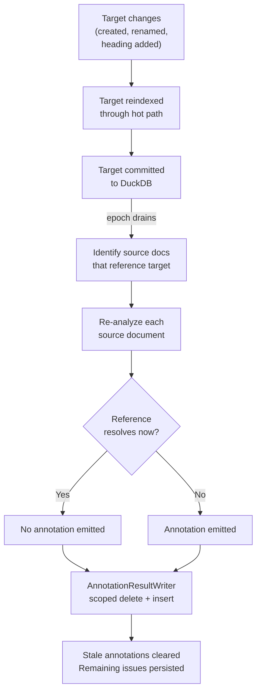

# Unresolved Reference Resolution Flow

How annotations for unresolved references get cleared when the world changes. A file is renamed, a heading is added, a missing document appears — references that were broken become valid.

Resolution is not a separate pipeline stage. It piggybacks on re-analysis: when a target file is indexed (or reindexed), source files that reference it are re-analyzed. The scoped delete-then-insert pattern in `AnnotationResultWriter` naturally clears annotations that no longer apply.

## Trigger

Any change that could make a previously-unresolved reference resolvable:

| Change | Example | What resolves |
|--------|---------|---------------|
| New file indexed | `api-guide.md` added | References to `api-guide.md` |
| File renamed/moved | `design.md` → `auth-design.md` | References to `auth-design.md` (but creates new unresolved refs to `design.md`) |
| Heading added | `## API Reference` added to existing doc | Cross-document `#api-reference` anchors |
| Heading renamed | `## Setup` → `## Installation` | Anchors to `#installation` resolve, anchors to `#setup` break |
| Package restored | Missing NuGet package added | Project references to that package |
| Imported repo indexed | `github://org/lib` finishes importing | Cross-repo references |

## Stages

### 1. Target Change Detection

**Actor**: File watcher or startup scan
**Action**: Detect that a file has been created, modified, renamed, or deleted
**Output**: File enters the indexing pipeline
**Failure**: Missed change detected on next startup scan

The target file — the one being referenced — is what changed. The source files that contain the references haven't changed, but their annotations may now be wrong.

### 2. Target Reindexed

**Actor**: Indexing pipeline (hot path)
**Action**: Target file goes through classification → parsing → single-file analysis → commit
**Output**: Target's nodes, edges, and headings are updated in the graph
**Failure**: Parse error in target — target's old state remains, no resolution occurs

After commit, the graph reflects the new state of the target. Headings that were added are now queryable. Files that were renamed have new URIs. But source files still carry stale annotations pointing at the old state.

### 3. Source Identification

**Actor**: Cross-document reference resolver (multi-file analysis)
**Action**: Identify which source documents have outbound references to the changed target
**Output**: Set of source documents that need re-analysis
**Failure**: Missed source — annotation persists until next full reindex

Two strategies for finding affected sources:

| Strategy | How | Trade-off |
|----------|-----|-----------|
| Full scan | Re-analyze all documents in the epoch | Simple, correct, potentially slow |
| Targeted | Query for edges/links whose `href` or `DstUri` matches the changed target | Fast, requires an index on reference targets |

### 4. Source Re-Analysis

**Actor**: Cross-document reference resolver
**Action**: For each affected source, re-check all its outbound references against the updated graph
**Output**: New set of lint annotations — some previous unresolved refs now resolve, some new ones may appear
**Failure**: Analyzer exception logged, source skipped — stale annotation persists

The re-analysis checks all `DstUri` edges for the source document — both unresolved and previously resolved. For resolved edges, it verifies the target node still exists. This catches the deletion case: a target that was resolved is now gone, so `DstId` gets cleared and a new annotation is emitted.

The key mechanic is **replacement, not patching**: `AnnotationResultWriter` deletes all annotations from the same analyzer source for that document, then inserts the new set.

```
Before: source.md has annotations [A, B, C] from "RepoQL.CrossDocRef"
  A: unresolved-ref → target.md (target didn't exist)
  B: unresolved-anchor → other.md#setup (heading didn't exist)
  C: unresolved-ref → missing.md (still doesn't exist)

Target.md is now indexed. other.md now has ## Setup.

After re-analysis:
  Delete all annotations from "RepoQL.CrossDocRef" for source.md
  Insert: [C] — only missing.md is still unresolved
  A and B are gone — their targets now resolve.
```

### 5. Annotation Update

**Actor**: `AnnotationResultWriter`
**Action**: Scoped delete-then-insert for the source document's annotations from this analyzer
**Output**: Stale annotations removed, remaining unresolved refs persisted
**Failure**: Write error logged — stale annotations persist until next re-analysis

## Termination

Resolution completes when:
- All source documents referencing the changed target have been re-analyzed
- `AnnotationResultWriter` has replaced their annotations

There is no explicit "all resolved" state. Resolution is the absence of annotations — the query `WHERE rule_id LIKE '%/unresolved-%'` returns fewer rows.

## Flow Diagram



## Resolution Scenarios

### File Created

```
1. docs/api-guide.md is created
2. Hot path indexes it → nodes, headings in graph
3. Epoch drains → multi-file analysis
4. Sources with href="api-guide.md" re-analyzed
5. References now resolve → annotations cleared
```

### File Renamed

```
1. docs/design.md renamed to docs/auth-design.md
2. Pruning removes old design.md entries
3. Hot path indexes auth-design.md
4. Epoch drains → multi-file analysis
5. Sources referencing auth-design.md → annotations cleared
6. Sources referencing design.md → NEW annotations emitted (target gone)
```

A rename is a create + delete. It resolves references to the new name and breaks references to the old name. This is correct behavior — those references need updating.

### Heading Added

```
1. docs/setup.md gains ## Installation heading
2. Hot path reindexes setup.md → heading node with slug "installation"
3. Epoch drains → multi-file analysis
4. Sources with href="setup.md#installation" re-analyzed
5. File exists AND anchor exists → annotations cleared
```

### Import Completes

```
1. github://org/shared-lib finishes importing
2. All files indexed as read-only (skip analysis)
3. Epoch drains → multi-file analysis of local files
4. Local files referencing shared-lib paths re-analyzed
5. Cross-repo references that now resolve → annotations cleared
```

## What Can Go Wrong

| Failure | Impact | Recovery |
|---------|--------|----------|
| Source not identified for re-analysis | Stale annotation persists | Full reindex (`::reindex`) clears all stale annotations |
| Target parse error | Target's headings not in graph, references stay unresolved | Fix target, reindex triggers re-analysis |
| Race: source analyzed before target committed | False positive — target exists but wasn't visible yet | Next epoch re-analysis sees the committed target |
| Circular references (A→B, B→A) | Both reindexed, both re-analyzed — no infinite loop because analysis is epoch-bounded | Epoch boundary prevents cycles |
| Deleted file with inbound references | New unresolved-ref annotations appear on source files | Correct behavior — references need updating |

## Interaction with Existing Flows

| Flow | Relationship |
|------|-------------|
| [file-watcher](file-watcher.md) | Detects target changes |
| [startup-scan](startup-scan.md) | Catches changes missed by watcher |
| [pruning](pruning.md) | Removes graph entries for deleted/renamed targets |
| [multi-file-analysis](multi-file-analysis.md) | Hosts the re-analysis stage |
| [epoch-tracking](epoch-tracking.md) | Bounds the re-analysis window |
| [unresolved-ref-detection](unresolved-ref-detection.md) | The detection side — this flow is the resolution side |

## Key Files

| File | Role |
|------|------|
| `src/RepoQL.Core/Analysis/AnnotationResultWriter.cs` | Scoped delete-then-insert — the mechanic that clears stale annotations |
| `src/Indexing/RepoQL.Indexing/Indexing/IndexingEngine.cs` | `ReleaseAnalysisAsync()` — coordinates idle processing |
| `src/Indexing/RepoQL.Indexing/Indexing/Pipelines/Analysis/MultiFileAnalysisPipeline.cs` | Hosts cross-document re-analysis |
