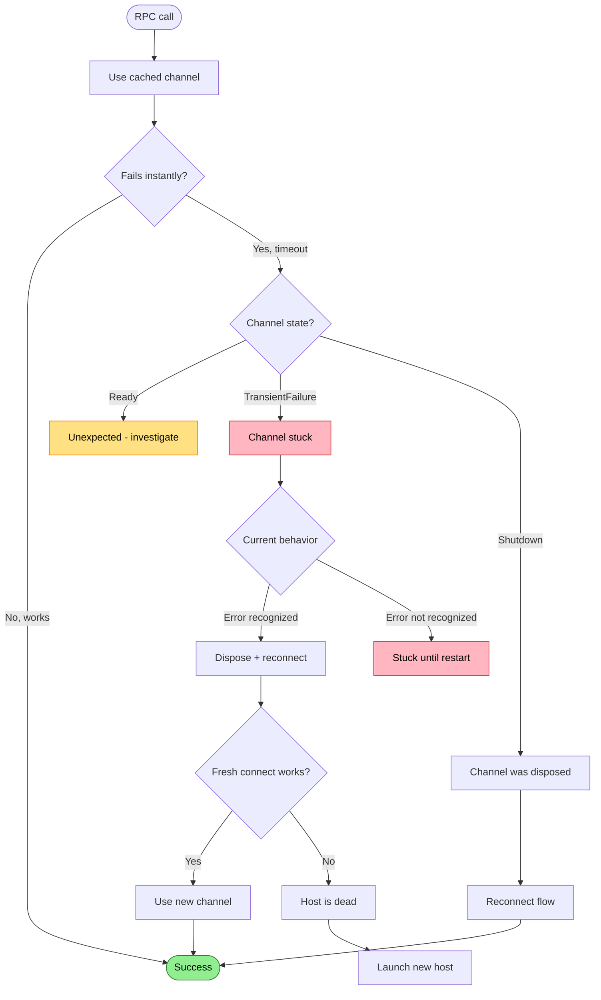

# Channel Stuck (TransientFailure)

gRPC channel enters failed state but host is healthy. Fresh connections work but cached channel is broken.

## Trigger

Cached gRPC channel enters `TransientFailure` state, doesn't recover automatically.

## Stages

### 1. RPC Timeout

**Actor**: MCP Client (RPC layer)
**Action**: RPC times out instantly (not 120s timeout - instant failure)
**Output**: Timeout or deadline exceeded
**Failure**: Error type may not be recognized as reconnectable

### 2. Fresh Connection Test

**Actor**: MCP Client (diagnostics)
**Action**: Create fresh socket connection bypassing cached channel
**Output**: Fresh connection succeeds
**Failure**: N/A

### 3. Health Check

**Actor**: MCP Client (diagnostics)
**Action**: Health check via fresh connection
**Output**: Host reports SERVING
**Failure**: N/A

### 4. Channel State Check

**Actor**: MCP Client (diagnostics)
**Action**: Check `GrpcChannel.State` property
**Output**: State is `TransientFailure`
**Failure**: **Currently not checked** - this is the gap

## Termination

Flow completes when:
- Channel disposed and fresh channel created, OR
- User restarts MCP server (current workaround)

## Flow Diagram



## Diagnostic Output

```
❌ Channel stuck
   Host: healthy (verified via fresh connection)
   Cached channel: TransientFailure

   This is a known gRPC-dotnet issue with Unix sockets.

   → Restart MCP server to clear channel cache
```

## Recovery

| Condition | Action |
|-----------|--------|
| Channel stuck, host healthy | Dispose channel, create fresh |
| Error not recognized | **Currently stuck** - requires restart |

## Status

❌ **Gap** - Channel state not checked before RPC.

**Current behavior**: If error type isn't in `ShouldAttemptReconnect`, client is stuck until MCP server restart.

**Proposed fix**:
1. Before RPC, check `_channel?.State`
2. If `TransientFailure` or `Shutdown`, dispose and reconnect proactively
3. Add channel state to diagnostics output

**Root cause**: gRPC-dotnet with Unix sockets + custom `ConnectCallback` doesn't support `ConnectAsync()` or proper connectivity state tracking.
