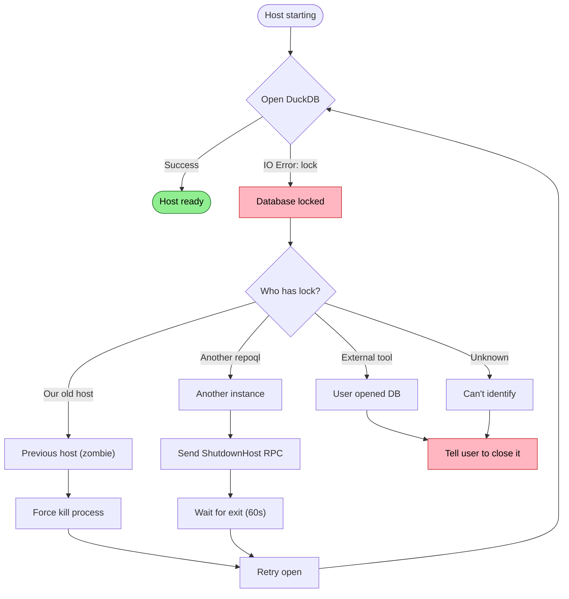

# Database Locked

Another process has the DuckDB file locked, preventing host startup.

## Trigger

Host attempts to open DuckDB database, fails with lock error.

## Stages

### 1. Database Open Attempt

**Actor**: Host (startup)
**Action**: Open DuckDB database file
**Output**: Success or IO error
**Failure**: "database is locked" or "exclusive access" error

### 2. Lock Holder Identification

**Actor**: Host (diagnostics)
**Action**: Find which process holds the lock (platform-specific)
**Output**: Locking PID
**Failure**: May not be able to identify on all platforms

### 3. Lock Holder Classification

**Actor**: Host (diagnostics)
**Action**: Compare locking PID to known host PIDs
**Output**: Classification (our zombie, another repoql, external tool)
**Failure**: Unknown process requires user investigation

### 4. Resolution

**Actor**: Host or User
**Action**: Depends on lock holder type
**Output**: Lock released
**Failure**: External process cannot be auto-resolved

## Termination

Flow completes when:
- Lock released and database opened, OR
- User informed of external lock holder

## Flow Diagram



## Diagnostic Output

```
❌ Database locked
   Database: /repo/.repoql/repoql.db
   Lock holder: PID 12345 (DBeaver.exe)

   Close DBeaver to release the lock, then retry.
```

If it's a RepoQL zombie:

```
❌ Database locked
   Database: /repo/.repoql/repoql.db
   Lock holder: PID 12345 (repoql)

   This is a previous RepoQL host process.
   Killing PID 12345...
```

If it's another RepoQL instance:

```
❌ Database locked
   Database: /repo/.repoql/repoql.db
   Lock holder: PID 12345 (repoql) - running, healthy

   Another RepoQL host is serving this repository.
   Sending shutdown request...
```

If we can't identify (platform limitation):

```
❌ Database locked
   Database: /repo/.repoql/repoql.db
   Lock holder: PID 12345

   Find what process has PID 12345:
   - Windows: Get-Process -Id 12345
   - Linux/macOS: ps -p 12345 -o comm=
```

## Recovery

| Lock holder | Auto-recoverable | Action |
|-------------|------------------|--------|
| Our zombie | ✅ Yes | Force kill, retry |
| Another repoql | ✅ Yes | Send ShutdownHost RPC, wait 60s |
| External tool | ❌ No | Inform user |
| Unknown | ❌ No | Inform user with PID |

## Status

⚠️ **Partially implemented** - `ServeCommands.TryShutdownExistingHostAsync()` handles another repoql instance.

**Gap**: No detection of zombie vs external process. Both show "locked" but need different handling.

**Proposed diagnostic probe**:
1. Try exclusive file open
2. If locked, find locking PID (platform-specific):
   - Windows: `handle.exe` or restart manager API
   - Linux: `fuser` or `/proc/locks`
   - macOS: `lsof`
3. Compare to known host PID
4. Report: "locked by our host" vs "locked by PID 12345 (DBeaver.exe)"
