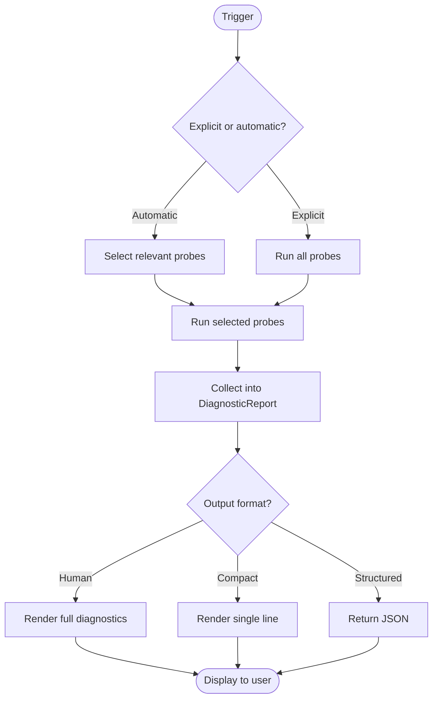

# Diagnostics Flow

How diagnostic information is collected and presented.

## Trigger

Diagnostics run in two modes:

| Mode | Trigger | Scope |
|------|---------|-------|
| **Explicit** | User runs `:diagnostics:` query | Full probe suite |
| **Automatic** | Tool call fails with infrastructure error | Relevant probes only |

## Stages

### 1. Probe Execution

**Actor**: Diagnostic Runner
**Action**: Execute probes to collect system state
**Output**: Structured diagnostic data (not formatted text)
**Failure**: Individual probe failures don't stop other probes

### 2. Data Assembly

**Actor**: Diagnostic Runner
**Action**: Assemble probe results into structured object
**Output**: `DiagnosticReport` with all observations
**Failure**: N/A

### 3. Presentation

**Actor**: Formatter
**Action**: Render structured data for display
**Output**: Human-readable text with emoji indicators
**Failure**: N/A

## Data Model

Diagnostics collect facts. Presentation interprets them.

```
DiagnosticReport
├── Environment
│   ├── Cwd: string
│   ├── RepoRoot: string
│   ├── Platform: string
│   └── RepoqlVersion: string
│
├── Socket
│   ├── Path: string
│   ├── Exists: bool
│   ├── CanConnect: bool
│   └── Error: string?
│
├── Host
│   ├── PidFile: string?
│   ├── Pid: int?
│   ├── ProcessRunning: bool
│   ├── ProcessName: string?
│   ├── MemoryMb: int?
│   └── Stderr: string[] (last N lines)
│
├── Health
│   ├── Status: Serving | NotServing | Unknown
│   ├── ResponseTimeMs: int?
│   └── Error: string?
│
├── Channel
│   ├── State: Ready | TransientFailure | Shutdown | None
│   ├── CachedSince: DateTime?
│   └── FreshConnectWorks: bool?
│
├── Lease
│   ├── Active: bool
│   ├── LastHeartbeat: DateTime?
│   ├── StreamState: Active | Faulted | None
│   └── Error: string?
│
├── Database
│   ├── Path: string
│   ├── Exists: bool
│   ├── SizeMb: int?
│   ├── Locked: bool
│   ├── LockHolder: ProcessInfo?
│   └── CanQuery: bool
│
├── Index
│   ├── Phase: Discovery | Indexing | SemanticIndexing | Analysis | Complete
│   ├── FilesTotal: int
│   ├── FilesIndexed: int
│   ├── CurrentFile: string?
│   └── ErrorCount: int
│
└── Probes[]
    ├── Name: string
    ├── Status: Pass | Fail | Warn | Skip
    ├── DurationMs: int
    └── Detail: string?
```

## Probes

Each probe collects specific facts:

| Probe | Collects | Fast? |
|-------|----------|-------|
| `environment` | cwd, repo root, platform, version | ✓ |
| `socket` | path, exists, connectable | ✓ |
| `host_process` | PID, running, memory, stderr | ✓ |
| `health_check` | gRPC health status | ✓ |
| `channel_state` | cached channel state | ✓ |
| `lease_state` | heartbeat recency, stream state | ✓ |
| `database_file` | exists, size, locked, lock holder | ✓ |
| `database_query` | can execute simple query | ~ |
| `index_state` | pipeline phase, progress | ~ |
| `fresh_connect` | new connection bypassing cache | ~ |

**Automatic mode** runs fast probes relevant to the error.
**Explicit mode** runs all probes.

## Presentation

### Status Indicators

| Symbol | Meaning |
|--------|---------|
| ✓ | Healthy / Pass |
| ⚠️ | Warning / Degraded |
| ❌ | Error / Failed |
| ○ | Unknown / Not checked |

### Explicit Diagnostics Output

```
RepoQL Diagnostics
==================

Environment
  ✓ cwd: C:\Source\MyProject
  ✓ repo: C:\Source\MyProject
  ✓ platform: win32 (Windows 11)
  ✓ version: 1.2.3

Connection
  ✓ socket: C:\Source\MyProject\.repoql\repoql.sock
  ✓ host: PID 12345 (repoql, 450MB)
  ✓ health: SERVING (12ms)
  ✓ channel: Ready
  ✓ lease: active, last heartbeat 3s ago

Database
  ✓ path: C:\Source\MyProject\.repoql\index.duckdb (125MB)
  ✓ query: OK (SELECT 1 in 2ms)

Index
  ✓ phase: Complete
  ✓ files: 1,247 indexed, 0 errors

All checks passed.
```

### Automatic Diagnostics (on error)

Only shows relevant information:

```
Connection failed: socket connect refused

Diagnostics:
  ✓ socket: exists
  ❌ connect: refused (ECONNREFUSED)
  ○ host: PID 12345 (exited, code 139)

  Host stderr (last 5 lines):
  > [10:23:45] Processing batch 12/50
  > [10:23:47] OutOfMemoryException
  >    at BatchProcessor.ProcessBatch()

Attempting restart...
```

### Compact Format (for logs)

```
diag: env=ok socket=ok host=ok(pid=12345) health=SERVING(12ms) channel=Ready lease=ok db=ok(125MB) index=complete(1247)
```

## Flow Diagram



## Separation of Concerns

```
┌─────────────────┐     ┌──────────────────┐     ┌─────────────────┐
│     Probes      │────▶│ DiagnosticReport │────▶│   Formatters    │
│  (collect data) │     │   (structured)   │     │ (render output) │
└─────────────────┘     └──────────────────┘     └─────────────────┘
                                │
                                ▼
                        ┌──────────────────┐
                        │  Failure Modes   │
                        │   (interpret)    │
                        └──────────────────┘
```

- **Probes** collect facts without interpretation
- **DiagnosticReport** holds structured data
- **Failure Modes** interpret data to identify specific failures
- **Formatters** render for different audiences (human, log, JSON)

## Status

⚠️ **Partially implemented** - Some probes exist, but:
- Channel state not probed
- Lease state not probed
- Lock holder detection not implemented
- No structured data model (directly renders text)

**Proposed**: Refactor to collect structured data first, then format.
