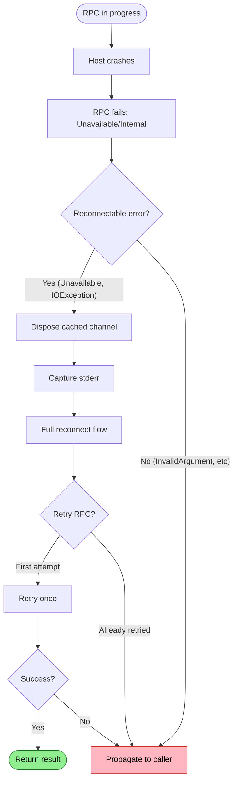

# Host Crashed

Host process dies unexpectedly during active session.

## Trigger

Client has active lease, host process terminates unexpectedly.

## Stages

### 1. RPC Failure

**Actor**: MCP Client (RPC layer)
**Action**: RPC fails with `Unavailable` or `Internal` status code
**Output**: gRPC exception with status code
**Failure**: Channel may cache stale connection state

### 2. Socket State Check

**Actor**: MCP Client (connection logic)
**Action**: Check socket file exists (may be stale)
**Output**: Socket present but stale
**Failure**: N/A

### 3. PID Verification

**Actor**: MCP Client (connection logic)
**Action**: Check PID file, verify process exited
**Output**: Exit code if available
**Failure**: N/A

### 4. Stderr Capture

**Actor**: MCP Client (diagnostics)
**Action**: Read captured stderr from host process
**Output**: Crash reason (exception, OOM, signal)
**Failure**: Stderr may be empty if crash was immediate

### 5. Channel Cleanup

**Actor**: MCP Client (connection logic)
**Action**: Dispose cached gRPC channel
**Output**: Channel resources released
**Failure**: N/A

### 6. Reconnection

**Actor**: MCP Client (connection logic)
**Action**: Delete stale socket, launch new host
**Output**: Fresh host process
**Failure**: Same as "Host Not Running" flow

## Termination

Flow completes when:
- New host running and lease established, OR
- Repeated crashes trigger circuit breaker

## Flow Diagram



## Diagnostic Output

```
❌ Host crashed
   Socket: /repo/.repoql/repoql.sock (stale)
   PID: 12345 (exited, code 139)

   Last stderr:
   > Unhandled exception: OutOfMemoryException
   > at RepoQL.Indexing.BatchProcessor.ProcessBatch()

   → Restarting automatically...
```

## Recovery

| Condition | Action |
|-----------|--------|
| Single crash | Auto-relaunch, retry RPC once |
| Repeated crashes | Circuit breaker, surface pattern |
| OOM crashes | Suggest reducing batch size |

## Status

✅ **Partially implemented** - Auto-relaunch works, but no circuit breaker for repeated crashes.

**Gap**: Repeated crashes cause repeated 120s waits with no circuit breaker.
