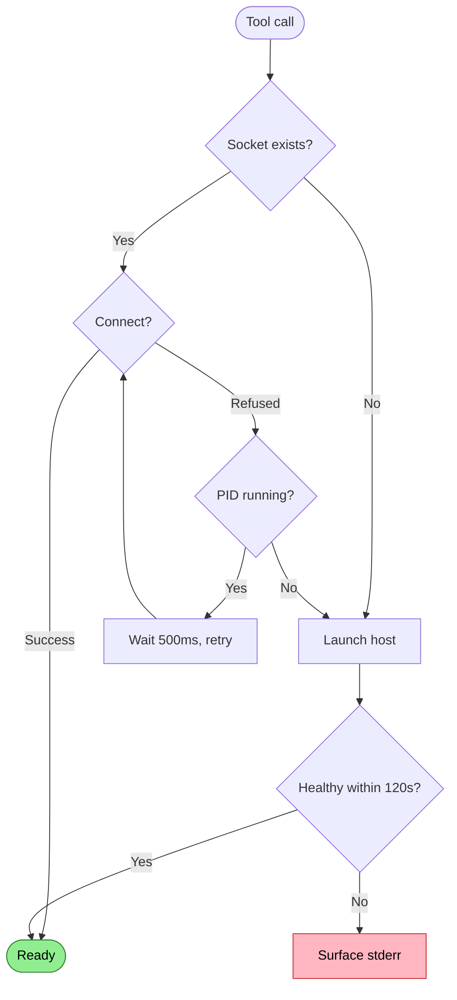

# Host Not Running

No host process exists when client attempts operation.

## Trigger

Client attempts tool call, no host process is running.

## Stages

### 1. Socket Check

**Actor**: MCP Client (connection logic)
**Action**: Check if socket file exists at `{repo}/.repoql/repoql.sock`
**Output**: Socket exists or missing
**Failure**: N/A

### 2. Connection Attempt

**Actor**: MCP Client (connection logic)
**Action**: Attempt TCP connect to Unix socket
**Output**: Connected, ECONNREFUSED, or ENOENT
**Failure**: Can't distinguish "never started" from "crashed" without PID check

### 3. PID Verification

**Actor**: MCP Client (connection logic)
**Action**: If refused, check for host PID file and verify process running
**Output**: Process state (running, exited, no PID file)
**Failure**: N/A

### 4. Auto-Launch

**Actor**: MCP Client (connection logic)
**Action**: Launch host process, poll health endpoint every 100ms
**Output**: Host running and healthy
**Failure**: Launch timeout after 120s

## Termination

Flow completes when:
- Host is healthy and lease established, OR
- Launch timeout exceeded → surface stderr to user

## Flow Diagram



## Diagnostic Output

```
❌ Host not running
   Socket: /repo/.repoql/repoql.sock (missing)
   PID file: none

   → Run: repoql serve
```

## Recovery

| Condition | Action |
|-----------|--------|
| Socket missing, no PID | Auto-launch host |
| Socket exists, connect refused, PID not running | Delete stale socket, auto-launch |
| Socket exists, connect refused, PID running | Wait and retry (host starting) |
| Launch timeout | Surface stderr, fail |

## Status

✅ **Implemented** - Auto-launch works today.
