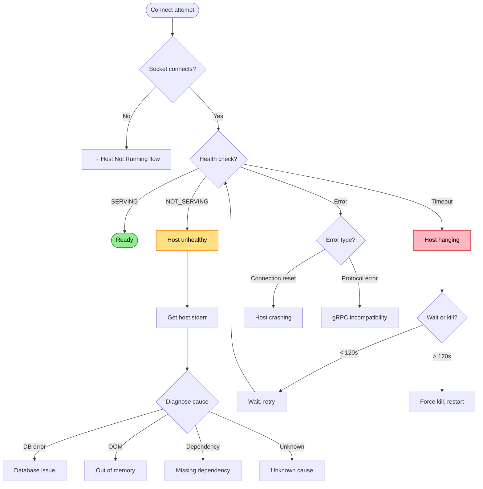

# Host Unhealthy

Host process running but health check fails.

## Trigger

gRPC health check returns NOT_SERVING or times out.

## Stages

### 1. Socket Connection

**Actor**: MCP Client (connection logic)
**Action**: Connect to Unix socket
**Output**: Connection established
**Failure**: If connection fails, different failure mode (Host Not Running)

### 2. Health Check

**Actor**: MCP Client (health probe)
**Action**: Send gRPC health check request
**Output**: SERVING, NOT_SERVING, or timeout
**Failure**: Various outcomes need different handling

### 3. Stderr Capture

**Actor**: MCP Client (diagnostics)
**Action**: Read host stderr for diagnosis
**Output**: Error messages, stack traces
**Failure**: Stderr may be empty

### 4. Cause Classification

**Actor**: MCP Client (diagnostics)
**Action**: Analyze stderr and health response
**Output**: Classified cause (DB error, OOM, dependency, unknown)
**Failure**: May not be able to classify

## Termination

Flow completes when:
- Cause identified and surfaced to user, OR
- Host recovers (transient issue), OR
- User takes corrective action

## Flow Diagram



## Diagnostic Output

Show facts, not guessed causes:

```
❌ Host unhealthy
   Socket: connected
   Health: NOT_SERVING

   Host stderr (last 10 lines):
   > [2024-01-15 10:23:45] Starting indexing pipeline
   > [2024-01-15 10:23:47] Processing batch 1/50
   > [2024-01-15 10:23:52] Unhandled exception: OutOfMemoryException
   >    at RepoQL.Indexing.BatchProcessor.ProcessBatch()

   Host process: running (PID 12345, 2.1GB memory)
```

No stderr captured:

```
❌ Host unhealthy
   Socket: connected
   Health: NOT_SERVING

   Host stderr: (empty)
   Host process: running (PID 12345)

   Try: repoql serve --verbose (in separate terminal for more output)
```

The error message shows what we *observed*, not what we *guess* caused it. The user/agent can read the stderr and determine the appropriate fix.

## Recovery

Not auto-recoverable. Surface the facts and let user/agent diagnose:

| What we show | User/agent determines |
|--------------|----------------------|
| Stderr content | What actually failed |
| Process memory usage | Whether memory is the issue |
| Health status | Whether to restart or investigate |

## Status

⚠️ **Partially implemented** - Health check exists, stderr captured.

**Principle**: Surface observations, not guessed causes. Stderr content is the diagnostic - we show it, user/agent interprets it.
