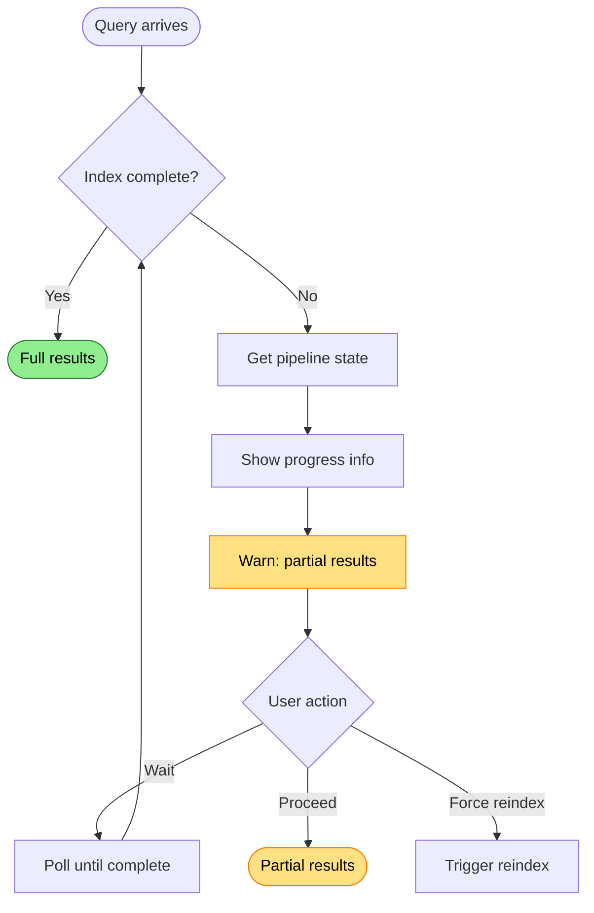

# Index Incomplete

Indexing pipeline hasn't finished processing all files.

## Trigger

User queries repository while indexing is still in progress.

## Stages

### 1. Pipeline State Query

**Actor**: Host (diagnostics)
**Action**: Query indexing pipeline state
**Output**: Current phase and progress
**Failure**: N/A - always queryable

### 2. Progress Calculation

**Actor**: Host (diagnostics)
**Action**: Count pending vs completed files
**Output**: Completion percentage
**Failure**: N/A

### 3. Phase Identification

**Actor**: Host (diagnostics)
**Action**: Identify current pipeline phase
**Output**: Discovery, Indexing, SemanticIndexing, or Analysis
**Failure**: N/A

### 4. Stall Detection

**Actor**: Host (diagnostics)
**Action**: Check for stalled workers (no progress for extended period)
**Output**: Stall detected or normal progress
**Failure**: Stalled worker is separate failure mode

## Termination

Flow completes when:
- Indexing completes (all phases done), OR
- User acknowledges partial results, OR
- Stall detected → separate failure mode

## Flow Diagram



## Diagnostic Output

```
⚠️ Index incomplete
   Phase: SemanticIndexing
   Progress: 847/1203 files (70%)
   Current: src/RepoQL.Indexing/BatchProcessor.cs
   Rate: 12 files/sec
   ETA: ~30s

   Queries may return partial results.

   → Wait for completion, or query with confidence:partial
```

## Recovery

| Condition | Action |
|-----------|--------|
| Normal indexing | Wait or accept partial |
| Stalled worker | Separate failure mode |
| Corrupted index | Delete .repoql/, reindex |

## Status

✅ **Implemented** - Pipeline state is queryable.

Diagnostics show:
- Current phase
- File counts
- Active file being processed

**Enhancement**: Add rate and ETA calculation for better user experience.
