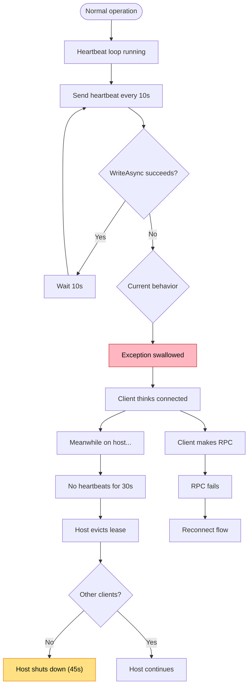

# Silent Lease Expiry

Heartbeats fail silently, host evicts lease, client doesn't know.

## Trigger

Heartbeat stream fails but exception is swallowed. Host evicts lease after 30s without heartbeats.

## Stages

### 1. Heartbeat Failure

**Actor**: MCP Client (heartbeat loop)
**Action**: `WriteAsync` throws exception (connection lost)
**Output**: Exception
**Failure**: **Exception swallowed by `Task.Run`** - this is the bug

### 2. Client Unaware

**Actor**: MCP Client
**Action**: Continues operating, thinks it's connected
**Output**: Stale lease state
**Failure**: No indication of problem

### 3. Host Eviction

**Actor**: Host (lease manager)
**Action**: No heartbeats received for 30s, evicts lease
**Output**: Lease removed from active set
**Failure**: N/A

### 4. Idle Shutdown (if applicable)

**Actor**: Host (lifecycle)
**Action**: If no other clients, begins 45s idle shutdown
**Output**: Host terminates
**Failure**: N/A

### 5. Surprise Failure

**Actor**: MCP Client
**Action**: Makes RPC call, fails unexpectedly
**Output**: RPC error
**Failure**: User sees failure with no warning

## Termination

Flow completes when:
- RPC fails and triggers reconnect flow, OR
- Heartbeat health detected and reconnect initiated proactively

## Flow Diagram



## Diagnostic Output

```
⚠️ Lease unhealthy
   Last heartbeat: 45s ago (should be <10s)
   Lease stream: faulted

   → Reconnecting...
```

## Recovery

| Condition | Action |
|-----------|--------|
| Heartbeat detected failed | Reconnect, re-establish lease |
| **Currently** | No detection - waits for RPC failure |

## Status

❌ **Bug** - Heartbeat exceptions swallowed.

**Current code** (`RepoQlClient.cs` lines 629-645):
```csharp
_ = Task.Run(async () =>
{
    while (!_leaseCts.IsCancellationRequested)
    {
        await Task.Delay(TimeSpan.FromSeconds(10), _leaseCts.Token);
        await leaseCall.RequestStream.WriteAsync(new ClientLeaseBeat {...});
        // NO TRY-CATCH — exceptions vanish into void
    }
}, _leaseCts.Token);
```

**Proposed fix**:
1. Add try-catch in heartbeat loop
2. On failure, set `_leaseHealthy = false`
3. Check lease health before RPC or include in periodic diagnostics
4. Surface lease health in `:diagnostics:` output
5. Consider: gRPC stream closure = lease end (remove app-level heartbeats)
