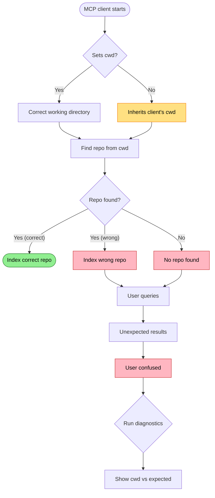

# Wrong Working Directory

MCP server launched in wrong directory - indexes wrong location or fails to find repository.

## Trigger

MCP client spawns RepoQL server process with incorrect working directory. Common with:
- VS Code (spawns in extension directory)
- Cursor (spawns in user home)
- Claude Desktop (spawns in app installation path)
- Any client that doesn't set `cwd` when spawning subprocess

## Stages

### 1. Process Launch

**Actor**: MCP Client (process spawner)
**Action**: Spawns `repoql` process without setting working directory
**Output**: Process running in client's directory, not user's project
**Failure**: Silent - process starts successfully

### 2. Repository Detection

**Actor**: Host (startup)
**Action**: Walks up from `cwd` looking for `.git` or project markers
**Output**: Wrong repo found, no repo found, or indexes client installation
**Failure**: Multiple failure modes depending on what's at wrong path

### 3. Index Creation

**Actor**: Host (indexing)
**Action**: Indexes whatever it found at wrong location
**Output**: Index of wrong content (or empty index)
**Failure**: User queries return unexpected results

### 4. User Confusion

**Actor**: User
**Action**: Queries expecting project files, gets wrong results
**Output**: "File not found" or results from wrong codebase
**Failure**: Hard to diagnose - everything "works" but wrong data

## Termination

Flow completes when:
- User realizes wrong directory and reconfigures client, OR
- Diagnostic surfaces the mismatch

## Flow Diagram



## Diagnostic Output

### Stderr on startup (always logged)

```
[MCP] cwd=C:\Users\dev\AppData\Local\Programs\cursor\resources
[MCP] repoRoot=C:\Users\dev\AppData\Local\Programs\cursor\resources
```

### When no repo markers found (error message)

```
No repository markers (.git or .repoql) were found starting at
'C:\Users\dev\AppData\Local\Programs\cursor\resources'.
Current working directory: 'C:\Users\dev\AppData\Local\Programs\cursor\resources'.
Use the command tool with "::repo[C:\Users\dev\MyProject]" to set the repository root, then retry.
```

### After using `::repo[...]`

```
Switched to repository: C:\Users\dev\MyProject
```

### Proposed: Enhanced diagnostics

```
⚠️ Working directory
   Server cwd: C:\Users\dev\AppData\Local\Programs\cursor\resources
   Detected repo: (none - no .git or .repoql found)

   This path looks like an MCP client installation directory.

   Fix options:
   1. Set REPOQL_CWD in your MCP client's env config
   2. Run: ::repo[/path/to/your/project]
```

## Known Client Issues

| Client | Issue | Status | Workaround |
|--------|-------|--------|------------|
| VS Code | Spawns in extension dir | Open bug | Set `REPOQL_CWD` env var |
| Cursor | Spawns in home dir | Open bug | Set `REPOQL_CWD` env var |
| Claude Desktop | Spawns in app path | Open bug | Set `REPOQL_CWD` env var |
| Zed | Unknown | Untested | Unknown |

## Recovery

| Condition | Action |
|-----------|--------|
| Before launch | Set `REPOQL_CWD` in MCP client env config |
| After launch, no markers found | Error message tells you to use `::repo[/path]` |
| After launch, wrong repo indexed | Use `::repo[/correct/path]` to switch |
| Client supports cwd config | Configure client to set cwd on spawn |

## Current Mitigation

Three mechanisms exist:

### 1. `REPOQL_CWD` Environment Variable

**Implemented** (`Program.cs` lines 30-36):
```csharp
var explicitWorkingDirectory = Environment.GetEnvironmentVariable("REPOQL_CWD");
if (!string.IsNullOrWhiteSpace(explicitWorkingDirectory) &&
    Directory.Exists(explicitWorkingDirectory))
{
    Environment.CurrentDirectory = explicitWorkingDirectory;
}
```

Set `REPOQL_CWD=/path/to/repo` in MCP client config to override cwd at startup.

### 2. `::repo[...]` Command

**Implemented** (`CommandTool.cs`, `RepoCommand.cs`, `RepoQlClientProvider.cs`):

Call `::repo[/path/to/repo]` to explicitly set the repository root. This:
- Sets working directory via `RepoQlClientProvider.SetWorkingDirectory()`
- Forces client recreation with new path
- Works even after startup with wrong cwd

### 3. Helpful Error Message

**Implemented** (`RepoQlClientProvider.cs` lines 55-62):

When no repo markers found, the error tells you exactly how to fix it:
```
No repository markers (.git or .repoql) were found starting at '{searchedFrom}'.
Current working directory: '{cwd}'.
Use the command tool with "::repo[{cwd}]" to set the repository root, then retry.
```

### 4. Stderr Logging

**Implemented** (`McpCommands.cs` lines 24-27):
```
[MCP] cwd=/wrong/path
[MCP] repoRoot=/wrong/path
```

## Status

✅ **Mitigated** - Multiple recovery paths exist.

| Mechanism | When to use |
|-----------|-------------|
| `REPOQL_CWD` env var | Configure in MCP client settings before launch |
| `::repo[...]` command | Runtime fix after wrong cwd detected |
| Error message | Guides user to solution when no markers found |

**Remaining gaps**:
1. No proactive warning when cwd looks like installation directory
2. User must know to check stderr or encounter error to discover the problem

## Verification

| Environment | How to verify |
|-------------|---------------|
| **Local** | Launch repoql from wrong directory, verify diagnostics show mismatch |
| **Automated tests** | Set cwd to temp dir, verify warning surfaces |
| **Production** | Diagnostics show cwd and indexed repo clearly |
