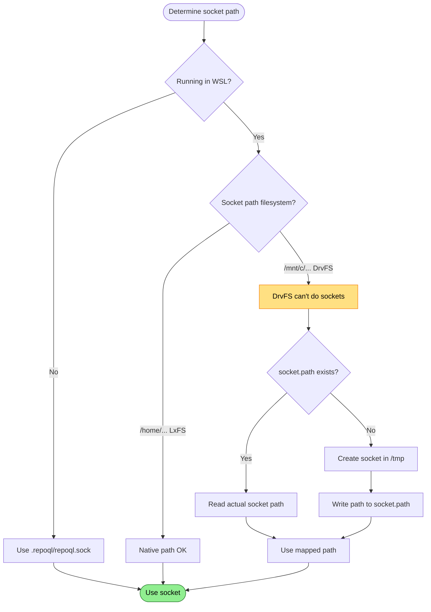

# WSL Socket Path

Unix socket on Windows mount (DrvFS) doesn't work in WSL2.

## Trigger

RepoQL running in WSL2 with repository on `/mnt/c/...` (Windows drive).

## Stages

### 1. Environment Detection

**Actor**: MCP Client (path resolution)
**Action**: Check if running in WSL (inspect `/proc/version`)
**Output**: WSL detected or not
**Failure**: N/A

### 2. Filesystem Detection

**Actor**: MCP Client (path resolution)
**Action**: Check socket path filesystem type
**Output**: DrvFS (Windows mount) or LxFS (native Linux)
**Failure**: N/A

### 3. Path Redirect

**Actor**: MCP Client (path resolution)
**Action**: If DrvFS, redirect socket to `/tmp/repoql-{hash}/`
**Output**: Working socket path on LxFS
**Failure**: N/A

### 4. Mapping File

**Actor**: MCP Client (path resolution)
**Action**: Write actual socket path to `socket.path` file in repo
**Output**: Future clients can find the redirected socket
**Failure**: N/A

## Termination

Flow completes when:
- Socket path resolved to working filesystem

## Flow Diagram



## Diagnostic Output

```
ℹ️ WSL socket redirect
   Repo path: /mnt/c/Users/dev/repo
   Filesystem: DrvFS (Windows mount)

   Unix sockets don't work on DrvFS in WSL2.

   Socket redirected to: /tmp/repoql-a1b2c3/repoql.sock
   Mapping file: /mnt/c/Users/dev/repo/.repoql/socket.path
```

Or if something goes wrong:

```
❌ WSL socket path issue
   Socket path: /mnt/c/Users/dev/repo/.repoql/repoql.sock
   Filesystem: DrvFS (Windows mount)

   Unix sockets don't work on DrvFS in WSL2.
   Failed to create redirect socket.

   → Check /tmp permissions or set REPOQL_SOCKET env var
```

## Recovery

| Condition | Action |
|-----------|--------|
| DrvFS detected | Auto-redirect to /tmp |
| /tmp not writable | User sets REPOQL_SOCKET |

## Status

✅ **Implemented** - `RepoDirectoryAccessor.ResolveSocketPath()` handles this.

**Background**: WSL2 runs a real Linux kernel but `/mnt/c/` is a 9P filesystem mount (DrvFS) that doesn't support Unix domain sockets. This limitation exists since WSL2 launched in 2020 and is unlikely to be fixed.
