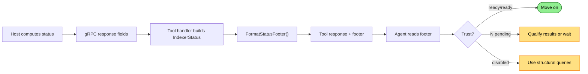

# Footer Trust Signals Flow (Current)

How every tool response includes a status footer that tells the agent whether to trust the results.

## Why This Matters

The footer is the cheapest diagnostic signal — ~10 tokens on every response, no separate query needed. When it works, the agent glances at it, confirms trust, and moves on. When it shows degradation, the agent knows results are partial before acting on them.

| Without | With |
|---------|------|
| Agent doesn't know index is 47% complete, acts on partial results | `index: 12 pending` → agent waits or qualifies answer |
| Agent doesn't know semantic search is disabled | `semantic: disabled` → agent uses structural queries instead |
| Agent has no signal that anything is wrong until a query fails | Footer changes before failures cascade |

## Trigger

Every successful tool response from `query`, `explore`, `read`, and `explain` appends a status footer.

## Actors

| Actor | Role |
|-------|------|
| **Host** | Computes `index_pending`, `semantic_ready`, `semantic_enabled` for each gRPC response |
| **Tool handler** | Constructs `IndexerStatus` from response fields, calls `FormatStatusFooter` |
| **RepresentationFormatter** | Formats the status footer string |
| **Agent** | Reads the footer, decides whether to trust results or investigate |

## Stages

### 1. Host Computes Status

**Actor**: Host (gRPC response)
**Action**: Attach indexer status fields to every query/explore/read response
**Output**: `index_pending` (int), `semantic_enabled` (bool), `semantic_ready` (bool), `execution_time_ms` (long)
**Failure**: N/A — these are populated from the UriRegistry, always available

The proto includes these fields on both `QueryResponse` and `ExploreIndexerStatus`:

```protobuf
int32 index_pending = 6;    // 0 = all files indexed
bool semantic_enabled = 7;   // embeddings feature on?
bool semantic_ready = 8;     // embeddings complete?
int64 execution_time_ms = 5; // query timing
```

`index_pending` comes from the UriRegistry — the count of URIs not yet in `Indexed` state. `semantic_ready` reflects whether the embedding pipeline has completed.

### 2. Tool Handler Constructs Status

**Actor**: Tool handler (`QueryTool`, `ExploreTool`, `ReadTool`, `ExplainTool`)
**Action**: Build `IndexerStatus` record from gRPC response fields
**Output**: `IndexerStatus(IndexPending, SemanticReady, SemanticEnabled, ElapsedMs)`
**Failure**: N/A

Each tool does this slightly differently:
- **QueryTool**: Builds `IndexerStatus` from `result.IndexPending`, `result.SemanticReady`, etc.
- **Explore/Read/Explain**: Status comes via `ExploreIndexerStatus` in the gRPC response, passed through to rendering

### 3. Footer Formatting

**Actor**: `RepresentationFormatter.FormatStatusFooter`
**Action**: Format status into a compact bracket-delimited string
**Output**: Footer string
**Failure**: N/A

Format logic:

```
Index status:
  IndexPending > 0  → "N pending"
  IndexPending == 0 → "ready"

Semantic status:
  !SemanticEnabled → "disabled"
  SemanticEnabled && !SemanticReady → "pending"
  SemanticEnabled && SemanticReady → "ready"

Token count: estimated from output length
Duration: execution time from host
```

### 4. Footer Appended to Response

**Actor**: Tool handler
**Action**: Append formatted footer to tool output
**Output**: Complete tool response with footer on the last line
**Failure**: N/A

## Current Footer Shape

```
[1.5k tok | 42ms | index: ready | semantic: ready]
```

```
[850 tok | 120ms | index: 12 pending | semantic: pending]
```

```
[2.1k tok | 35ms | index: ready | semantic: disabled]
```

### What Each Field Means

| Field | Example | Meaning |
|-------|---------|---------|
| Token count | `1.5k tok` | Estimated tokens in this response |
| Duration | `42ms` | Host-side query execution time |
| Index status | `ready` or `12 pending` | Whether all discovered files have been indexed |
| Semantic status | `ready`, `pending`, or `disabled` | Whether vector embeddings are available for search |

### Additional Context (Explore/Read Only)

Explore and read tools may include additional footer context:

```
[1.2k tok | 42ms | index: ready | semantic: ready | showing: structure | full: 5.2k tok]
```

The `showing:` hint tells the agent which representation was selected (structure, headline, content) and what the full cost would be. This supports the budget overflow consent pattern.

Truncation summaries appear separately when results are omitted:

```
[+12 more results (5x .cs, 4x .ts, 3x .md)]
```

## What the Agent Sees

The footer is always the last line of a successful tool response. The agent reads it without a separate query.

**Healthy — move on:**
```
[1.5k tok | 42ms | index: ready | semantic: ready]
```

**Partially indexed — results may be incomplete:**
```
[850 tok | 120ms | index: 12 pending | semantic: pending]
```
The agent should either wait for indexing to complete or qualify its answer: "Based on the 88% of files indexed so far..."

**Semantic disabled — structural queries only:**
```
[2.1k tok | 35ms | index: ready | semantic: disabled]
```
The agent should use keyword-based explore or SQL queries instead of relying on semantic search.

## Termination

The footer is appended once per tool response. No separate flow termination — it's a side-effect of every tool call.

## Flow Diagram



## What's Not in the Footer

| Missing signal | Why it matters | Currently available via |
|---------------|----------------|----------------------|
| Failed file count | Files that error during parsing are silently omitted from results | `SELECT count(*) FROM indexer_status() WHERE status = 'Error'` |
| Parse depth / format coverage | A file may be "indexed" but only shallowly (no type/function extraction) | Not directly queryable |
| Freshness / last scan time | Index may be ready but stale if working tree changed since last scan | Not tracked |
| Error count | Parsing/analysis errors that didn't prevent indexing but degraded quality | Not in footer |

These gaps are addressed in the enhanced footer flow (`docs/flows/future/diagnostics/footer-trust-signals.md`).

## Verification

| Environment | How |
|-------------|-----|
| **Agent session** | Run any tool, verify footer appears on last line with token/time/index/semantic fields |
| **During indexing** | Run a query while files are still being indexed, verify `index: N pending` appears |
| **Semantic disabled** | Run without embeddings configured, verify `semantic: disabled` |
| **Automated** | Integration test: query during indexing, assert footer contains `pending`; query after indexing, assert `ready` |

## Related

- North star: `docs/north-star/diagnostics.md` (Trust section — "under 20 tokens, on every response")
- Enhanced vision: `docs/flows/future/diagnostics/footer-trust-signals.md`
- Implementation — formatter: `src/RepoQL.Explore/RepresentationFormatter.cs` (`FormatStatusFooter`)
- Implementation — status record: `src/RepoQL.Explore/IndexerStatus.cs`
- Implementation — output assembly: `src/RepoQL.Explore/OutputComposer.cs`
- Implementation — query tool: `src/RepoQL.ConsoleApp/Tools/QueryTool.cs`
- Implementation — proto: `src/RepoQL.Protocol/Protos/repoql.proto` (`ExploreIndexerStatus`, `QueryResponse`)
