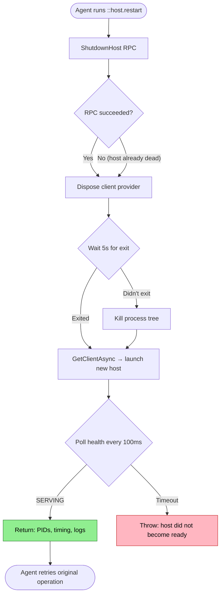
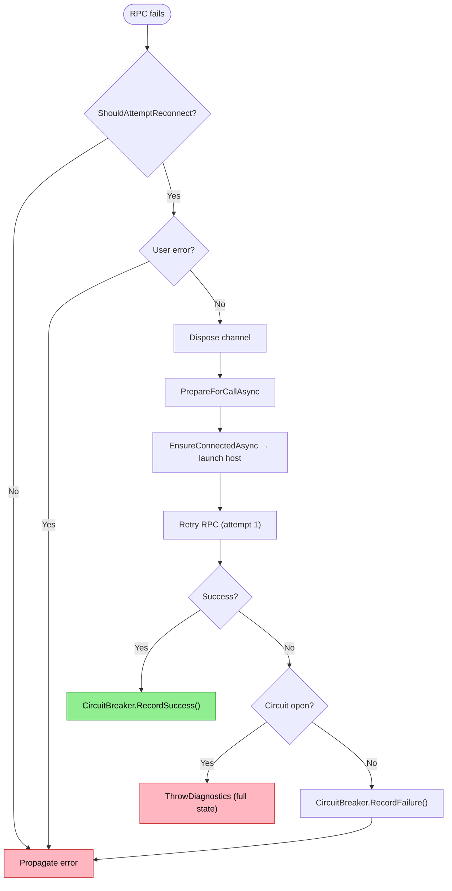

# Host Restart Flow (Current)

How an agent restarts the gRPC host — the recovery primitive that all other recovery depends on.

## Why This Matters

Host restart is the single most critical recovery primitive. Every failure mode that includes "restart the host" as a recovery step depends on this working reliably. If restart fails, the agent's entire self-healing capability collapses.

| Without | With |
|---------|------|
| Host crashes → agent tells user to restart manually | Host crashes → agent runs `::host.restart` → continues |
| Stale socket → stuck until MCP server restart | Stale socket → restart clears it → fresh connection |
| OOM → same configuration crashes again | OOM → restart with adjusted config → stable |

There are two restart paths: **agent-initiated** (`::host.restart` command) and **automatic** (resilient client detects failure, reconnects). Both ultimately launch a new host and wait for it to serve.

## Trigger

Agent-initiated:
- Agent runs `::host.restart` after diagnosing a problem (see self-service troubleshooting meta-flow)

Automatic:
- RPC fails with reconnectable error (`Unavailable`, `Internal`, `IOException`, `SocketException`)
- Health watch detects channel degradation
- Lease stream faults

## Actors

| Actor | Role |
|-------|------|
| **Agent** | Decides to restart, runs `::host.restart`, verifies result |
| **MCP Client** | Executes `HostRestartCommand`, manages `RepoQlClientProvider` lifecycle |
| **Resilient Client** | `RepoQlClient.Resilient` — circuit breaker, health watch, automatic reconnection |
| **Host (old)** | Receives `ShutdownHost` RPC, begins graceful shutdown |
| **Host (new)** | Launches, binds socket, passes health checks, begins serving |

## Stages

### 1. Shutdown Request

**Actor**: MCP Client (`HostRestartCommand`)
**Action**: Send `ShutdownHost` gRPC RPC to the running host
**Output**: Host PID for exit monitoring
**Failure**: Host unreachable (already crashed), RPC timeout, permission denied

The command gets the current client via `RepoQlClientProvider`, calls `ShutdownHostAsync`, and receives the host's PID. The host delays 500ms before actually stopping (to let the RPC response complete).

If the host is already dead, this step fails — but the command catches the exception and proceeds to cleanup anyway.

### 2. Connection Teardown

**Actor**: MCP Client (`HostRestartCommand`)
**Action**: Dispose the `RepoQlClientProvider` — drops the gRPC channel, stops health watch
**Output**: All client-side connection state cleared
**Failure**: N/A — disposal is best-effort

This happens before waiting for the host to exit. The client needs a clean slate so `GetClientAsync` in stage 4 creates a fresh connection rather than reusing a stale channel.

### 3. Wait for Exit (with Kill Fallback)

**Actor**: MCP Client (`HostRestartCommand`)
**Action**: Wait up to 5 seconds for the host process to exit. If it doesn't, kill the entire process tree.
**Output**: Previous host terminated (gracefully or forcefully)
**Failure**: Process.GetProcessById throws if already exited (caught silently). Kill may fail on protected processes.

```
Wait for exit (5s timeout)
├── Process exits within 5s → method = "stopped"
├── Process doesn't exit → Kill(entireProcessTree: true) → method = "killed"
└── Process already exited → ArgumentException caught → continue
```

This is the force multiplier. Without the kill fallback, a hanging host blocks restart indefinitely. The 5-second grace period is short enough to keep restart fast but long enough for clean shutdown.

### 4. Reconnect (Launch New Host)

**Actor**: MCP Client (`RepoQlClientProvider.GetClientAsync` → `RepoQlClient.EnsureConnectedAsync`)
**Action**: Create a new managed client, which launches a fresh host process and polls health checks until SERVING
**Output**: New host running, health check passing, client connected
**Failure**: Host fails to start (binary not found, socket bind fails, database locked), health check timeout

The reconnection path:
1. `GetClientAsync` calls `RepoQlClient.CreateManagedAsync`
2. `EnsureConnectedAsync` calls `EnsureServerRunning`
3. `EnsureServerRunning` checks if existing host is healthy (it won't be — we just killed it)
4. `LaunchHost` starts a new process:
   - **Debug**: `dotnet watch run --project RepoQL.ConsoleApp.csproj -- serve --implicit-start`
   - **Release**: `repoql serve --implicit-start`
5. Polls `TryHealthCheckAsync` every 100ms until the host responds SERVING
6. Returns connected client

The new host goes through its own startup sequence:
- Preflight checks
- `TryShutdownExistingHostAsync` (cleans stale socket/PID from our killed process)
- Socket bind
- Database init
- Service registration
- Health → SERVING

### 5. Result Reporting

**Actor**: MCP Client (`HostRestartCommand`)
**Action**: Collect timing and startup logs, format result
**Output**: Success message with PIDs, timing, and startup log tail
**Failure**: N/A — if we got here, restart succeeded

```
Host restarted in 3.2s (previous PID 43876 stopped, new PID 51234).

Startup logs:
[host 14:23:01] Host starting (pid=51234 version=1.3.31)
[host 14:23:01] Phase: preflight
[host 14:23:02] Phase: socket bind
[host 14:23:03] Phase: database init
[host 14:23:04] Phase: ready
[host 14:23:04] Host ready
```

The startup logs come from `RepoQlConnectionClient.GetHostDiagnostics()` — the stderr ring buffer of the new host process (last ~50 lines).

## Automatic Restart Path

Separate from `::host.restart`, the resilient client handles automatic reconnection when RPCs fail:

### Detection

**Actor**: Resilient Client (`RepoQlClient.Resilient`)
**Action**: RPC fails, exception matches `ShouldAttemptReconnect` pattern
**Reconnectable errors**: `Unavailable`, `Internal` (gRPC), `IOException`, `SocketException`, `ObjectDisposedException`, HTTP/2 connection failure

### Recovery

**Actor**: Resilient Client
**Action**: Dispose channel, call `EnsureConnectedAsync(forceReconnect: true)` which launches a new host
**Output**: Fresh connection, RPC retried once

```
Attempt 0: RPC fails → ShouldAttemptReconnect = true
  → DisposeChannel()
Attempt 1: PrepareForCallAsync → EnsureConnectedAsync (launches new host)
  → Retry RPC on fresh connection
  → Success → CircuitBreaker.RecordSuccess()
  → Failure → throw (no more retries)
```

### Circuit Breaker

**Actor**: Resilient Client (`ConnectionCircuitBreaker`)
**Action**: Track failures in a rolling window. Open circuit after threshold.
**Configuration**: 3 failures within 5 minutes → circuit opens
**Effect**: When open, `ThrowDiagnostics` is called instead of retrying — includes full connection state in the error

### Health Watch

**Actor**: Resilient Client
**Action**: Background task monitors gRPC channel health via `WaitForStateChangedAsync`
**Output**: Sets `_healthWatchFaulted` flag when channel degrades
**Effect**: `ShouldReconnectBeforeCallAsync` checks this flag and forces reconnect before the next RPC

## Termination

Flow completes when:
- **Agent-initiated**: New host SERVING, startup logs returned, agent verifies by running original operation
- **Automatic**: RPC retry succeeds on fresh connection, circuit breaker records success

## Flow Diagram





## Known Gaps

| Gap | Impact | Severity |
|-----|--------|----------|
| **`::host.restart` depends on host being reachable for step 1** | If host is crashed, `ShutdownHostAsync` fails. Command catches it but doesn't clean stale socket or PID file before reconnecting — relies on new host startup to clean up. | Medium |
| **No stale socket cleanup in `HostRestartCommand`** | If the old host crashed and left a stale socket, the command relies on the *new* host's `TryShutdownExistingHostAsync` to clean it. If that also fails (e.g., socket file permissions), restart stalls. | Medium |
| **No kill fallback when PID is unknown** | `HostRestartCommand` gets PID from the `ShutdownHost` RPC response. If the RPC fails (host already dead), there's no PID to wait for or kill. The command skips straight to reconnect, hoping the new host startup handles cleanup. | Low |
| **Circuit breaker doesn't trigger `::host.restart`** | When the circuit breaker opens, it throws a diagnostic exception. It doesn't proactively attempt a restart. The agent must interpret the error and run `::host.restart` manually. | Low |
| **Health watch doesn't proactively restart** | The health watch sets a flag that triggers reconnect on the *next* RPC. It doesn't proactively restart the host when it detects degradation between calls. | Low |
| **No `::host.restart` when host is unreachable** | The command starts by calling `clientProvider.GetClientAsync()` to get a client to send `ShutdownHost`. If the host is completely unreachable, this call will *launch a new host* rather than failing. The old stale process may still be running. | Medium |

## Host-Side Startup Shutdown (New Host Cleaning Up)

When the new host starts, it runs its own cleanup via `TryShutdownExistingHostAsync` in `ServeCommands`:

1. Check if socket file exists → if not, proceed
2. Probe socket → if stale (can't connect), delete it
3. If socket is active → send `ShutdownHost` RPC to existing host
4. Wait for exit (5s) → if no exit, find PID from PID file
5. If PID found and is a RepoQL process → force kill
6. Clean up socket and PID file
7. Acquire host lock (45s timeout, prevents concurrent starts)

This means the new host has its own robust cleanup — but there's a window where two hosts could race. The host lock (`WaitForHostLockAsync`) serializes this.

## Verification

| Environment | How |
|-------------|-----|
| **Agent session** | Run `::host.restart`, verify startup logs show new PID, run a query to confirm results |
| **Simulated** | Kill host process externally, run `::host.restart`, verify it recovers |
| **Automated** | Integration test: start host, send `ShutdownHost`, verify exit, launch new host, verify health |

## Related

- North star: `docs/north-star/diagnostics.md` (restart as critical recovery primitive)
- Meta-flow: `docs/flows/future/diagnostics/self-service-troubleshooting.md` (how restart fits in the troubleshooting decision tree)
- Existing host cleanup: `docs/flows/current/host/failure-modes/existing-host.md`
- Failure mode research: `docs/research/failure-modes/host-startup-failure-modes.md`
- Help docs: `help:///commands/host.restart.md`
- Implementation — command: `src/RepoQL.ConsoleApp/CommandImplementations/HostRestartCommand.cs`
- Implementation — client reconnect: `src/RepoQL.Protocol/RepoQlClient.Resilient.cs`
- Implementation — host launch: `src/RepoQL.Protocol/RepoQlClient.cs` (LaunchHost, EnsureServerRunning)
- Implementation — host-side cleanup: `src/RepoQL.ConsoleApp/Commands/ServeCommands.cs` (TryShutdownExistingHostAsync)
- Implementation — circuit breaker: `src/RepoQL.Protocol/ConnectionCircuitBreaker.cs`
