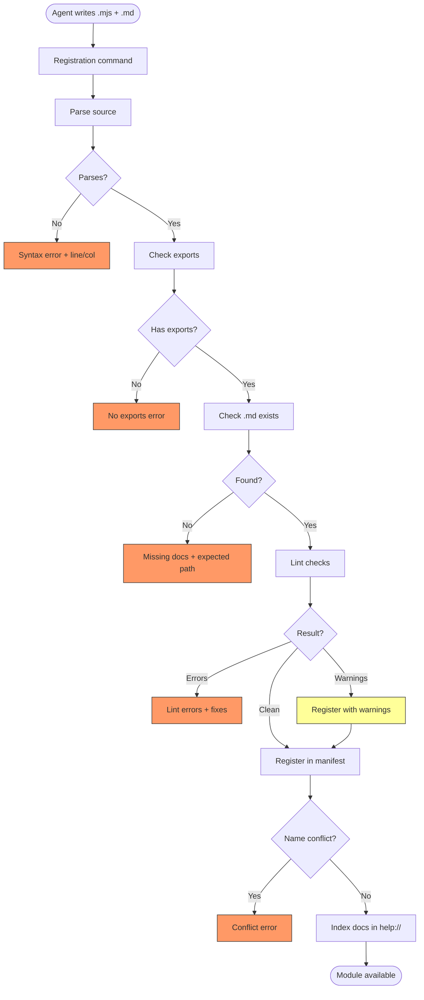

```mermaid
flowchart LR
    subgraph Publish["Publish (author's repo)"]
        Validate["Validate"] --> Package["Package"]
        Package --> Upload["Upload to registry"]
    end

    subgraph Registry["Community Registry"]
        Upload --> Store["Store package"]
        Store --> Index["Index metadata"]
    end

    subgraph Install["Install (consumer's repo)"]
        Search["Search/browse"] --> Inspect["Inspect capabilities"]
        Inspect --> Download["Download + verify hash"]
        Download --> LocalReg["Register locally"]
    end

    Index --> Search

    subgraph Runtime["Runtime enforcement"]
        LocalReg --> Import["import from module"]
        Import --> Enforce["Enforce declared capabilities"]
    end
```

# Module Lifecycle Flow

How modules are authored, registered, used, shared, updated, and retired.

## Why This Matters

Modules are the accumulation mechanism. Every session that registers a module leaves the repository more capable. But accumulated tools that rot silently are worse than no tools — they produce wrong results with confidence. The lifecycle must make creation easy, validation strict, usage safe, and retirement discoverable.

| Phase | Without lifecycle management | With lifecycle management |
|-------|-------------------------------|--------------------------|
| Registration | Module accepted silently, fails at use time | Validated at registration with specific feedback |
| Usage | Opaque — no way to know what a module does before running it | Provenance, capabilities, docs inspectable before use |
| Staleness | Broken modules discovered by agents mid-task | Staleness detectable — modules that reference missing schema flagged |
| Sharing | Copy-paste between repos | Publish/install with trust and safety guarantees |

## Flow 1: Module Authoring & Registration

### Trigger

Agent writes a module file and documentation, then calls the registration command.

### Stages

#### 1. Source Authoring
**Actor**: Agent
**Action**: Write a JavaScript module file and a companion documentation file. The module exports functions. Functions that need sandbox capabilities accept them as a parameter.
**Output**: Source file (`.mjs`) and documentation file (`.md`) in the module directory

#### 2. Registration Request
**Actor**: Agent
**Action**: Call the registration command with the module's identifier (prefix + name)
**Output**: Registration process begins
**Failure**: Invalid identifier format → error with correct format

#### 3. Source Validation
**Actor**: Module linter
**Action**: Load the module source into the JS engine. Verify it parses without syntax errors. Verify it exports at least one function.
**Output**: Module loads successfully
**Failure**: Syntax error → error with line/column and the parse error. No exports → error explaining modules must export functions.

#### 4. Documentation Validation
**Actor**: Module linter
**Action**: Check that a companion `.md` file exists alongside the source file.
**Output**: Documentation found
**Failure**: Missing documentation → error naming the expected file path

#### 5. Lint Checks
**Actor**: Module linter
**Action**: Check for common problems:
- Module references `repoql` global directly instead of accepting it as a parameter
- Module has side effects at module level (execution outside function bodies)
- Module imports other agent-authored modules (not allowed)
- Module shadows a bundled module name
**Output**: Clean or lint warnings/errors
**Failure**: Each violation produces a specific, fixable message. Errors block registration. Warnings allow registration with advisory.

#### 6. Manifest Update
**Actor**: Module registry
**Action**: Record the module in the registry manifest — identifier, source path, documentation path, registration timestamp, hash of source.
**Output**: Module registered and available for import
**Failure**: Naming conflict with existing module → error naming the conflict. Agent can choose to replace.

#### 7. Help Surface Update
**Actor**: Documentation system
**Action**: Index the module's documentation so it is discoverable via `help://`
**Output**: Module docs queryable alongside bundled module docs

### Flow Diagram

---

## Flow 2: Module Usage

### Trigger

A script contains an `import` statement referencing a registered module.

### Stages

#### 1. Specifier Resolution
**Actor**: Module loader
**Action**: Parse the import specifier. No prefix → bundled module lookup. Has prefix → agent module lookup in registry.
**Output**: Source location
**Failure**: Unknown specifier → error listing available modules with similar names

#### 2. Source Loading
**Actor**: Module loader
**Action**: Load the module source. For bundled modules, from embedded resources. For agent modules, from the registered file path.
**Output**: Module source ready for execution
**Failure**: Source file missing (deleted after registration) → error suggesting re-registration

#### 3. Module Execution
**Actor**: JavaScript engine
**Action**: Execute module top-level code. Bind exports.
**Output**: Module exports available to the importing script
**Failure**: Runtime error in module initialization → error identifying the module and the failure

#### 4. Function Invocation
**Actor**: Script code
**Action**: Call an exported function, optionally passing the `repoql` global for capability access.
**Output**: Function return value
**Failure**: Function throws → normal JS exception handling (catchable or bubbling)

---

## Flow 3: Module Sharing — Publish

### Trigger

Agent or developer wants to make a module available for other repositories to install.

### Stages

#### 1. Pre-publish Validation
**Actor**: Publish tooling
**Action**: Re-run all registration checks (parse, exports, docs, lint). Additionally verify:
- Module documentation includes a description and usage example
- Module declares its capability requirements (read/write/delete/none)
- Module has a version identifier
**Output**: Package ready for publication
**Failure**: Missing capability declaration → error. Missing description → error.

#### 2. Packaging
**Actor**: Publish tooling
**Action**: Bundle the module source, documentation, and manifest into a publishable package.
**Output**: Package artifact with metadata (name, version, capabilities, description, hash)

#### 3. Publication
**Actor**: Registry client
**Action**: Upload package to the community registry.
**Output**: Module available for installation by others
**Failure**: Name already taken → error suggesting alternative. Version already published → error requiring version bump.

---

## Flow 4: Module Sharing — Install

### Trigger

Agent wants to use a community module in a repository.

### Stages

#### 1. Discovery
**Actor**: Agent
**Action**: Search or browse the community registry for modules by keyword, capability, or name.
**Output**: Module listing with metadata — name, description, version, declared capabilities, download count

#### 2. Inspection
**Actor**: Agent
**Action**: Review the module's declared capabilities before installing. A module that declares `read` cannot write. A module that declares `none` runs in pure computation mode.
**Output**: Agent decides to proceed or skip
**Failure**: None — this is a decision point

#### 3. Installation
**Actor**: Install tooling
**Action**: Download the package. Verify hash integrity. Extract source and docs to the module directory. Register in the local manifest.
**Output**: Module available for import locally
**Failure**: Hash mismatch → error, package rejected. Conflicts with existing local module → error with resolution options.

#### 4. Capability Enforcement
**Actor**: Sandbox runtime
**Action**: At runtime, enforce the module's declared capabilities. If the module declared `read` only, write calls through its capability parameter are rejected — even if the calling script has write access.
**Output**: Module runs within its declared capability boundary
**Failure**: Capability violation → JS exception with message explaining the module's declared limits

### Flow Diagram

---

## Flow 5: Module Retirement

### Trigger

A module becomes stale, broken, or superseded.

### Stages

#### 1. Staleness Detection
**Actor**: Module registry
**Action**: Periodically (or on demand) check registered modules for health:
- Source file still exists?
- Module still parses?
- Imports still resolve? (bundled libraries may have been renamed/removed between versions)
**Output**: Health status per module
**Failure**: None — this is diagnostic

#### 2. Staleness Reporting
**Actor**: Module registry
**Action**: Surface stale modules through the module listing. Mark unhealthy modules visibly.
**Output**: Agent can see which modules need attention

#### 3. Module Removal
**Actor**: Agent
**Action**: Deregister a module. Remove from manifest. Optionally delete source and docs.
**Output**: Module no longer available for import
**Failure**: Module in use by a currently executing script → deferred removal after execution completes

---

## Cross-Cutting Concerns

| Concern | Where it applies | What the design must resolve |
|---------|-----------------|------------------------------|
| **Module caching** | Usage flow, step 2 | Cache parsed modules across invocations? Clear on re-registration? |
| **Capability declarations** | Sharing flows | Format of capability manifest. Enforcement mechanism at runtime. |
| **Registry storage** | All flows | File format for manifest. Location relative to `.repoql/`. |
| **Community registry** | Sharing flows | Protocol, hosting, trust model. Can be deferred — local-first works without it. |
| **Versioning** | Sharing + retirement | Semantic versioning? Breaking change detection? |
| **Provenance** | Trust + sharing | What metadata is recorded. How it's displayed. |
| **Help integration** | Registration + sharing | How module docs become queryable. Re-indexing on registration. |

---

## Error Handling Summary

| Error | Flow | Recovery |
|-------|------|----------|
| Syntax error in source | Registration | Error shows line/column and parse error |
| No exports | Registration | Error explains modules must export functions |
| Missing documentation | Registration | Error names the expected file path |
| Global `repoql` reference | Registration (lint) | Error says to accept as parameter instead |
| Agent-to-agent import | Registration (lint) | Error explains the constraint and suggests bundled alternatives |
| Name conflict | Registration | Error names the conflict, agent chooses to replace or rename |
| Source file missing | Usage | Error suggests re-registration |
| Module parse error (cached stale) | Usage | Clear cache, reload, report error |
| Hash mismatch on install | Install | Package rejected, error shows expected vs actual |
| Capability violation at runtime | Usage (shared module) | Exception names the module and its declared capabilities |
| Stale module detected | Retirement | Module flagged in listing, agent can fix or remove |

---

## Verification

| Environment | How |
|-------------|-----|
| **Registration** | Register modules with intentional errors (no exports, missing docs, lint violations). Assert each produces the correct specific error. |
| **Roundtrip** | Author → register → import → use → verify result. The minimum viable lifecycle. |
| **Staleness** | Register a module, delete its source file, assert staleness detection flags it. |
| **Capability enforcement** | Install a module declared as read-only. Pass it write capabilities. Assert writes are rejected at runtime. |
| **Sharing roundtrip** | Publish → install → import → use. Verify hash integrity check. Verify capability enforcement. |
