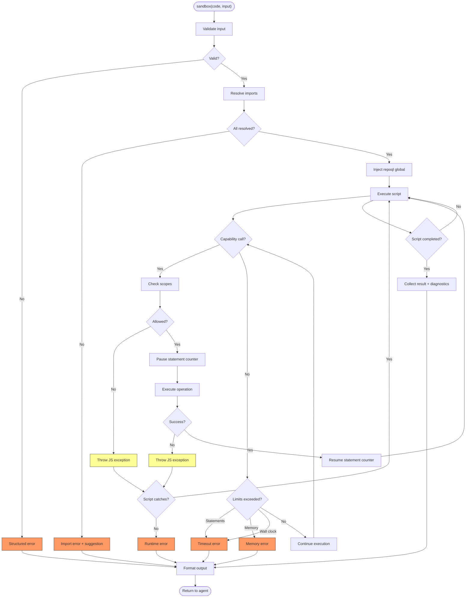

# Sandbox Execution Flow

What happens when an agent runs code in the sandbox — from tool call through capability resolution to formatted result.

## Why This Matters

The sandbox is the only surface where agents run arbitrary code. Every other tool has a fixed interface. Here, the agent writes the logic. That means execution must be predictable, observable, and recoverable at every stage — because the tool can't anticipate what the code will do.

| Without this flow | With this flow |
|-------------------|----------------|
| Capability calls happen at unknown points during execution | Every interleaving point is defined — scope check, statement pause, timeout enforcement |
| Errors from capabilities vanish inside scripts | Errors are JS exceptions — catchable or bubbling, never silent |
| Output shape varies by what the script does | Output is always: result + diagnostics + footer, same as every other tool |

## Trigger

Agent calls the `sandbox` MCP tool with `code` and optional `input`.

## Stages

### 1. Input Validation
**Actor**: Sandbox tool handler
**Action**: Validate code is present, input is valid JSON (if provided), sandbox is enabled
**Output**: Validated request or structured error
**Failure**: Missing code → syntax error. Sandbox disabled → disabled error with config hint. Malformed input → syntax error.

### 2. Module Resolution
**Actor**: Module loader
**Action**: Parse code for import statements. For each import, resolve the specifier against the module registry. Bundled modules (`repoql:yaml`) resolve to embedded resources. Agent-authored modules (`repoql:@prefix/name`) resolve to registered sources.
**Output**: All imports resolved, source loaded, ready for execution
**Failure**: Unknown specifier → import error with suggestion (did you mean `repoql:X`?). Bare specifier (`"yaml"` not `"repoql:yaml"`) → import error with the correct form.

### 3. Capability Injection
**Actor**: Sandbox tool handler
**Action**: Construct the `repoql` global with read/write/delete bound to the current execution context. Freeze the object. Bind configured scopes to each capability.
**Output**: Frozen `repoql` global installed in engine
**Failure**: None — this is construction, not user code.

*This stage does not occur for SQL `js()` — the `repoql` global is absent.*

### 4. Execution
**Actor**: JavaScript engine
**Action**: Execute the script. Statement counter increments per JS statement. Timeout enforced on wall clock. Memory tracked against configured limit.
**Output**: Script result value (or exception)
**Failure**: Statement limit → timeout error. Wall-clock timeout → timeout error. Memory limit → memory error. Uncaught exception → runtime error.

During execution, the script may invoke capability calls (see Capability Call flow below).

### 5. Result Collection
**Actor**: Sandbox tool handler
**Action**: Serialize script result to JSON. Collect diagnostics emitted during execution. Record execution metadata (elapsed time, capability call counts).
**Output**: Result JSON + diagnostics + metadata
**Failure**: Result not serializable → runtime error with message about the return value.

### 6. Output Formatting
**Actor**: Sandbox tool handler
**Action**: Format result for the caller. Rendered output for MCP (result + diagnostics inline + footer with timing/status). Structured output for programmatic callers (result object + diagnostics array + metadata).
**Output**: Formatted response
**Failure**: None — formatting is deterministic.

## Termination

Flow completes when the tool returns a response to the agent — either a successful result with formatted output, or a structured error. Every path produces output in the same shape.

## Flow Diagram

---

## Capability Call (Sub-flow)

What happens when a script calls `repoql.read()`, `repoql.write()`, or `repoql.delete()` during execution.

### Trigger

Script invokes a method on the `repoql` global.

### Stages

#### 1. Scope Validation
**Actor**: Scope enforcer
**Action**: Check the URI against configured scopes for the operation type (read/write/delete). Read scopes default to `file://**`. Write scopes default to `.repoql/tmp/**`. Delete scopes match write scopes.
**Output**: Allowed or denied
**Failure**: URI outside scope → JS exception with message naming the scope that would allow it.

#### 2. Statement Counter Pause
**Actor**: Execution context
**Action**: Pause the statement counter. The capability call counts as exactly one statement regardless of internal complexity.
**Output**: Counter paused
**Failure**: None.

#### 3. Operation Execution
**Actor**: Varies by operation
**Action**:
- **Read**: Resolve URI through the read engine (supports modifiers like `=> tree`, `=> structure`, `=> blame`). Return structured result.
- **Write**: Write content to the resolved URI through the filesystem layer.
- **Delete**: Remove content at the resolved URI through the filesystem layer.
**Output**: Read returns a structured object. Write and delete return void.
**Failure**: URI not found → exception. Permission denied → exception. Read timeout → exception. All exceptions are catchable JS errors.

#### 4. Statement Counter Resume
**Actor**: Execution context
**Action**: Increment statement counter by one. Resume counting.
**Output**: Counter resumed
**Failure**: None.

### Memory Accounting

Capability results are deserialized into the JS engine's heap. A read that returns 500KB of content consumes ~500KB of the engine's memory budget. Scripts that read many large files may hit memory limits. The error message indicates memory was exceeded and suggests reading less content or using smaller token budgets.

---

## SQL js() Execution (Boundary Flow)

What happens when SQL `js()` encounters a module that expects capabilities.

### Trigger

SQL query contains `js('expression', input)` where the expression imports a module with capability-dependent functions.

### Stages

#### 1. Module Resolution
**Actor**: Module loader
**Action**: Resolve imports identically to sandbox execution — bundled and agent-authored modules both resolve.
**Output**: Module loaded
**Failure**: Same import errors as sandbox execution.

#### 2. Execution Without Capabilities
**Actor**: JavaScript engine
**Action**: Execute the expression. The `repoql` global does not exist. Pure functions work. Functions that access capabilities hit `undefined`.
**Output**: Result or exception
**Failure**: Accessing `repoql.read()` → `TypeError: Cannot read properties of undefined (reading 'read')`. This raw JS error is not actionable.

#### 3. Boundary Error Enhancement
**Actor**: Error handler
**Action**: Detect `undefined` access on `repoql` and replace with an actionable error: "This module requires sandbox capabilities (read/write/delete). Use the sandbox tool instead of js() in SQL."
**Output**: Structured error with kind `context` and a clear suggestion
**Failure**: None — this is error enrichment.

### Why This Matters

Without boundary error enhancement, an agent gets `TypeError: Cannot read properties of undefined` — opaque, no recovery path. With it, the agent gets a signpost back to the correct tool. This is the "errors are actionable" promise applied to the two-surface boundary.

---

## Error Handling Summary

| Error | Stage | Catchable? | Recovery |
|-------|-------|-----------|----------|
| Sandbox disabled | Validation | No | Error includes config command to enable |
| Missing code | Validation | No | Error describes what's needed |
| Bad import specifier | Resolution | No | Error suggests correct specifier |
| Bare specifier (`"yaml"`) | Resolution | No | Error shows `repoql:yaml` form |
| Scope denied (read) | Capability call | Yes | Error names the scope that would allow it |
| Scope denied (write) | Capability call | Yes | Error names the scope and config to set |
| URI not found | Capability call | Yes | Error shows what was requested |
| Statement limit | Execution | No | Error shows limit and suggests simplification |
| Wall-clock timeout | Execution | No | Error shows timeout duration |
| Memory exceeded | Execution | No | Error shows limit and suggests reducing reads |
| Uncaught exception | Execution | No | Error shows exception message and stack |
| Result not serializable | Collection | No | Error describes the return value problem |
| `repoql` in `js()` | Boundary | No | Error redirects to sandbox tool |

---

## Cross-Cutting Concerns

These concerns span multiple stages and will need design decisions:

| Concern | Where it applies | What the design must resolve |
|---------|-----------------|------------------------------|
| **Scope enforcement** | Every capability call | How scopes are configured, stored, and checked |
| **Statement accounting** | Execution + capability calls | Pause/resume mechanism, whether reads count as one or vary |
| **Memory accounting** | Execution + capability results | How read results are charged against memory budget |
| **Timeout** | Entire execution including capability calls | Whether capability calls have independent timeouts or share wall clock |
| **Diagnostics** | Any point during execution | Collection mechanism, storage during execution, formatting in output |
| **Module resolution** | Parsing phase, before execution | Registry format, lookup order (bundled → agent), caching |
| **Output formatting** | Result collection | Dual-mode (structured + rendered), footer shape, diagnostic inline format |
| **Boundary detection** | SQL `js()` only | How to detect `repoql` access and enhance the error |

---

## Verification

| Environment | How |
|-------------|-----|
| **Unit tests** | Inject mock capabilities into sandbox. Assert scope enforcement, statement pausing, error shapes. |
| **Integration tests** | Run full sandbox with real DuckDB. Read from graph, write to `.repoql/tmp/`, verify output format matches other tools. |
| **Boundary tests** | Call `js()` with a module that accesses `repoql`. Assert enhanced error, not raw TypeError. |
| **Stress tests** | Script that reads 100 files, writes 10 outputs. Verify memory accounting, statement counting, timeout enforcement. |
